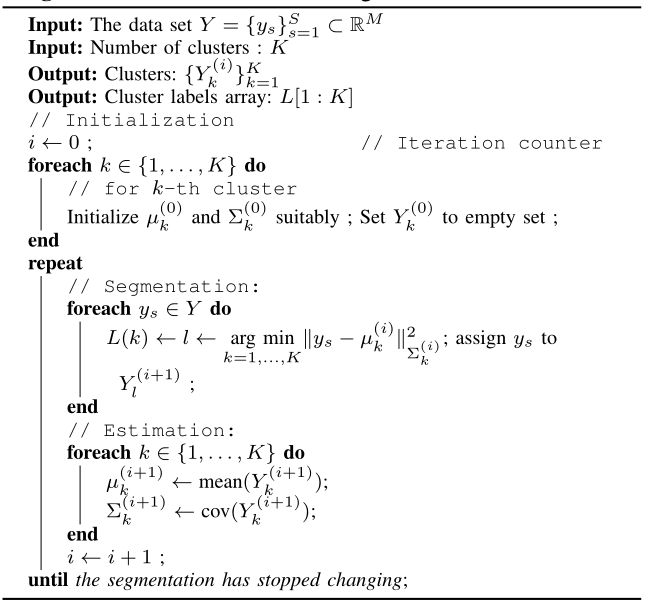

.. _sec:kmeans:
 
K-means Clustering
----------------------------------------------------

    K-means clustering algorithm

K-means clustering algorithm :cite:`macqueen1967some,duda2012pattern,hartigan1975clustering` is an 
iterative clustering method. We start with an initial set of means 
and covariance matrices for each cluster. In each iteration,
we segment the data points into individual clusters by choosing
the nearest mean. Then, we estimate the new mean and covariance matrices.
We return a label vector :math:`L[1:K]` which maps each point to
corresponding cluster. A *within-cluster-scatter* can be defined as

.. math::
    w(L) = \frac{1}{S} \sum_{k=1}^K \sum_{L(s) = k} \| y_s - \mu_k \|^2_{\Sigma_k}.

This represents the average (squared) distance of each point
to the respective cluster mean. The :math:`K`-means algorithm reduces
the scatter in each iteration. it is guaranteed to converge to
a local minimum.

A simpler version of this algorithm is based on Euclidean distance
and doesn't compute or updates the covariance matrices for each cluster.

.. disqus::
