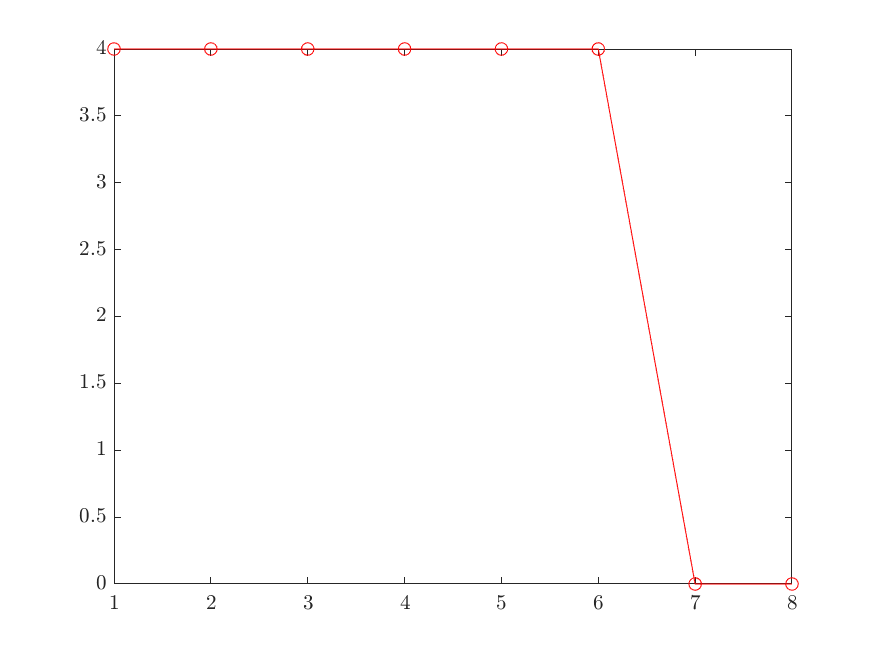
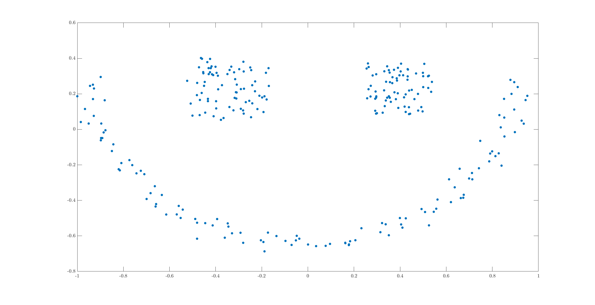
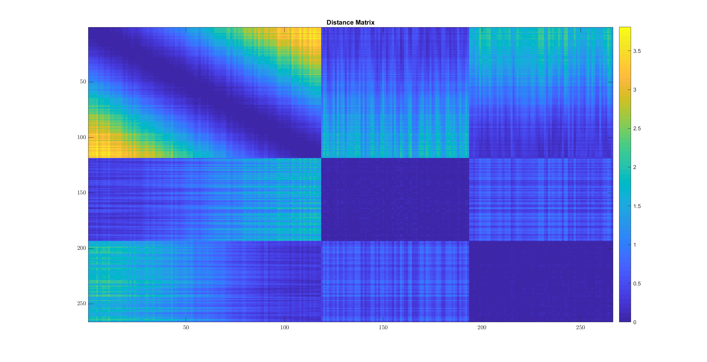
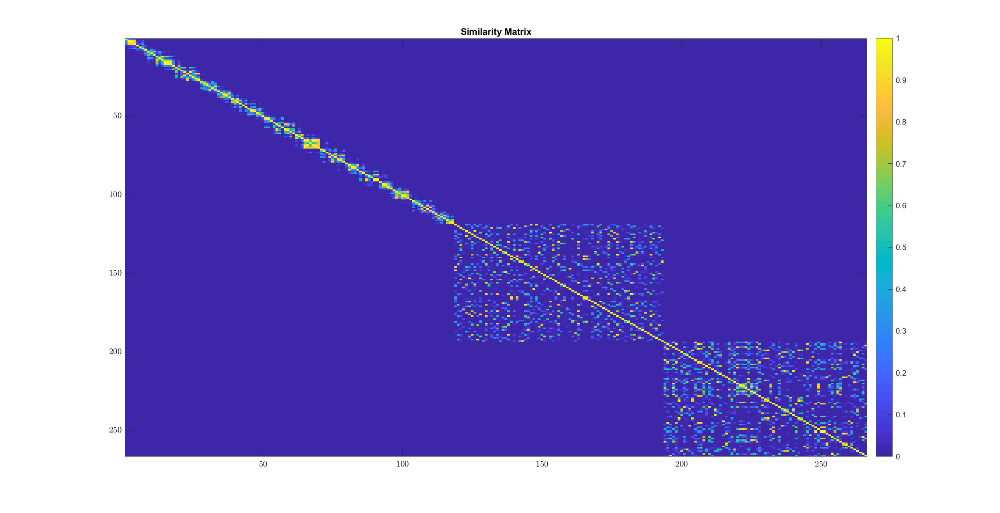
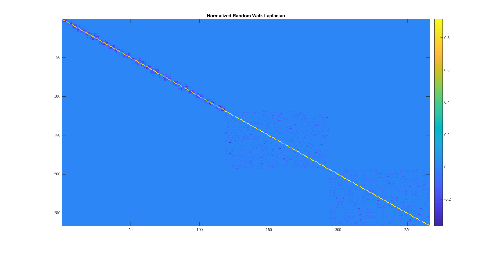
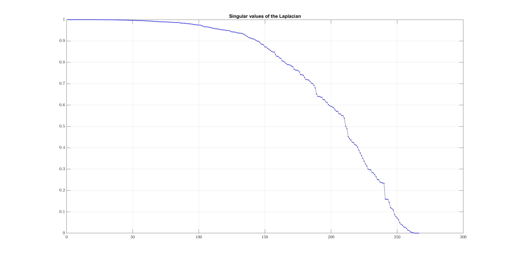
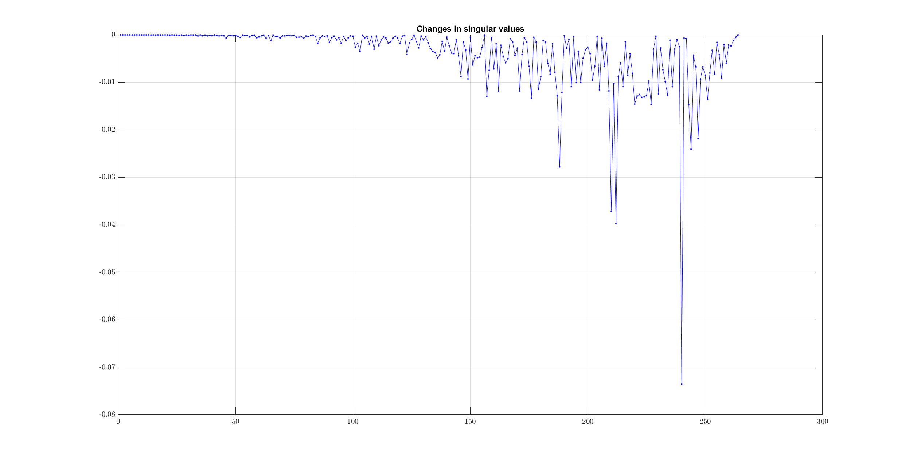
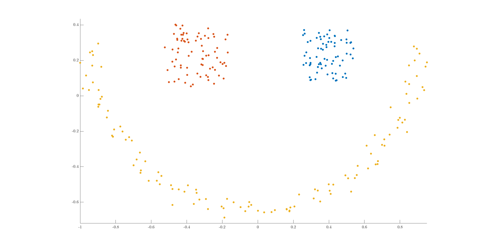

.. _clustering-handson-spectral-clustering:

Hands-on spectral clustering
======================================

.. highlight:: matlab

.. example:: Clustering rings

    In this example, we will cluster 2D data
    which form three different rings in
    the plane.

    Sample data is available in the `data` directory.

    Let us load the data::

        dataset_file = fullfile(spx.data_dir, 'clustering', ...
            'self_tuning_paper_clustering_data');
        data = load(dataset_file);
        datasets = data.XX;
        raw_data = datasets{1};
        num_clusters = data.group_num(1);

    The raw data is organized in a matrix where
    each row represents one 2D point. Number of
    data points is the number of rows in the dataset.
    Let's plot the data to get a better understanding::

        X = raw_data(:, 1);
        Y = raw_data(:, 2);
        figure;
        axis equal;
        plot(X, Y, '.', 'MarkerSize',16);

    .. figure:: images/demo_sc_1_unscaled.png

    We can see that the data is organized in three
    different rings. This data set is unlikely to 
    be clustered properly by K-means algorithm.

    It is good practice to scale the data before
    clustering it::

        raw_data = raw_data - repmat(mean(raw_data),size(raw_data,1),1);
        raw_data = raw_data/max(max(abs(raw_data)));
        X = raw_data(:, 1);
        Y = raw_data(:, 2);
        figure;
        axis equal;
        plot(X, Y, '.', 'MarkerSize',16);

    .. figure:: images/demo_sc_1_scaled.png

    The next step is to compute pairwise distances 
    between the points in the dataset::

        sqrt_dist_mat = spx.commons.distance.sqrd_l2_distances_rw(raw_data);

    We convert the distances into a Gaussian 
    similarity. To compute the similarity, we will
    need to provide the scale value::

        scale = 0.04;
        % Compute the similarity matrix
        sim_mat = spx.cluster.similarity.gauss_sim_from_sqrd_dist_mat(sqrt_dist_mat, scale);

    We are now ready to perform spectral clustering on the data. 

    Create the spectral clustering algorithm instance::

        clusterer = spx.cluster.spectral.Clustering(sim_mat);

    Inform it about the expected number of clusters::

        clusterer.NumClusters = num_clusters;

    There are two different spectral clustering 
    algorithms available. We will use the random walk 
    version::

        cluster_labels = clusterer.cluster_random_walk();

    We can summarize the results of clustering::

        >> tabulate(cluster_labels)
          Value    Count   Percent
              1       99     33.11%
              2      139     46.49%
              3       61     20.40%

    Let's plot the data points in different colors
    depending on which cluster they belong to::

        figure;
        colors = [1,0,0;0,1,0;0,0,1;1,1,0;1,0,1;0,1,1;0,0,0];
        hold on;
        axis equal;
        for c=1:num_clusters
            % Identify points in this cluster
            points = raw_data(cluster_labels == c, :);
            X = points(:, 1);
            Y = points(:, 2);
            plot(X, Y, '.','Color',colors(c,:), 'MarkerSize',16);
        end

    .. figure:: images/demo_sc_1_clustered.png

    Complete example code can be downloaded
    :download:`here <demo_spectral_clustering_1.m>`.

Inside Unnormalized Spectral Clustering
----------------------------------------------

In this section, we will start with a similarity
matrix and go through the steps of unnormalized 
spectral clustering.

We will consider a simple case of of 8 data
points which are known to be falling into
two clusters. 

We construct an undirected graph :math:`G`
where the nodes in same cluster are connected
to each other and nodes in different clusters
are not connected to each other.

In this simple example, we will assume
that the graph is unweighted.

The adjacency matrix for the graph is :math:`W`::

    >> W = [ones(4) zeros(4); zeros(4) ones(4)]
    W =

         1     1     1     1     0     0     0     0
         1     1     1     1     0     0     0     0
         1     1     1     1     0     0     0     0
         1     1     1     1     0     0     0     0
         0     0     0     0     1     1     1     1
         0     0     0     0     1     1     1     1
         0     0     0     0     1     1     1     1
         0     0     0     0     1     1     1     1

We have arranged the adjacency matrix in a manner
so that the clusters are easily visible.

Let's just get the number of nodes::

    >> [num_nodes, ~] = size(W);

Let's also assign the true labels to these nodes
which will be used for verification later::

    >> true_labels = [1 1 1 1 2 2 2 2];

We construct the degree matrix :math:`D` for the graph::

    >> Degree = diag(sum(W))
    Degree =

         4     0     0     0     0     0     0     0
         0     4     0     0     0     0     0     0
         0     0     4     0     0     0     0     0
         0     0     0     4     0     0     0     0
         0     0     0     0     4     0     0     0
         0     0     0     0     0     4     0     0
         0     0     0     0     0     0     4     0
         0     0     0     0     0     0     0     4

The unnormalized Laplacian is given by :math:`L = D - W`::

    >> Laplacian = Degree - W
    Laplacian =

         3    -1    -1    -1     0     0     0     0
        -1     3    -1    -1     0     0     0     0
        -1    -1     3    -1     0     0     0     0
        -1    -1    -1     3     0     0     0     0
         0     0     0     0     3    -1    -1    -1
         0     0     0     0    -1     3    -1    -1
         0     0     0     0    -1    -1     3    -1
         0     0     0     0    -1    -1    -1     3

We now compute the singular value decomposition of
the Laplacian :math:`U \Sigma V^T = L`::

    >> [~, S, V] = svd(Laplacian);
    >> singular_values = diag(S);
    >> fprintf('Singular values: \n');
    >> spx.io.print.vector(singular_values);
    Singular values: 
    4.00 4.00 4.00 4.00 4.00 4.00 0.00 0.00 

We know that the number of connected components
in an undirected graph is equal to the number
of singular values of the Laplacian which are zero.
On inspection, we can see that the there are
indeed two such zeros.

For more general cases, the lower singular values
may not indeed be zero.  We need to find the
knee of the singular value curve.

A simple way to find it to look
at the changes between consecutive
singular values and find the place
where the change is largest::

    >> sv_changes = diff( singular_values(1:end-1) );
    >> spx.io.print.vector(sv_changes);
    0.00 0.00 0.00 -0.00 0.00 -4.00 

Note that it is known that the Laplacian
always has one singular value which is 0.
Thus, we need to look at the changes only
in remaining singular values.

Locate the largest change::

    >> [min_val , ind_min ] = min(sv_changes)
    min_val =

       -4.0000

    ind_min =

         6

The number of clusters is now easy to determine::

    >> num_clusters = num_nodes - ind_min
    num_clusters =

         2

We pickup the right singular vector
corresponding to the last 2 smallest
singular values::

    >> Kernel = V(:,num_nodes-num_clusters+1:num_nodes);

Each row of this matrix corresponds to one data
point. At this point, the standard k-means clustering
can be invoked to cluster the points 
into clusters where the number of clusters
was determined as above::

    % Maximum iteration for KMeans Algorithm
    >> max_iterations = 1000; 
    % Replication for KMeans Algorithm
    >> replicates = 100;
    >> labels = kmeans(Kernel, num_clusters, ...
        'start','sample', ...
        'maxiter',max_iterations,...
        'replicates',replicates, ...
        'EmptyAction','singleton'...
        );

Print the labels given by k-means::

    >> spx.io.print.vector(labels, 0);
    1 1 1 1 2 2 2 2 

As expected, the algorithm has been able
to group the points into two clusters.
The labels are matching with the original 
true labels.

Complete example code can be downloaded
:download:`here <demo_unnormalized_spectral_clustering.m>`.

``sparse-plex`` includes a function
which implements the unnormalized
spectral clustering algorithm. We
can use it on the data above as follows::

    >> result = spx.cluster.spectral.simple.unnormalized(W);
    >> result.labels'

    ans =

         1     1     1     1     2     2     2     2

Inside Normalized (Random Walk) Spectral Clustering
-----------------------------------------------------

In this section, we will look at a spectral
clustering method using normalized Laplacians.
The primary difference is the way the graph
Laplacian is computed :math:`L = I - D^{-1} W`.

We will use the third example from self tuning
paper for demonstration here.

There are three clusters in the dataset.
While two of the clusters have very clear 
convex shapes, the third one forms a 
half moon. It is this cluster which causes
problems with a simple algorithm like k-means.
The semi-moon is the first cluster, while the
other two above it are cluster 2 and 3 (from left to right).

Loading the dataset::

    dataset_file = fullfile(spx.data_dir, 'clustering', ...
        'self_tuning_paper_clustering_data');
    data = load(dataset_file);
    datasets = data.XX;
    raw_data = datasets{3};
    % Scale the raw_data
    raw_data = raw_data - repmat(mean(raw_data),size(raw_data,1),1);
    raw_data = raw_data/max(max(abs(raw_data)));
    num_clusters = data.group_num(1);
    X = raw_data(:, 1);
    Y = raw_data(:, 2);
    % plot it
    axis equal;
    plot(X, Y, '.', 'MarkerSize',16);

Let's compute the pairwise (squared) :math:`\ell_2` distances
between the points::

    sqrt_dist_mat = spx.commons.distance.sqrd_l2_distances_rw(raw_data);
    imagesc(sqrt_dist_mat);
    title('Distance Matrix');

* In cluster 2 and 3, the distances are quite small
  between all pairs of points.
* In cluster 1, every point is near to some of the
  points. The points form kind of a chain structure.
  They keep getting farther and farther.
  This is visible from the gradual color change 
  from blue to yellow in the off diagonal parts of
  the first (diagonal) sub-part in the image above.

We map the (squared) distances to similarity values
between 0 to 1::

    scale = 0.04;
    W = spx.cluster.similarity.gauss_sim_from_sqrd_dist_mat(sqrt_dist_mat, scale);
    imagesc(W);
    title('Similarity Matrix');

The transformation involved here is

.. math::

    w_{i j} = \exp \left ( - \frac{d_{i j}^2}{\sigma^2} \right).

The chain structure of similarity in cluster 1 is
clearly visible here. In cluster 2 and 3 points are
fairly similar to each other.

We now compute the graph Laplacian::

    [num_nodes, ~] = size(W);
    Degree = diag(sum(W));
    DegreeInv = Degree^(-1);
    Laplacian = speye(num_nodes) - DegreeInv * W;
    imagesc(Laplacian);
    title('Normalized Random Walk Laplacian');

Note how the Laplacian has been computed slightly differently.

Let's look at the singular values::

    [~, S, V] = svd(Laplacian);
    singular_values = diag(S);
    plot(singular_values, 'b.-');
    grid on;
    title('Singular values of the Laplacian');

This time no clear knee is visible in the 
singular value plot. We can verify this
by looking at the differences::

    sv_changes = diff( singular_values(1:end-1) );
    plot(sv_changes, 'b.-');
    grid on;
    title('Changes in singular values');

Finding the largest change in singular values
will not give us the correct number of clusters::

    >> [min_val , ind_min ] = min(sv_changes);
    >> num_clusters = num_nodes - ind_min;
    >> num_clusters

    num_clusters =

        26

However, by data inspection, we can clearly see
that there are only 3 clusters of interest.

In this case, since the data are well segregated,
the number of singular values which is close to
zero actually matches with the number of clusters::

    >> num_clusters = sum(singular_values < 1e-6)
    num_clusters =

         3

Let's verify by printing 10 smallest singular
values::

    >> spx.io.print.vector(singular_values(end-10:end), 6)
    0.027412 0.023242 0.014100 0.012101 0.006108 0.003988 0.001655 0.000471 0.000000 0.000000 0.000000 

We will stick to this way of computing number of
clusters here.

Let's pick up the right singular vectors
corresponding to the last 3 singular values::

    % Choose the last num_clusters eigen vectors
    Kernel = V(:,num_nodes-num_clusters+1:num_nodes);

Time to perform k-means clustering on the row vectors
of this kernel::

    % Maximum iteration for KMeans Algorithm
    max_iterations = 1000; 
    % Replication for KMeans Algorithm
    replicates = 100;
    cluster_labels = kmeans(Kernel, num_clusters, ...
        'start','plus', ...
        'maxiter',max_iterations,...
        'replicates',replicates, ...
        'EmptyAction','singleton'...
        );

The labels are returned in the variable ``cluster_labels``.

Let's plot the original data by assigning different colors
to points belonging to different labels::

    hold on;
    axis equal;
    for c=1:num_clusters
        % Identify points in this cluster
        points = raw_data(cluster_labels == c, :);
        X = points(:, 1);
        Y = points(:, 2);
        plot(X, Y, '.', 'MarkerSize',16);
    end
    hold off;

We can see that the clusters have been clearly 
identified.

.. disqus::

