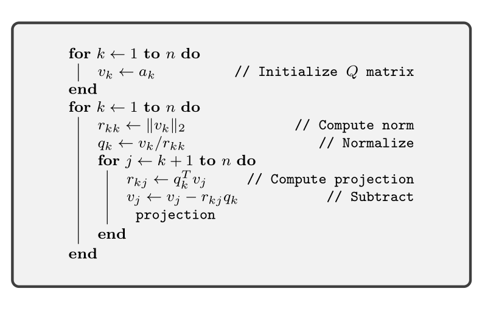

.. _sec:complexity:basic_operations:
 
Basic Operations
===================================================

Essential operations in the implementation of a numerical
algorithm are addition, multiplication, comparison, load and store.
Numbers are stored in floating point representation. 
A dedicated floating point unit is available for performing
arithmetic operations. 
These operations are known as floating point operations
(flops).  
A typical update operation :math:`b \leftarrow b + x y` 
(a.k.a. multiply and add) involves
two flops (one floating point multiply and open floating
point addition). 
Subtraction costs same as addition.
A division is usually counted as 4 flops in HPC community 
as a more sophisticated procedure is invoked in the floating
point arithmetic hardware. 
For our purposes, we will count
division as single flop as it is a rare operation and doesn't
affect overall flop count asymptotically.
A square root operation can take about 6 flops on typical CPU architectures,
but [following  :cite:`trefethen1997numerical`], we will treat it
as a single flop.
We ignore the costs of load and store operations. We
usually, also ignore costs of decision making operations
and integer counters.
We will also be treating real arithmetic as well as
complex arithmetic costing same number of flops
to maintain ease of analysis. 

Let :math:`x, y \in \RR^n` be two vectors, then their inner product
is computed as 

.. math:: 

    \langle x, y \rangle = \sum_{i=1}^n x_i y_i.

This involves :math:`n` multiplications and :math:`n-1` additions.
Total operation count is :math:`2n - 1` flops. If we implement
this as a sequence of multiply and add operation starting
with :math:`0`, then this will take :math:`2n` flops. We will use this
simpler expression.
Addition and subtraction of :math:`x` and :math:`y` takes :math:`n` flops.
Scalar multiplication takes :math:`n` flops.

 
Multiplication
----------------------------------------------------
 
Let :math:`A \in \RR^{m \times n}` be a real matrix and :math:`x \in \RR^n`
be a vector. Then :math:`y = A x  \in \RR^m` is their matrix-vector
product. A straight-forward implementation consists of
taking inner product of each row of :math:`A` with :math:`x`. Each 
inner product costs :math:`2n` flops. There are  :math:`m` such
inner products computed. 
Total operation count is :math:`2mn`.
When two matrices :math:`A \in \RR^{m \times n}` and :math:`B \in \RR^{n \times p}`
are multiplied, the operation count is :math:`2mnp`. 

There are
specialized matrix-matrix multiplication algorithms which can
reduce the flop count, but we would be content with this result.
If :math:`A` has a certain structure [e.g. Fourier Transform], then
specialized algorithms may compute the product much faster. 
We will not be concerned with this at the moment. Also,
partitioning of a matrix into blocks and using block versions
of fundamental matrix operations
helps a lot in improving
the memory traffic and can significantly improve the performance
of the algorithm on real computers, but this doesn't affect the
flop count and we won't burden ourselves with these details.

If :math:`A` is diagonal (with :math:`m=n`), then :math:`Ax` can be computed in :math:`n` flops.
If :math:`A` is lower triangular (with :math:`m=n`), then :math:`Ax` can be computed in 
:math:`n(n+1)` flops.
Here is a quick way to compute :math:`(I + uv^T)x`: 
Compute :math:`c = v^T x` (:math:`2n` flops), then compute :math:`w = c u` (:math:`n` flops),
then compute :math:`w + x` (:math:`n` flops). The total is :math:`4n` flops.

The Gram Matrix :math:`G = A^T A` (for :math:`A \in \RR^{m \times n}`) is symmetric
of size :math:`n \times n`. 
We need to calculate
only the upper triangular part and we can fill the lower triangular
part easily. Each row vector of :math:`A^T` and column vector of :math:`A` 
belong to :math:`\RR^{m}`. Their inner product takes :math:`2m` flops. We need
to compute :math:`n(n+1)/2` such inner products. The total flop count is
:math:`mn(n+1) \approx mn^2`.
Similarly, the frame operator :math:`AA^T` is symmetric requiring
:math:`nm(m+1) \approx nm^2` flops. 

Squared norm of a vector :math:`\| x \|_2^2 = \langle x, x \rangle`
can be computed in :math:`2n-1` flops. Norm can be computed in :math:`2n`
flops.

 
Elementary row operations
----------------------------------------------------

There are a few memory operations for which we need to assign
flop counts. 
Setting a vector :math:`x \in \RR^n` to zero (or any constant value)
will take :math:`n` flops. Swapping two rows of a matrix 
:math:`A` (with :math:`n` columns) takes :math:`3n` flops.

Scaling a row of :math:`A` takes :math:`n` flops. Scaling a row and
adding to another row takes :math:`2n` flops.

 
Back and forward substitution
----------------------------------------------------

Given an upper triangular matrix :math:`L \in \RR^{n \times n}`,
solving the equation :math:`L x = b` takes :math:`n^2` flops.
This can be easily proved by induction. The case for :math:`n=1`
is trivial (requiring 1 division). Assume that the flop
count is valid for :math:`1\dots n-1`. For :math:`n \times n` matrix :math:`L`,
let the top most row equation be

.. math:: 

    l_{11} x_1 + \sum_{k=2}^n l_{1k} x_k = b_1

where :math:`x_2 \dots x_n` are already determined in :math:`(n-1)^2` flops.
Solving for :math:`x_1` requires :math:`2n -3 + 1 + 1= 2n - 1` flops. The
total is :math:`(n-1)^2 + 2n -1 = n^2`.
Flop count for forward substitution is also :math:`n^2`.

 
Gaussian elimination
----------------------------------------------------

Let :math:`A \in \RR^{n \times n}` be a full rank matrix
and let us look at the Gaussian elimination process 
in solving the equation :math:`A x = y` for a given :math:`y` and
unknown :math:`x`.
As the pivot column shifts in Gaussian elimination process,
the number of columns involved keeps reducing. The first
pivot is :math:`a_{11}`. Computing its inverse takes 4 flops.
For :math:`i`-th row beneath the first row, computing 
:math:`a_{11} / a_{i1}` takes 4 flops, 
scaling the row with this value takes :math:`n` flops, and 
subtracting 1st from from this takes :math:`n` flops. Total
flop count is :math:`(2n+1)` flops. We repeat the same for
:math:`(n-1)` rows. Total flop count is :math:`(2n+1)(n-1)`.
For :math:`i`-th pivot from :math:`i`-th row, the number of columns
involved is :math:`n-i+1`. Number of rows below it is :math:`n-i`.
Flop count of zeroing out entries below the pivot is
:math:`(2(n-i+1)+1)(n-i)`. Summing over :math:`1` to :math:`n`, we obtain:

.. math:: 

    \sum_{i=1}^n (2(n-i+1)+1)(n-i) = \frac{2\, n^3}{3} + \frac{n^2}{2} - \frac{7\, n}{6}
    .

For a :math:`2\times 2` matrix, this is 5 flops. For a :math:`3\times 3` matrix, 
this is :math:`19` flops.
Actually, substituting :math:`n-i+1` by :math:`k`, we can rewrite the sum as:

.. math:: 

    \sum_{k=1}^n (2k+1)(k -1) = \frac{2\, n^3}{3} + \frac{n^2}{2} - \frac{7\, n}{6}
    .

Additional :math:`n^2` flops are required for back substitution part.
 
QR factorization
----------------------------------------------------

We factorize a full column rank matrix :math:`A \in \RR^{m \times n}` as
:math:`A = QR` where :math:`Q \in \RR^{m \times n}` is an orthogonal matrix :math:`Q^TQ = I` and
:math:`R \in \RR^{n \times n}` is an upper triangular matrix. This can be computed in :math:`2mn^2`
flops using Modified Gram-Schmidt algorithm presented in :ref:`here <alg:gram_schmidt>`. 

.. _alg:gram_schmidt:

:: 

    \caption{Modified Gram-Schmidt Algorithm}

    \footnotesize
    \SetAlgoLined
    \For{:math:`k \leftarrow 1` \KwTo :math:`n`}{
        :math:`v_k \leftarrow a_k`\tcp*{Initialize :math:`Q` matrix}
    }
    \For{:math:`k \leftarrow 1` \KwTo :math:`n`}{
        :math:`r_{kk} \leftarrow \| v_k \|_2`\tcp*{Compute norm}
        :math:`q_k \leftarrow v_k / r_{kk}` \tcp*{Normalize}
        \For{:math:`j \leftarrow k+1` \KwTo :math:`n`} {
            :math:`r_{kj} \leftarrow q_k^T v_j` \tcp*{Compute projection}
            :math:`v_j \leftarrow v_j - r_{kj} q_k` \tcp*{Subtract projection} 
        }
    }

Most of the time of the algorithm is spent in the inner loop on :math:`j`.
Projection of :math:`v_j` on :math:`q_k` is computed in :math:`2m-1` flops.
It is subtracted from :math:`v_j` in :math:`2m` flops. Projection of :math:`q_k`
is subtracted from remaining :math:`(n-k)` vectors requiring
:math:`(n-k)(4m-1)` flops. Summing over :math:`k`, we get:

.. math:: 

    \sum_{k=1}^n (n-k)(4m-1) = \frac{n}{2} - 2m n + 2mn^2 - \frac{n^2}{2}.

Computing norm :math:`r_{kk}` requires :math:`2m` flops. Computing :math:`q_k` requires
:math:`m+1` flops (1 inverse and :math:`m` multiplications). These contribute :math:`(3m+1)n` flops for :math:`n` columns. Initialization
of :math:`Q` matrix can be absorbed into the normalization step requiring
no additional flops. Thus, the total flop count is 
:math:`\frac{3n}{2} + m n + 2mn^2 - \frac{n^2}{2} \approx 2mn^2`.

A variation of this algorithm is presented below.
In this version :math:`Q` and :math:`R` matrices are computed column by column
from :math:`A` matrix. This allows for incremental update of :math:`QR` factorization
of :math:`A` as more columns in :math:`A` are added. This variation is very useful
in efficient implementation of algorithms like Orthogonal Matching Pursuit.

.. _alg:gram_schmidt_colwise:

Again, the inner loop requires :math:`4m-1` flops. This loop is run
:math:`k-1` times. We have
:math:`\sum_{k=1}^n (k-1)= \sum_{k=1}^n (n - k)`. Thus, flop counts
are identical.

 
Least Squares
===================================================

Standard least squares problem of minimizing the
norm squared :math:`\| A x  - b\|_2^2` where :math:`A` is a full
column rank matrix, can be solved using various methods. 
Solution can be obtained by solving the normal equations
:math:`A^T A x = A^T b`. Since the Gram matrix :math:`A^T A` is symmetric,
faster solutions than Gaussian elimination are applicable.
 
QR factorization
----------------------------------------------------

We write :math:`A = QR`. Then, an equivalent formulation of
normal equations is :math:`R x = Q^T b`. The solution is obtained
in 3 steps: 
a) Compute :math:`QR` factorization of :math:`A`. 
b) Form :math:`d = Q^T b`.
c) Solve :math:`R x = d` by back substitution.
Total cost for solution is :math:`2mn^2 + 2mn + n^2` flops.
We refrain from ignoring the lower order terms as we 
will be using incremental QR update based series of
least squares problems in sequel.

 
Cholesky factorization
----------------------------------------------------

We calculate :math:`G = A^T A`. We then perform the
Cholesky factorization of :math:`G = LL^T`.
We compute :math:`d = A^T b`. We solve :math:`Lz = d` by forward substitution.
We solve :math:`L^T x = z` by back substitution.
Total flop count is approximately 
:math:`mn^2 + (1/3) n^3 + 2mn + n^2 + n^2` flops.
For large :math:`m, n`, the cost is approximately :math:`mn^2 + (1/3) n^3`.
QR factorization is numerically more stable though Cholesky is
faster. Cholesky factorization can be significantly faster if
:math:`A` is a sparse matrix. Otherwise QR factorization is the preferred
approach.

 
Incremental QR factorization
----------------------------------------------------

Let us spend some time on looking at the QR based 
solution differently. Let us say that
:math:`A = \begin{bmatrix} a_1 & a_2 & \dots & a_n \end{bmatrix}`.
Let :math:`A_k` be the submatrix consisting of first :math:`k` columns of
:math:`A`. Let the QR factorization of :math:`A_k` be :math:`Q_k R_k`.
Let :math:`x_k` be the solution of the least squares
problem of minimizing :math:`\| A_k x_k - b \|_2^2`.
We form :math:`d_k = Q_k^T b` and solve :math:`R_k x_k = d_k`
via back substitution.

Similarly, QR factorization of :math:`A_{k+1}` is :math:`Q_{k+1} R_{k+1}`.
We can write

.. math:: 

    A_{k+1} = \begin{bmatrix}A_k & a_{k+1}\end{bmatrix}, \quad
    Q_{k+1} = \begin{bmatrix}Q_k & q_{k+1}\end{bmatrix}, \quad
    R_{k+1} = \begin{bmatrix} R_k & r_{k+1}\\ 0 & r_{k+1, k+1} \end{bmatrix}

:math:`k` entries in the vector :math:`r_{k+1}` are computed
as per the loop in :ref:`above <alg:gram_schmidt_colwise>`.
Computing and subtracting projection of :math:`a_{k+1}`
for each normalized column in :math:`Q_k` requires :math:`4m-1` flops.
This loop is run  :math:`k` times. Computing norm and
division requires :math:`3m+1` flops. The whole QR 
update step requires :math:`k(4m-1) + 3m + 1` flops.
It is clear that the first :math:`k` entries in :math:`d_{k+1}`
are identical to :math:`d_k`. We just need to compute the
last entry as :math:`q_{k+1}^T b` (requiring :math:`2m` flops).
Back substitution will require all :math:`(k+1)^2` flops.
Total number of flops required for solving the
:math:`k+1`-th least squares problem is
:math:`k(4m-1) + 3m + 1 + 2m + (k+1)^2` flops.
Summing over :math:`k=0` to :math:`n-1`, we get

.. math:: 

    \sum_{k=0}^{n-1} k(4m-1) + 3m + 1 + 2m + (k+1)^2
    = \frac{5\, n}{3} + 3\, m\, n + 2\, m\, n^2 + \frac{n^3}{3}.

Compare this with the flop count for QR factorization
based least squares solution
for whole matrix :math:`A`: :math:`2mn^2 + 2mn + n^2`.
Asymptotically (with :math:`n < m`), this is close to 
:math:`2mn^2`, the operation count for solving the full
least squares problem. This approach gives us
a series of solutions with sacrificing much
on computational complexity.