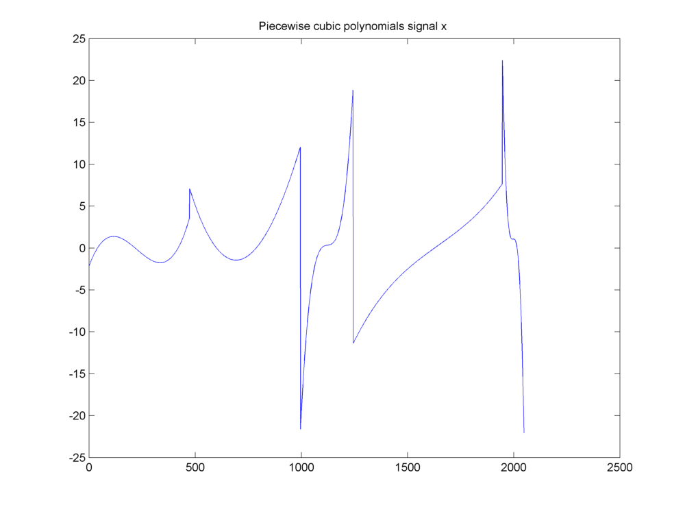
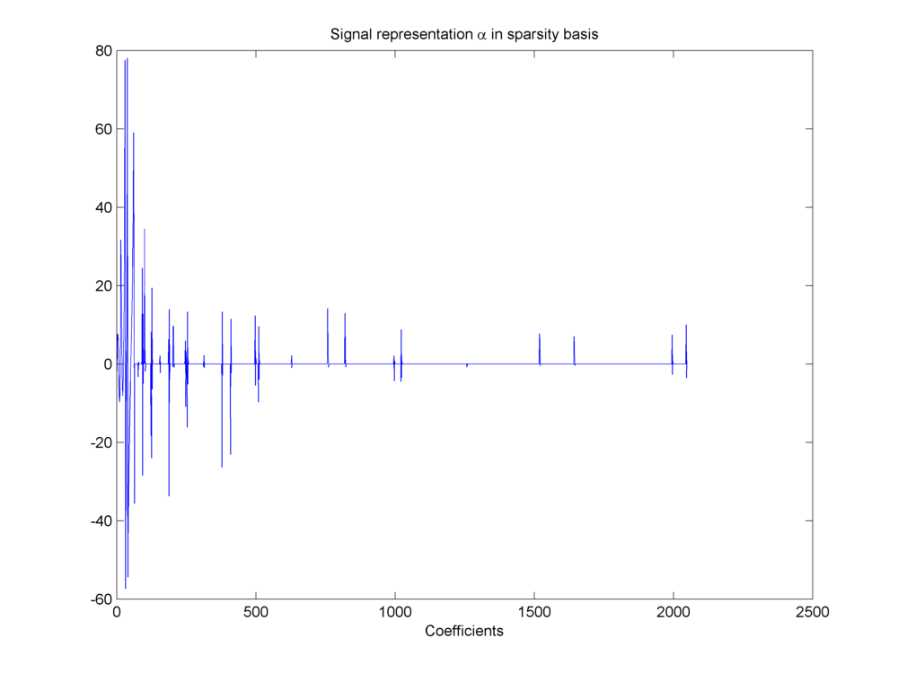
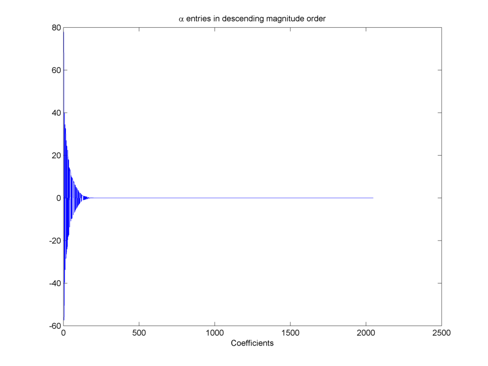
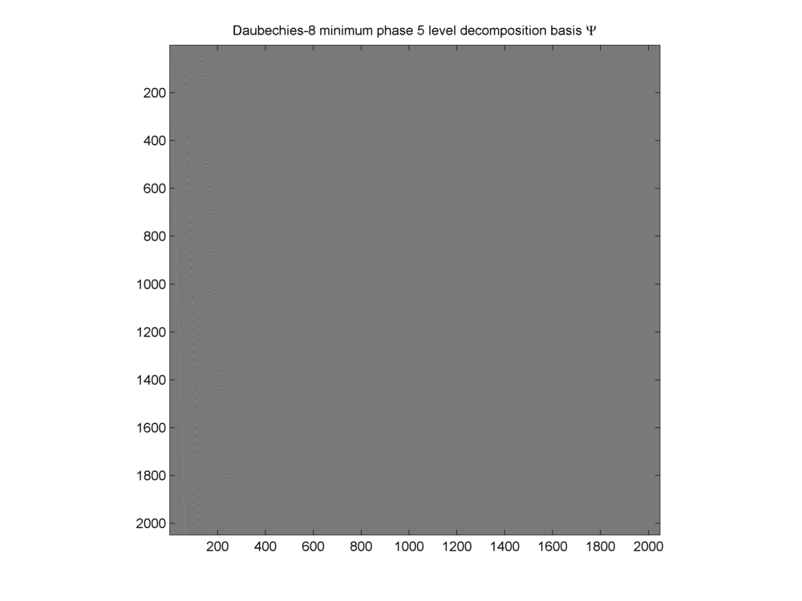
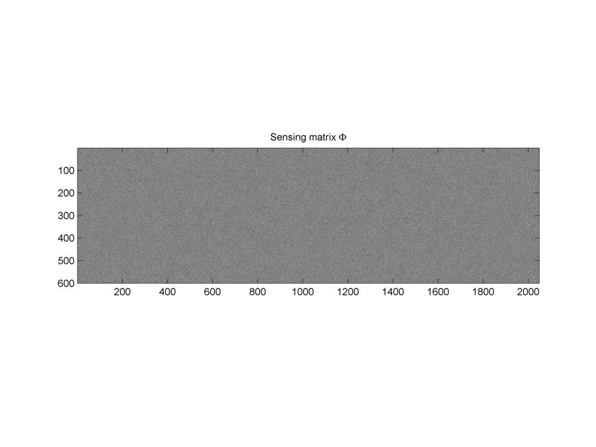
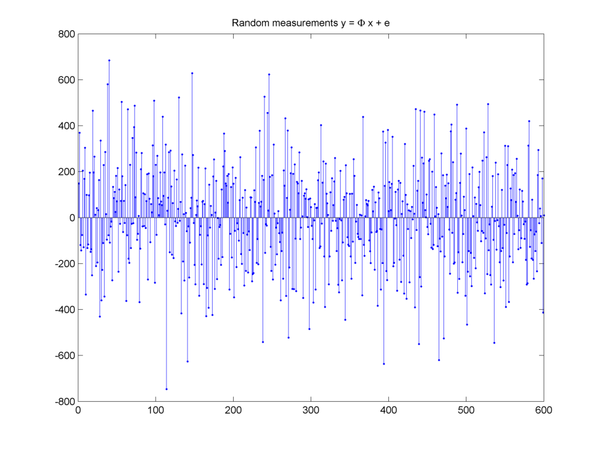
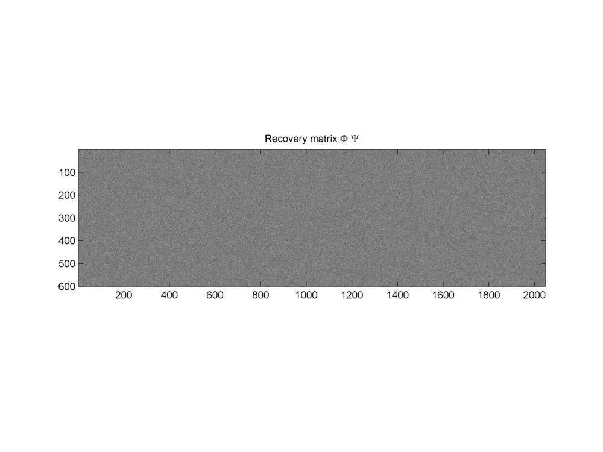

 
Examples
===================================================

In this section we will look at several examples
which can be modeled using sparse and redundant
representations and measured using compressed
sensing techniques.

Several examples in this section have been 
incorporated from Sparco :cite:`sparco:2007` (a testing framework
for sparse reconstruction).

 
Piecewise cubic polynomial signal
----------------------------------------------------

This example was discussed in :cite:`candRomb2004practical`.
Our signal of interest is a piecewise cubic polynomial signal
as shown  here. 

    A piecewise cubic polynomials signal

It has a sparse representation in a wavelet basis.

    Sparse representation of signal in wavelet basis

We can sort the wavelet coefficients by magnitude and plot
them in descending order to visualize how sparse the 
representation is. 

    Wavelet coefficients sorted by magnitude

The chosen basis is a Daubechies wavelet basis  :math:`\Psi`.

    Daubechies-8 wavelet basis

A Gaussian random sensing matrix  :math:`\Phi` 
is used to generate the measurement vector  :math:`y` 

    Gaussian sensing matrix  :math:`\Phi`

The measurements are shown here:

    Measurement vector  :math:`y = \Phi x + e`

Finally the product of  :math:`\Phi` and  :math:`\Psi` given by  :math:`\Phi \Psi` 
will be used for actual recovery of sparse representation.

    Recovery matrix  :math:`\Phi \Psi`

Fundamental equations are:

.. math:: 

    x = \Psi \alpha

and

.. math:: 

    y = \Phi x + e = \Phi \Psi \alpha + e.

with  :math:`x \in \RR^N`. In this example  :math:`N = 2048`.
:math:`\Psi` is a complete dictionary of size  :math:`N \times N`.
Thus we have  :math:`D = N` and  :math:`\alpha \in \RR^N`. 
:math:`\Phi \in \RR^{M \times N}`. In this example, 
the number of measurements  :math:`M=600`. The 
measurement vector  :math:`y \in \RR^M`. For this problem
we chose  :math:`e = 0`. 

Sparse signal recovery problem is denoted as

.. math:: 

    \widehat{\alpha} = \text{recovery}(\Phi \Psi, y, K).

where  :math:`\widehat{\alpha}` is a  :math:`K`-sparse approximation of  :math:`\alpha`.

Closely examining the coefficients in  :math:`\alpha` we can note that
:math:`\max(\alpha_i) = 78.0546`. Further if we put different thresholds
over magnitudes of entries in  :math:`\alpha` we can find the number
of coefficients higher than the threshold as listed in  the table below. 
A choice of  :math:`M = 600` looks quite reasonable given the decay
of entries in  :math:`\alpha`.

.. _tbl:ssm:piecewise_polynomial:nonzero_entries:

.. list-table:: Entries in wavelet representation of piecewise cubic polynomial signal higher than a threshold
    :header-rows: 1

    * - Threshold
      - Entries higher than threshold
    * - 1
      - 129
    * - 1E-1
      - 173
    * - 1E-2
      - 186
    * - 1E-4
      - 197
    * - 1E-8
      - 199
    * - 1E-12
      - 200

.. disqus::

