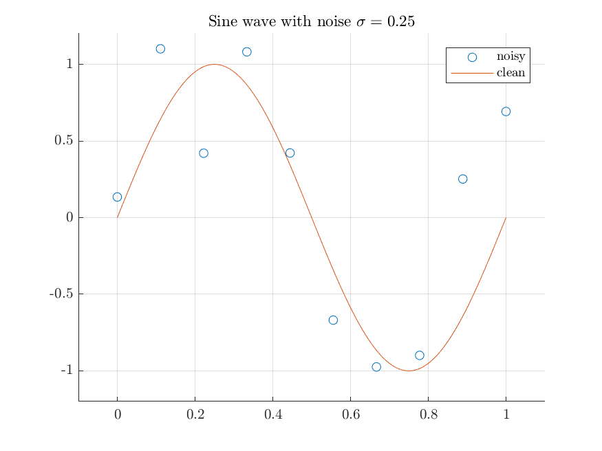
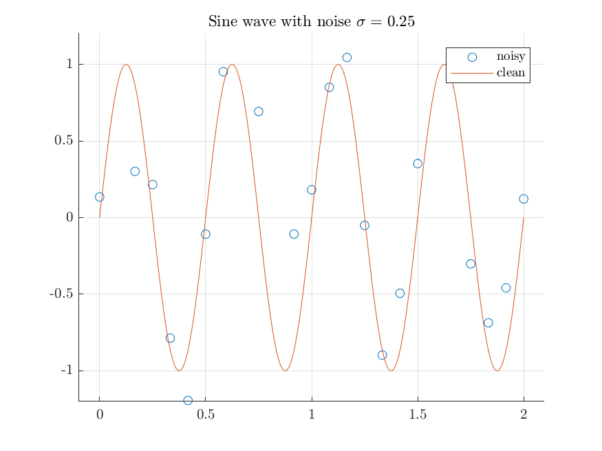

Sample Data
===============

.. highlight:: matlab

Sinusoids
-----------------------

Constructing a sinusoid with noise::

    n = 10;
    sigma = 0.25;
    [x, y] = spx.data.synthetic.func.sinusoid('n', n, 'sigma', sigma);

Sinusoid with four cycles::

    n = 25;
    sigma = 0.25;
    x_min = 0;
    x_max = 2;
    f = 2;
    [x, y] = spx.data.synthetic.func.sinusoid('n', n, 'sigma', sigma, 'min', x_min, 'max', x_max, 'f', f);

