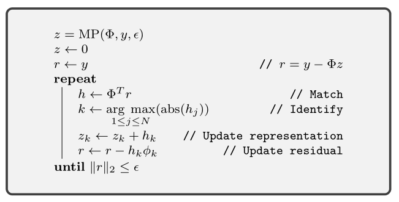

.. _sec:pursuit:greedy:mp: 

Matching Pursuit
=======================================

Algorithm
---------------------

.. highlight:: matlab

    Matching Pursuit

The matching pursuit algorithm is a 
very simple iterative approach to 
solve the sparse recovery problem.
We are given the signal :math:`y`
and the dictionary :math:`\Phi` 
and we are to recover the sparse
representation :math:`x` satisfying
:math:`y = \Phi x`.

In each iteration of matching pursuit:

* A current estimate of the
  representation vector :math:`x` is maintained 
  in the variable :math:`z`.
* Current residual :math:`r = y - \Phi z` is 
  maintained.
* The inner product of the residual with
  all the atoms in :math:`\Phi` is computed.
* We look for the atom which has the largest
  inner product in magnitude.
* Contribution from this atom is added to
  the representation.
* Residual is reduced accordingly.

Note that it is guaranteed that the norm of residual 
decreases monotonically in each iteration till it
converges.

The algorithm can be motivated as follows.

Let :math:`\Lambda` be the support of 
the representation vector :math:`x`.
Then

.. math::

    y = \sum_{j \in \Lambda} \phi_{j} x_{j}.

For some :math:`k \in \Lambda`

.. math::

    \langle y, \phi_k \rangle = \sum_{j \in \Lambda} \langle \phi_{j} , \phi_k \rangle x_{j}.

If the atoms formed an orthonormal set, this would have reduced to
:math:`x_{k} =  \langle y, \phi_k \rangle` and picking the largest
inner product would give us the largest non-zero entry in :math:`x`.

In fact, if :math:`\Phi` was an orthonormal basis, then matching
pursuit recovers the representation of :math:`y` in
exactly :math:`K` iterations where :math:`K = |\Lambda|`
by successively picking up nonzero coefficients in :math:`x`
in the order of descending magnitude. We hope that
the algorithm is useful even when the atoms in 
:math:`\Phi_{\Lambda}` are not orthogonal.

Now, let us look at the iterative structure. Assume that
the current estimate :math:`z` satisfies 
:math:`\supp(z) \subseteq \Lambda`. Then
:math:`\Phi z \in \Range(\Phi_{\Lambda})`.
Since :math:`y \in \Range(\Phi_{\Lambda})`, hence
the residual :math:`r \in \Range(\Phi_{\Lambda})` also holds.

Finally, if the atoms in :math:`\Phi` are nearly 
orthogonal to each other, then the largest inner
product of :math:`r` will be for one of the atoms
in :math:`\Lambda`. This atom is indexed by
the variable :math:`k`. Then :math:`h_k`
is the projection of the residual :math:`r` on 
the atom :math:`\phi_k`.

We add this projection coefficient to :math:`z_k` and remove
the projection from the residual.  The support
of :math:`z` continues to be within :math:`\Lambda`.

Since the atoms are not orthogonal, matching pursuit
typically takes much larger number of iterations
than the sparsity level :math:`K`. However, 
under suitable conditions, it does converge
to the correct solution.

.. _sec:pursuit:mp:hands-on:

Hands-on with Matching Pursuit
----------------------------------------

Matching pursuit on a 2-sparse vector
''''''''''''''''''''''''''''''''''''''''''''''''''''''''''''''''''''''''''

In this example, we will reconstruct a 2-sparse
representation vector :math:`x` from a signal
:math:`y = \Phi x`. We will develop the basic
implementation of matching pursuit along-with.

From :ref:`this example <ex:ssm:spark:partial-hadamard>`, we know of a way to construct a dictionary with high spark::

    rng default;
    N = 20;
    M = 10;
    K = 2;
    PhiA = hadamard(N);
    rows = randperm(N, M);
    PhiB = PhiA(rows, :);

Let's print its contents::

    >> PhiB

    PhiB =

         1 -1 -1 -1 -1  1 -1  1 -1  1  1  1  1 -1 -1  1 -1 -1  1  1
         1 -1 -1  1 -1 -1  1  1 -1 -1 -1 -1  1 -1  1 -1  1  1  1  1
         1 -1 -1 -1  1 -1  1 -1  1  1  1  1 -1 -1  1 -1 -1  1  1 -1
         1  1  1 -1 -1  1 -1 -1  1  1 -1 -1 -1 -1  1 -1  1 -1  1  1
         1  1 -1  1  1  1  1 -1 -1  1 -1 -1  1  1 -1 -1 -1 -1  1 -1
         1 -1  1  1  1  1 -1 -1  1 -1 -1  1  1 -1 -1 -1 -1  1 -1  1
         1 -1  1  1 -1 -1 -1 -1  1 -1  1 -1  1  1  1  1 -1 -1  1 -1
         1  1  1 -1 -1 -1 -1  1 -1  1 -1  1  1  1  1 -1 -1  1 -1 -1
         1 -1  1 -1 -1  1  1 -1 -1 -1 -1  1 -1  1 -1  1  1  1  1 -1
         1  1 -1 -1  1  1 -1 -1 -1 -1  1 -1  1 -1  1  1  1  1 -1 -1

Let's normalize its columns:: 

    Phi = spx.norm.normalize_l2(PhiB);

:ref:`sec:pursuit:tf:bigaussian` discusses ways to 
generate synthetic sparse vectors.

Let's generate our 2-sparse representation vector::

    rng(100);
    gen = spx.data.synthetic.SparseSignalGenerator(N, K);
    x =  gen.biGaussian();

Let's print :math:`x`::

    >> spx.io.print.sparse_signal(x);
    (6,1.6150) (11,-1.2390)   N=20, K=2

This is a nice helper function to print sparse vectors. It
prints a sequence of tuples where each tuple consists of
the index of a non-zero value and corresponding value.

The support for this vector is::

    >> spx.commons.sparse.support(x)'

    ans =

         6    11

Let's construct our 10-dimensional signal from it::

    y = Phi * x;

Let's print it::

    >> spx.io.print.vector(y)
    0.12 -0.12 -0.90 0.90 0.90 0.90 -0.90 -0.12 0.90 0.12 

Our problem is now setup. Our job now is to 
recover :math:`x` from :math:`\Phi` and :math:`y`.

Initialize the estimated representation and current residual::

    z = zeros(N, 1);
    r = y;

We will run the matching pursuit iterations up to 100 times:: 

    for i=1:100

Following code samples are part of each matching pursuit iteration.
We start with computing the inner products of the 
current residual with each atom::

    inner_products = Phi' * r;

Find the index of best matching atom :math:`k` ::

    [max_abs_inner_product, index]  = max(abs(inner_products));

Corresponding signed inner product :math:`h_k`::

    max_inner_product = inner_products(index);

Update the representation::

    z(index) = z(index) + max_inner_product;

Remove the projection of the atom from the residual::

    r = r - max_inner_product * Phi(:, index);

Compute the norm of residual::

    norm_residual = norm(r);

If the norm is less than a threshold, we break out of loop:: 

    if norm_residual < 1e-4
        break;
    end

It will be instructive to print current value of residual norm, selected atom index and estimated coefficients in the 
:math:`z` variable in each iteration::

    fprintf('[%d]: k: %d, h_k : %.4f, r_norm: %.4f, estimate: ', i, index, norm_residual, max_inner_product);

Here is the output of running this algorithm 
for this problem::

    [1]: k: 6, h_k : 1.2140, r_norm: 1.8628, estimate: (6,1.8628)   N=20, K=1
    [2]: k: 11, h_k : 0.2428, r_norm: -1.1894, estimate: (6,1.8628) (11,-1.1894)   N=20, K=2
    [3]: k: 6, h_k : 0.0486, r_norm: -0.2379, estimate: (6,1.6249) (11,-1.1894)   N=20, K=2
    [4]: k: 11, h_k : 0.0097, r_norm: -0.0476, estimate: (6,1.6249) (11,-1.2370)   N=20, K=2
    [5]: k: 6, h_k : 0.0019, r_norm: -0.0095, estimate: (6,1.6154) (11,-1.2370)   N=20, K=2
    [6]: k: 11, h_k : 0.0004, r_norm: -0.0019, estimate: (6,1.6154) (11,-1.2389)   N=20, K=2
    [7]: k: 6, h_k : 0.0001, r_norm: -0.0004, estimate: (6,1.6150) (11,-1.2389)   N=20, K=2

It took us 7 iterations, but the residual norm 
reached close to 0. We can note that 
the non-zero values in :math:`z` match closely
with the corresponding values in :math:`x`.
Matching pursuit has been successful.
We can also notice that the reconstruction alternates
between atom number 6 and 11 in each iteration. 
Also, the residual norm keeps on decreasing with
each iteration.

The complete code can be downloaded 
:download:`here <demo_mp_partial_hadamard_10x20_k_3.m>`.

.. example:: When matching pursuit fails::

    Although the spark of the dictionary in previous example
    is :math:`8`, matching pursuit fails to recover signals
    which are 3-sparse.

    Here is an example output of running matching pursuit on a 3-sparse vector
    for 20 iterations::

        The representation: (6,-1.9014) (8,1.3481) (11,1.6150)   N=20, K=3
        [1]: k: 6, h_k : 1.9189, r_norm: -2.7636, estimate: (6,-2.7636)   N=20, K=1
        [2]: k: 11, h_k : 1.2654, r_norm: 1.4425, estimate: (6,-2.7636) (11,1.4425)   N=20, K=2
        [3]: k: 8, h_k : 0.7712, r_norm: 1.0032, estimate: (6,-2.7636) (8,1.0032) (11,1.4425)   N=20, K=3
        [4]: k: 6, h_k : 0.3449, r_norm: 0.6898, estimate: (6,-2.0738) (8,1.0032) (11,1.4425)   N=20, K=3
        [5]: k: 8, h_k : 0.2069, r_norm: 0.2759, estimate: (6,-2.0738) (8,1.2791) (11,1.4425)   N=20, K=3
        [6]: k: 11, h_k : 0.1542, r_norm: 0.1380, estimate: (6,-2.0738) (8,1.2791) (11,1.5805)   N=20, K=3
        [7]: k: 6, h_k : 0.0690, r_norm: 0.1380, estimate: (6,-1.9359) (8,1.2791) (11,1.5805)   N=20, K=3
        [8]: k: 8, h_k : 0.0414, r_norm: 0.0552, estimate: (6,-1.9359) (8,1.3343) (11,1.5805)   N=20, K=3
        [9]: k: 16, h_k : 0.0308, r_norm: 0.0276, estimate: (6,-1.9359) (8,1.3343) (11,1.5805) (16,0.0276)   N=20, K=4
        [10]: k: 14, h_k : 0.0241, r_norm: -0.0193, estimate: (6,-1.9359) (8,1.3343) (11,1.5805) (14,-0.0193) (16,0.0276) 
          N=20, K=5
        [11]: k: 10, h_k : 0.0197, r_norm: 0.0138, estimate: (6,-1.9359) (8,1.3343) (10,0.0138) (11,1.5805) (14,-0.0193) 
        (16,0.0276)   N=20, K=6
        [12]: k: 6, h_k : 0.0151, r_norm: 0.0127, estimate: (6,-1.9232) (8,1.3343) (10,0.0138) (11,1.5805) (14,-0.0193) 
        (16,0.0276)   N=20, K=6
        [13]: k: 11, h_k : 0.0115, r_norm: 0.0097, estimate: (6,-1.9232) (8,1.3343) (10,0.0138) (11,1.5902) (14,-0.0193) 
        (16,0.0276)   N=20, K=6
        [14]: k: 15, h_k : 0.0095, r_norm: -0.0065, estimate: (6,-1.9232) (8,1.3343) (10,0.0138) (11,1.5902) (14,-0.0193) 
        (15,-0.0065) (16,0.0276)   N=20, K=7
        [15]: k: 13, h_k : 0.0078, r_norm: 0.0055, estimate: (6,-1.9232) (8,1.3343) (10,0.0138) (11,1.5902) (13,0.0055) 
        (14,-0.0193) (15,-0.0065) (16,0.0276)   N=20, K=8
        [16]: k: 1, h_k : 0.0056, r_norm: -0.0054, estimate: (1,-0.0054) (6,-1.9232) (8,1.3343) (10,0.0138) (11,1.5902) 
        (13,0.0055) (14,-0.0193) (15,-0.0065) (16,0.0276)   N=20, K=9
        [17]: k: 20, h_k : 0.0044, r_norm: -0.0035, estimate: (1,-0.0054) (6,-1.9232) (8,1.3343) (10,0.0138) (11,1.5902) 
        (13,0.0055) (14,-0.0193) (15,-0.0065) (16,0.0276) (20,-0.0035) 
          N=20, K=10
        [18]: k: 2, h_k : 0.0034, r_norm: 0.0028, estimate: (1,-0.0054) (2,0.0028) (6,-1.9232) (8,1.3343) (10,0.0138) 
        (11,1.5902) (13,0.0055) (14,-0.0193) (15,-0.0065) (16,0.0276) 
        (20,-0.0035)   N=20, K=11
        [19]: k: 4, h_k : 0.0025, r_norm: 0.0023, estimate: (1,-0.0054) (2,0.0028) (4,0.0023) (6,-1.9232) (8,1.3343) 
        (10,0.0138) (11,1.5902) (13,0.0055) (14,-0.0193) (15,-0.0065) 
        (16,0.0276) (20,-0.0035)   N=20, K=12
        [20]: k: 17, h_k : 0.0021, r_norm: -0.0014, estimate: (1,-0.0054) (2,0.0028) (4,0.0023) (6,-1.9232) (8,1.3343) 
        (10,0.0138) (11,1.5902) (13,0.0055) (14,-0.0193) (15,-0.0065) 
        (16,0.0276) (17,-0.0014) (20,-0.0035)   N=20, K=13

    The sparse vector is supported on atoms 6, 8 and 11.
    If we order the atoms in terms of the magnitude of their coefficients, 
    the order is 6,11 and 8.

    * Atom 6 is discovered in first iteration.
    * Atom 11 is discovered in second iteration.
    * Atom 8 is discovered in the third iteration.
    * The coefficients for atom 6, 8 and 11 continue to be updated till 8 iterations.
    * In 9-th iteration, it discovers an incorrect atom 16. 
    * In the following iterations, it keeps discovering more incorrect atoms 14, 10, 15, 13, 1, 20, etc.
    * The algorithm is side-tracked after 9-th iteration. The residual doesn't belong to the 
      range :math:`\Range(\Phi_{\Lambda})` anymore. 
    * After 20 iterations, as many as 13 atoms are involved in the representation.
    * Yet, most of the energy is concentrated in atoms 6, 8, 11 only. In that sense, MP hasn't failed
      completely. 
    * A simple thresholding can remove the spurious contributions from incorrect atoms.
