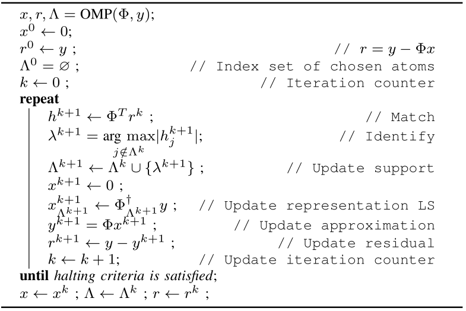

The Algorithm
=======================

**Orthogonal Matching Pursuit** (OMP) addresses some of the limitations of 
:ref:`sec:pursuit:greedy:mp`. In particular, in each iteration:

* The current estimate is computed by performing a least squares
  estimation on the subdictionary formed by atoms selected so far.
* It ensures that the residual is totally orthogonal to already selected atoms.
* It also means that an atom is selected only once.
* Further, if all the atoms in the support are selected by OMP correctly, then
  the least squares estimate is able to achieve perfect recovery. 
  The residual becomes 0.
* In other words, if OMP is recovering a K-sparse representation, then 
  it can recover it in exactly K iterations (if in each iteration it 
  recovers one atom correctly).
* OMP performs far better than MP in terms of the set of signals it can 
  recover correctly.
* At the same time, OMP is a much more complex algorithm (due to the least squares step).

    Orthogonal Matching Pursuit

The core OMP algorithm is presented above.
The algorithm is iterative. 

*  We start with the initial estimate of solution as :math:`x=0`. 
*  We also maintain the support of :math:`x` i.e. the set of indices for which :math:`x` is non-zero
   in a variable :math:`\Lambda`.
   We start with an empty support.
*  In each (:math:`k`-th) iteration we attempt to reduce the difference between the 
   actual signal :math:`y` 
   and the approximate signal based on current solution 
   :math:`x^{k}` given by :math:`r^{k} = y - \Phi x^{k}`.
*  We do this by choosing a new index in :math:`x` given by :math:`\lambda^{k+1}` for the 
   column :math:`\phi_{\lambda^{k+1}}`
   which most closely matches our current residual.
*  We include this to our support for :math:`x`, estimate 
   new solution vector :math:`x^{k+1}` and compute
   new residual.
*  We stop when the residual magnitude is below a threshold :math:`\epsilon` defined by us.

Each iteration of algorithm consists of following stages:

#. **Match** For each column :math:`\phi_j` in our dictionary, 
   we measure the projection of residual from previous iteration  on the column
#. **Identify** We identify the atom with largest inner product and store its index 
   in the variable :math:`\lambda^{k+1}`.
#. **Update support** We include :math:`\lambda^{k+1}` in the support set :math:`\Lambda^{k}`.
#. **Update representation** In this step we find the solution of minimizing 
   :math:`\| \Phi x - y \|^2` over the
   support :math:`\Lambda^{k+1}` as our next candidate solution vector.

   By keeping :math:`x_i = 0` for :math:`i \notin \Lambda^{k+1}` we are essentially 
   leaving out corresponding columns :math:`\phi_i` from our calculations.
   
   Thus we pickup up only the columns specified by :math:`\Lambda^{k+1}` 
   from :math:`\Phi`. Let us call this matrix
   as :math:`\Phi_{\Lambda^{k+1}}`. 
   The size of this matrix is :math:`N \times | \Lambda^{k+1} |`. 
   Let us call corresponding sub vector as :math:`x_{\Lambda^{k+1}}`.
   
   E.g. suppose :math:`D=4`, then 
   :math:`\Phi = \begin{bmatrix} \phi_1 & \phi_2 & \phi_3 & \phi_4 \end{bmatrix}`.
   Let :math:`\Lambda^{k+1} = \{1, 4\}`. 
   Then :math:`\Phi_{\Lambda^{k+1}} = \begin{bmatrix} \phi_1 & \phi_4 \end{bmatrix}` 
   and :math:`x_{\Lambda^{k+1}} = (x_1, x_4)`.
   
   Our minimization problem then reduces to minimizing 
   :math:`\|\Phi_{\Lambda^{k+1}} x_{\Lambda^{k+1}} - y \|_2`.
   
   We use standard least squares estimate for getting the coefficients for 
   :math:`x_{\Lambda^{k+1}}` over these indices.
   We put back :math:`x_{\Lambda^{k+1}}` to obtain our 
   new solution estimate :math:`x^{k+1}`.
   
   In the running example after obtaining the values 
   :math:`x_1` and :math:`x_4`, we will have 
   :math:`x^{k+1} = (x_1, 0 , 0, x_4)`.
   
   The solution to this minimization problem is given by
   
   .. math:: 
   
       \Phi_{\Lambda^{k+1}}^H ( \Phi_{\Lambda^{k+1}}x_{\Lambda^{k+1}} - y ) = 0 
       \implies x_{\Lambda^{k+1}} = ( \Phi_{\Lambda^{k+1}}^H \Phi_{\Lambda^{k+1}} )^{-1} \Phi_  {\Lambda^{k+1}}^H y.
   
   Interestingly, we note that :math:`r^{k+1} = y - \Phi x^{k+1} = y - \Phi_{\Lambda^{k+1}}   x_{\Lambda^{k+1}}`, thus
   
   .. math:: 
   
       \Phi_{\Lambda^{k+1}}^H r^{k+1} = 0
   
   which means that columns in :math:`\Phi_{\Lambda^k}` which are part of support 
   :math:`\Lambda^{k+1}` are necessarily
   orthogonal to the residual :math:`r^{k+1}`. 
   This implies that these columns will not be considered
   in the coming iterations for extending the support. 
   This orthogonality is the reason
   behind the name of the algorithm as OMP.
#. **Update residual** We finally update the residual vector to 
   :math:`r^{k+1}` based on new solution vector estimate.

Hands-on with Orthogonal Matching Pursuit
-----------------------------------------------

.. example::

    
    Let us consider a synthesis matrix of size :math:`10 \times 20`. 
    Thus :math:`N=10` and :math:`D=20`. In order to fit into the display, we will
    present the matrix in two 10 column parts.
    
    \tiny
    
    
    .. math:: 
    
        \begin{aligned}
        \Phi_a = \frac{1}{\sqrt{10}}
        \begin{bmatrix}
        -1 & -1 & -1 & 1 & -1 & -1 & 1 & 1 & -1 & 1\\
        1 & 1 & 1 & 1 & 1 & -1 & -1 & 1 & -1 & -1\\
        -1 & -1 & -1 & -1 & -1 & 1 & 1 & 1 & 1 & 1\\
        1 & -1 & -1 & 1 & 1 & 1 & -1 & 1 & 1 & 1\\
        1 & 1 & 1 & -1 & -1 & 1 & -1 & -1 & 1 & 1\\
        1 & -1 & 1 & -1 & -1 & -1 & 1 & -1 & 1 & -1\\
        -1 & -1 & 1 & 1 & -1 & -1 & -1 & -1 & 1 & -1\\
        1 & -1 & 1 & 1 & -1 & 1 & -1 & -1 & -1 & 1\\
        -1 & 1 & -1 & 1 & 1 & -1 & -1 & -1 & 1 & 1\\
        1 & 1 & 1 & 1 & -1 & 1 & -1 & 1 & -1 & 1
        \end{bmatrix}\\
        \Phi_b = \frac{1}{\sqrt{10}}
        \begin{bmatrix}
        1 & -1 & -1 & -1 & 1 & 1 & 1 & -1 & -1 & -1\\
        1 & 1 & 1 & -1 & -1 & -1 & -1 & -1 & -1 & 1\\
        -1 & 1 & 1 & 1 & 1 & 1 & -1 & -1 & -1 & -1\\
        1 & -1 & 1 & -1 & 1 & 1 & 1 & -1 & -1 & -1\\
        1 & -1 & -1 & 1 & 1 & 1 & -1 & 1 & 1 & -1\\
        -1 & 1 & 1 & 1 & -1 & 1 & -1 & 1 & -1 & 1\\
        -1 & 1 & 1 & -1 & 1 & -1 & -1 & -1 & 1 & 1\\
        1 & -1 & -1 & 1 & 1 & -1 & -1 & 1 & -1 & 1\\
        1 & 1 & 1 & 1 & -1 & -1 & 1 & 1 & 1 & -1\\
        -1 & -1 & 1 & 1 & -1 & 1 & 1 & -1 & -1 & 1
        \end{bmatrix}
        \end{aligned}
    
    with
    
    
    .. math:: 
    
        \Phi = \begin{bmatrix}\Phi_a & \Phi_b \end{bmatrix}.
    
    
    You may verify that each column is unit norm. 
    
    It is known that :math:`\Rank(\Phi) = 10` and :math:`\spark(\Phi)= 6`. Thus if a signal :math:`y` 
    has a :math:`2` sparse representation in :math:`\Phi` then the representation is necessarily unique.
    
    We now consider a signal :math:`y` given by
    
    
    .. math:: 
    
        \small
        y = \begin{pmatrix}
        4.74342 & -4.74342 & 1.58114 & -4.74342 & -1.58114 \\
        1.58114 & -4.74342 & -1.58114 & -4.74342 & -4.74342
        \end{pmatrix}.
        \normalsize
    
    
    For saving space, we have written it as an n-tuple over two rows. 
    You should treat it as a column vector of size :math:`10 \times 1`.
    
    It is known that the vector has a two sparse representation in :math:`\Phi`. 
    Let us
    go through the steps of OMP and see how it works.
    
    In step 0, :math:`r^0= y`, :math:`x^0 = 0`, and :math:`\Lambda^0  = \EmptySet`. 
    
    We now compute absolute value of inner product of :math:`r^0` with each of the columns.
    They are given by
    
    
    .. math:: 
    
        \small
        \begin{pmatrix}
        4 & 4 & 4 & 7 & 3 & 1 & 11 & 1 & 2 & 1 \\ 
        2 & 1 & 7 & 0 & 2 & 4 & 0 & 2 & 1 & 3
        \end{pmatrix}
        \normalsize
    
    
    We quickly note that the maximum occurs at index 7 with value 11.
    
    We modify our support to :math:`\Lambda^1 = \{ 7 \}`. 
    
    We now solve the least squares problem     
    
    .. math:: 
    
        \text{minimize} \left \| y - [\phi_7] x_7 \right \|_2^2.
    
    
    The solution gives us :math:`x_7 = 11.00`. Thus we get
    
    .. math:: 
    
        x^1 = \begin{pmatrix}
        0 & 0 & 0 & 0 & 0 & 0 & 11 & 0 & 0 & 0 \\
        0 & 0 & 0 & 0 & 0 & 0 & 0 & 0 & 0 & 0
        \end{pmatrix}.
    
    Again note that to save space we have presented 
    :math:`x` over two rows. You
    should consider it as a :math:`20 \times 1` column vector.
    
    
    This leaves us the residual as
    
    .. math:: 
    
        r^1 = y - \Phi x^1 = 
        \begin{pmatrix}
        1.26491 & -1.26491 & -1.89737 & -1.26491 & 1.89737 \\
        -1.89737 & -1.26491 & 1.89737 & -1.26491 & -1.26491
        \end{pmatrix}.
    
    We can cross check that the residual is indeed orthogonal to 
    the columns already selected, for
    
    .. math:: 
    
        \langle r^1 , \phi_7 \rangle  = 0.
    
    
    Next we compute inner product of :math:`r^1` with all 
    the columns in :math:`\Phi` and take absolute values.
    They are given by

    .. math:: 
    
        \begin{pmatrix}
        0.4 & 0.4 & 0.4 & 0.4 & 0.8 & 1.2 & 0 & 1.2 & 2 & 1.2 \\
        2.4 & 3.2 & 4.8 & 0 & 2 & 0.4 & 0 & 2 & 1.2 & 0.8
        \end{pmatrix}
        
    We quickly note that the maximum occurs at index 13 with value :math:`4.8`.
    
    We modify our support to :math:`\Lambda^1 = \{ 7, 13 \}`. 
    
    We now solve the least squares problem 
    
    .. math:: 
    
        \text{minimize} 
        \left \| y - \begin{bmatrix} \phi_7 & \phi_{13} \end{bmatrix}  
        \begin{bmatrix}  x_7  \\ x_{13} \end{bmatrix}  \right \|_2^2.
    
    
    This gives us :math:`x_7 = 10` and :math:`x_{13} = -5`.
    
    Thus we get 
    
    .. math:: 
    
        x^2 = \begin{pmatrix}
        0 & 0 & 0 & 0 & 0 & 0 & 10 & 0 & 0 & 0 \\
        0 & 0 & -5 & 0 & 0 & 0 & 0 & 0 & 0 & 0
        \end{pmatrix}
    
    Finally the residual we get at step 2 is
    
    
    .. math:: 
    
        r^2 = y - \Phi x^2 = 
        10^{-14} \begin{pmatrix}
        0 & 0 & -0.111022 & 0 & 0.111022 \\
        -0.111022 & 0 & 0.111022 & 0 & 0
        \end{pmatrix}
    
    The magnitude of residual is very small.
    We conclude that our OMP algorithm has converged and we have been able
    to recover the exact 2 sparse representation of :math:`y` in :math:`\Phi`.

