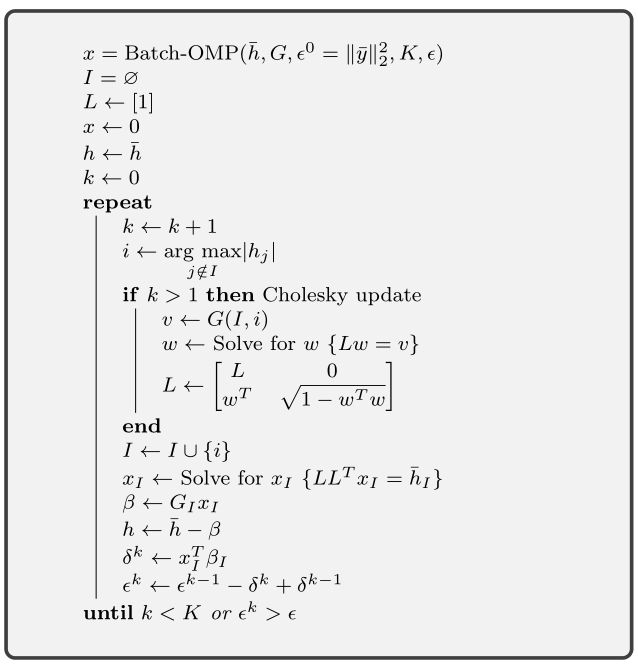

Batch OMP
==================

.. highlight:: matlab

In this section, we develop an efficient version of OMP 
known as Batch OMP :cite:`rubinstein2008efficient`.

In OMP, given a signal :math:`\bar{y}` and a dictionary :math:`\Phi`,
our goal is to iteratively construct a sparse representation
:math:`x` such that :math:`\bar{y} \approx \Phi x` satisfying
either a target sparsity :math:`K` of :math:`x` or
a target error :math:`\| \bar{y} - \Phi x\|_2 \leq \epsilon`.
The algorithm picks an atom from :math:`\Phi` in each
iteration and computes a least squares estimate :math:`y` of :math:`\bar{y}`
on the selected atoms. 
The residual :math:`r = \bar{y} - y` is used to select the
next atom by choosing the atom which matches best with the
residual.
Let :math:`I` be the set of atoms selected in OMP
after some iterations.

Recalling the OMP steps in the next iteration:

#. Matching atoms with residuals: :math:`h = \Phi^T r`
#. Finding the new atom (best match with residual): 
   :math:`i = \underset{j}{\text{arg max}} (\abs(h_j))`
#. Support update: :math:`I = I \cup \{ i \}`
#. Least squares:  :math:`x_I = \Phi_I^{\dag} \bar{y}`
#. Approximation update: :math:`y = \Phi_I x_I = \Phi_I \Phi_I^{\dag} \bar{y}`
#. Residual update: :math:`r = \bar{y} - y = (I - \Phi_I \Phi_I^{\dag}) \bar{y}`
 
Batch OMP is useful when we are trying to reconstruct 
representations of multiple signals at the same time.

Least Squares in OMP using Cholesky Update
-------------------------------------------------

Here we review how least squares can be fast implemented
using Cholesky updates.

In the following, we will denote 

* the matrix :math:`\Phi^T \Phi` by the symbol :math:`G`
* the matrix :math:`\Phi^T \Phi_I` by the symbol :math:`G_I`
* the matrix :math:`(\Phi_I^T \Phi_I)` by the symbol :math:`G_{I, I}`. 

Note that :math:`G_I` is formed by taking the columns indexed by 
:math:`I` from :math:`G`.
The matrix :math:`G_{I, I}` is formed by taking the rows and columns 
both indexed by :math:`I` from :math:`G`.

 
We have

.. math:: 
    x_I = (\Phi_I^T \Phi_I)^{-1} \Phi_I^T y

and 

.. math::    
    y = \Phi_I x_I = \Phi_I \Phi_I^{\dag} \bar{y} 
      = \Phi_I (\Phi_I^T \Phi_I)^{-1} \Phi_I^T \bar{y}.

We can rewrite:

.. math::
    (\Phi_I^T \Phi_I) x_I  = \Phi_I^T \bar{y}.

If we perform a Cholesky decomposition of the Gram matrix 
:math:`G_{I, I} = \Phi_I^T \Phi_I`
as :math:`G_{I, I} = L L^T`, then we have:

.. math::
    
    L L^T x_I =  \Phi_I^T \bar{y}.

Solving this equation involves

* Computing :math:`b = \Phi_I^T \bar{y}`
* Solving the triangular system :math:`L u = b`
* Solving the triangular system :math:`L^T x_I = u`

We also need an efficient way of computing :math:`L`.
It so happens that the Cholesky decomposition
:math:`G_{I, I} = L L^T` can be updated incrementally in each
iteration of OMP.
Let 

* :math:`I^k` denote the index set of chosen atoms after
  k iterations.
* :math:`\Phi_{I^k}` denote the corresponding subdictionary
  of chosen atoms.
* :math:`G_{I^k, I^k}` denote the Gram matrix :math:`\Phi_{I^k}^T \Phi_{I^k}`.
* :math:`L^k` denote the Cholesky decomposition of `G_{I^k, I^k}`.
* :math:`i^k` be the index of atom chosen in k-th iteration.

The Cholesky update process aims to compute :math:`L^k`
given :math:`L^{k-1}` and :math:`i^k`.
Note that we can write

.. math::
    G_{I^k, I^k} = \begin{split}\Phi_{I^k}^T \Phi_{I^k} = \begin{bmatrix}
       \Phi_{I^{k-1}}^T \Phi_{I^{k-1}}  & \Phi_{I^{k-1}}^T \phi_{i^k}\\
       \phi_{i^k}^T \Phi_{I^{k-1}} & \phi_{i^k}^T \phi_{i^k}
    \end{bmatrix}.\end{split}

Define :math:`v = \Phi_{I^{k-1}}^T \phi_{i^k}`.
Note that :math:`\phi_{i^k}^T \phi_{i^k} = 1` for dictionaries
with unit norm columns.
This gives us:

.. math::
    \begin{split} G_{I^k, I^k} = \begin{bmatrix}
        G_{I^{k-1}, I^{k-1}} & v \\
        v^T & 1
    \end{bmatrix}.\end{split}

This can be solved to give us an equation for update of Cholesky decomposition:

.. math::
    \begin{split}L^k = \begin{bmatrix}
        L^{k - 1} & 0 \\
        w^T &  \sqrt{1 - w^T w}
    \end{bmatrix}\end{split}

where :math:`w` is the solution of the triangular system
:math:`L^{k - 1} w = v`.

Removing residuals from the computation
---------------------------------------------

An interesting observation on OMP is that the real goal
of OMP is to identify the index set of atoms participating
in the sparse representation of :math:`\bar{y}`. The computation
of residuals is just a way of achieving the same. If the
index set has been identified, then the sparse representation
is given by :math:`x_I = \Phi_I^{\dag} \bar{y}` with all
other entries in :math:`x` set to zero and the sparse
approximation of :math:`y` is given by :math:`\Phi_I x_I`.

The selection of atoms doesn't really need the residual
explicitly. All it needs is a way to update the inner
products of atoms in :math:`\Phi` with the current residual.
In this section, we will rewrite the OMP steps in a way
that doesn't require explicit computation of residual.

We begin with pre-computation of :math:`\bar{h} = \Phi^T \bar{y}`.
This is the initial value of :math:`h` (the inner products
of atoms in dictionary with the current residual).
This computation is anyway needed for OMP.
Now, let's expand the calculation of :math:`h`: 

.. math::
    \begin{aligned}
    h  &= \Phi^T r \\
       &= \Phi^T (\bar{y} - y) \\
       &= \Phi^T (I - \Phi_I \Phi_I^{\dag}) \bar{y}\\
       &= \Phi^T \bar{y} - \Phi^T \Phi_I \Phi_I^{\dag}) \bar{y}\\
       &= \bar{h} - G_I G_{I, I}^{-1} \Phi_I^T \bar{y}\\
       &= \bar{h} - G_I x_I.
    \end{aligned}

But :math:`\Phi_I^T \bar{y}` is nothing but :math:`\bar{h}_I`.
Thus, 

.. math::
    h =  \bar{h} - G_I G_{I, I}^{-1} \bar{h}_I.

This means that if :math:`\bar{h} = \Phi^T \bar{y}` 
and :math:`G = \Phi^T \Phi` have been precomputed,
then :math:`h` can be computed for each iteration
without explicitly computing the residual.

If we are reconstructing just one signal, then the computation
of :math:`G` is very expensive. But, if we are reconstructing
thousands of signals together in batch, computation of
:math:`G` is actually a minuscule factor in overall computation.
This is the essential trick in Batch OMP algorithm.

There is one more issue to address. A typical halting 
criterion in OMP is the error based stopping criterion 
which compares the norm of the residual with a threshold.
If the residual norm goes below the threshold, we stop OMP.
If the residual is not computed explicitly, the it becomes
challenging to apply this criterion. However, there is a way out. In the following, let

* :math:`x_{I^k} = \Phi_{I^k}^{\dag} \bar{y}` be the non-zero
  entries in the k-th sparse representation
* :math:`x^k` denote the k-th sparse representation
* :math:`y^k` be the k-th sparse approximation :math:`y^k = \Phi x^k = \Phi_{I^k} x_{I^k}`
* :math:`r^k` be the residual :math:`\bar{y} - y^k`.

We start by writing a residual update equation.
We have:

.. math::
    \begin{aligned}
    r^k &= \bar{y} - y^k = \bar{y} - \Phi x^k \\
    r^{k-1} &= \bar{y} - y^{k-1} = \bar{y} - \Phi x^{k -1}. 
    \end{aligned}

Combining the two, we get:

.. math::

    r^k = r^{k -1} + \Phi (x^{k -1 } - x^k) = r^{k -1} + y^{k -1} - y^k. 

Due to the orthogonality of the residual, we have
:math:`\langle r^k, y^k \rangle = 0`. Using
this property and a long derivation (in eq 2.8 of :cite:`rubinstein2008efficient`), we obtain the relationship:

.. math::

    \| r^k \|_2^2 = \| r^{k -1} \|_2^2 
    - (x^k)^T G x^k +  (x^{k-1})^T G x^{k-1}.

We introduce the symbols 
:math:`\epsilon^k = \| r^k \|_2^2`
and :math:`\delta^k = (x^k)^T G x^k`. The previous
equation reduces to:

.. math::
    \epsilon^k = \epsilon^{k-1} - \delta^{k -1} + \delta^{k}.

Thus, we just need to keep track of the quantity
:math:`\delta^k`. 
Note that :math:`\delta^0 = 0` since
the initial estimate :math:`x^0 = 0` for OMP.

Recall that

.. math::

    \begin{aligned}
    G x &= G_I x_I \\
        &= G_I \Phi_I^{\dag} \bar{y}\\
        & = G_I (\Phi_I^T \Phi_I)^{-1} \Phi_I \bar{y}\\
        &= G_I G_{I, I}^{-1} \Phi_I \bar{y}\\
        &= G_I G_{I, I}^{-1} \bar{h}_I 
    \end{aligned}

which has already been computed for updating :math:`h`
and can be reused. So

.. math::

    \delta^k = (x^k)^T G x^k
    = (x^k)^T \left( G_{I^k} G_{{I^k}, {I^k}}^{-1} \bar{h}_{I^k} \right)

which is a simple inner product.

The Batch OMP Algorithm
---------------------------------

The batch OMP algorithm is described in the figure 
below.

The inputs are

* The Gram matrix :math:`G = \Phi^T \Phi`.
* The initial correlation vector :math:`\bar(h) = \Phi^T \bar{y}`.
* The squared norm :math:`\epsilon^0` of the signal 
  :math:`\bar{y}` whose sparse representation we are
  constructing.
* The upper bound on the desired sparsity level :math:`K`
* Residual norm (squared) threshold :math:`\epsilon`.

It returns the sparse representation :math:`x`.

Note that the algorithm doesn't need direct access to
either the dictionary :math:`\Phi` or the signal
:math:`\bar{y}`.

.. note::

    The sparse vector :math:`x` is
    usually returned as a pair of 
    vectors :math:`I` and :math:`x_I`.
    This is more efficient in terms of
    space utilization.

Fast Batch OMP Implementation
--------------------------------------

As part of `sparse-plex`_,
we provide a fast CPU based implementation of Batch OMP.
It is up to 3 times faster than the Batch OMP 
implementation in `OMPBOX`_.

This is written in C and uses the
BLAS and LAPACK features available in MATLAB.
The implementation is available in the function
`spx.fast.batch_omp`_.  
The corresponding C code is in `batch_omp.c`_. 

.. rubric:: A Simple Example

Let's create a Gaussian matrix (with normalized columns)::

    M = 400;
    N = 1000;
    Phi = spx.dict.simple.gaussian_mtx(M, N);

See :ref:`cs-hands-on-gaussian-sensing-matrices` for details.

Let's create a few thousand sparse signals::

    K = 16;
    S = 5000;
    X = spx.data.synthetic.SparseSignalGenerator(N, K, S).biGaussian();

See :ref:`sec:pursuit:testing:synthetic-sparse-representations` 
for details.

Let's compute their measurements using the Gaussian matrix::

    Y = Phi*X;

We wish to recover :math:`X` from :math:`Y` and :math:`\Phi`.

Let's precompute the Gram matrix::

    G = Phi' * Phi;

Let's precompute the correlation vectors for each signal::

    DtY = Phi' * Y;

Let's perform sparse recovery using Batch OMP and time it::

    start_time = tic;
    result = spx.fast.batch_omp(Phi, [], G, DtY, K, 1e-12);
    elapsed_time = toc(start_time);
    fprintf('Time taken: %.2f seconds\n', elapsed_time);
    fprintf('Per signal time: %.2f usec', elapsed_time * 1e6/ S);

    Time taken: 0.52 seconds
    Per signal time: 103.18 usec

We note that the reconstruction has happened very quickly
taking about just 100 micro seconds per signal.

We can verify the correctness of the result::

    cmpare = spx.commons.SparseSignalsComparison(X, result, K);
    cmpare.summarize();

    Signal dimension: 1000
    Number of signals: 5000
    Combined reference norm: 536.04604784
    Combined estimate norm: 536.04604784
    Combined difference norm: 0.00000000
    Combined SNR: 302.5784 dB

    All signals have indeed been recovered correctly.
    See :ref:`sec:library-commons-comparison-sparse` for 
    details about ``SparseSignalsComparison``.

For comparison, let's see the time taken by Fast OMP 
implementation::

    fprintf('Reconstruction with Fast OMP')
    start_time = tic;
    result = spx.fast.omp(Phi, Y, K, 1e-12);
    elapsed_time = toc(start_time);
    fprintf('Time taken: %.2f seconds\n', elapsed_time);
    fprintf('Per signal time: %.2f usec', elapsed_time * 1e6/ S);

    Reconstruction with Fast OMPTime taken: 4.39 seconds
    Per signal time: 878.88 usec

See :ref:`sec:pursuit:omp:fast` for details about our
fast OMP implementation.

Fast Batch OMP implementation is more than 
8 times faster than fast OMP implementation
for this problem configuration (M, N, K, S).

.. rubric:: Benchmarks

.. list-table:: System configuration

    * - OS
      - Windows 7 Professional 64 Bit
    * - Processor
      - Intel(R) Core(TM) i7-3630QM CPU @ 2.40GHz
    * - Memory (RAM)
      - 16.0 GB
    * - Hard Disk
      - SATA 120GB
    * - MATLAB
      - R2017b

The method for benchmarking has been adopted from 
the file ``ompspeedtest.m`` in the `OMPBOX`_ 
package by Ron Rubinstein.

We compare following algorithms:

* Batch OMP in OMPBOX.
* Our C version in `sparse-plex`_.

The work load consists of a Gaussian dictionary of
size :math:`512 \times 1000`.  Sufficient signals
are chosen so that the benchmarks can run reasonable duration.
8 sparse representations are constructed for each 
randomly generated signal in the given dictionary.

::

    Speed summary for 178527 signals, dictionary size 512 x 1000:
    Call syntax        Algorithm               Total time
    --------------------------------------------------------
    OMP(D,X,G,T)                     Batch-OMP               60.83 seconds
    OMP(DtX,G,T)                     Batch-OMP with DTX    12.73 seconds
    SPX-Batch-OMP(D, X, G, [], T)    SPX-Batch-OMP           19.78 seconds
    SPX-Batch-OMP([], [], G, Dtx, T) SPX-Batch-OMP DTX      7.25 seconds
    Gain SPX/OMPBOX without DTX 3.08
    Gain SPX/OMPBOX with DTX 1.76

Our implementation is up to 3 times faster on this large 
workload.

The benchmark generation code is in `ex_fast_batch_omp_speed_test.m`_.

.. _sparse-plex: https://github.com/indigits/sparse-plex

.. _OMPBOX: http://www.cs.technion.ac.il/~ronrubin/software.html

.. _batch_omp.c: https://github.com/indigits/sparse-plex/blob/master/library/%2Bspx/%2Bfast/private/batch_omp.c

.. _spx.fast.batch_omp: https://github.com/indigits/sparse-plex/blob/master/library/%2Bspx/%2Bfast/batch_omp.m

.. _ex_fast_batch_omp_speed_test.m: https://github.com/indigits/sparse-plex/blob/master/experiments/fast_batch_omp/ex_fast_batch_omp_speed_test.m