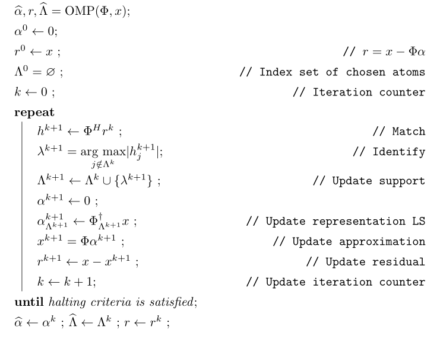

Sparse approximation conditions
=========================================

We now remove the assumption that :math:`x` is :math:`K`-sparse in :math:`\Phi`.  This
is indeed true for all real life signals as they are not truly sparse.

In this section we will look at conditions under which
OMP can successfully solve the :math:`(\mathcal{D}, K)`-:textsc:`sparse` approximation
problem. 

Let :math:`x` be an arbitrary signal and suppose that :math:`\alpha_{\text{opt}}` is
an optimum :math:`K`-term approximation representation of :math:`x`. i.e. 
:math:`\alpha_{\text{opt}}`  is a solution to :eq:`eq:ssm:d_k_sparse_approximation_problem`
and the optimal :math:`K`-term approximation of :math:`x` is given by

.. math:: 

    x_{\text{opt}} = \Phi \alpha_{\text{opt}}.

We note that :math:`\alpha_{\text{opt}}`  may not be unique. 

Let :math:`\Lambda_{\text{opt}}` be the support of :math:`\alpha_{\text{opt}}` which 
identifies the atoms in :math:`\Phi` that participate in the :math:`K`-term approximation of
:math:`x`.

Once again let :math:`\Phi_{\text{opt}}` be the sub-matrix consisting of columns
of :math:`\Phi` indexed by  :math:`\Lambda_{\text{opt}}`. 

We assume that columns in :math:`\Phi_{\text{opt}}` are linearly independent. 
This is easily established since if any atom in this set were linearly dependent
on other atoms, we could always find a more optimal solution.

Again let :math:`\Psi_{\text{opt}}` be the matrix of :math:`(D - K)` columns which
are not indexed by :math:`\Lambda_{\text{opt}}`.

We note that if :math:`\Lambda_{\text{opt}}` is identified then finding
:math:`\alpha_{\text{opt}}` is a straightforward least squares problem.

We now present a condition under which Orthogonal Matching Pursuit is able
to recover the optimal atoms.

.. _thm:greedy:omp:general_recovery:

.. theorem:: 

    Assume that :math:`\mu_1(K) < \frac{1}{2}`, and suppose that at :math:`k`-th
    iteration, the support :math:`S^k` for :math:`\alpha^k` consists only of atoms from
    an optimal :math:`k`-term approximation of the signal :math:`x`.At step :math:`(k+1)`, 
    Orthogonal Matching Pursuit will recover another atom indexed by
    :math:`\Lambda_{\text{opt}}` whenever
    
    
    .. math::
        :label: eq:greedy:omp:general_recovery
    
        \| x - \Phi \alpha^k \|_2 > \sqrt{1 + \frac{K ( 1 - \mu_1(K))}{(1 - 2 \mu_1(K))^2} } \;
        \| x - \Phi \alpha_{\text{opt}}\|_2.
    

A few remarks are in order.

*  :math:`\| x - \Phi \alpha^k \|_2` is the approximation error norm at 
   :math:`k`-th iteration.
*  :math:`\| x - \Phi \alpha_{\text{opt}}\|_2` is the optimum approximation
   error after :math:`K` iterations.
*  The theorem says that OMP makes absolute progress whenever the current
   error is larger than optimum error by a factor.
*  As a result of this theorem, we note that every optimal :math:`K`-term
   approximation of :math:`x` contains the same kernel of atoms. The optimum error
   is always independent of choice of atoms in :math:`K` term approximation (since 
   it is optimum). Initial error is also independent of choice of atoms (since
   initial support is empty). OMP always selects the same set of atoms by design.

.. proof:: 

    Let us assume that after :math:`k` steps, OMP has recovered an approximation :math:`x^k` 
    given by
    
    
    .. math:: 
    
        x^k = \Phi \alpha^k
    
    where :math:`S^k = \supp(\alpha^k)` chooses :math:`k` columns from :math:`\Phi`
    all of which belong to :math:`\Phi_{\text{opt}}`.
    
    Let the residual at :math:`k`-th stage be
    
    
    .. math:: 
    
        r^k = x - x^k =  x - \Phi \alpha^k.
    
    
    Recalling from previous section, a sufficient condition for 
    recovering another optimal atom is
    
    
    .. math::
        \rho(r^k) = \frac{\| \Psi_{\text{opt}}^H r^k \|_{\infty}}{\| \Phi_{\text{opt}}^H r^k \|_{\infty}} < 1.
    
    
    One difference from previous section is that :math:`r^k \notin \ColSpace(\Phi_{\text{opt}})`.
    
    We can write
    
    
    .. math:: 
    
        r^k = x - x^k = (x  - x_{\text{opt}}) + (x_{\text{opt}} - x^k).
    
    
    Note that :math:`(x  - x_{\text{opt}})` is nothing but the residual left after
    :math:`K` iterations. 
    
    We also note that since residual in OMP is always orthogonal to already selected
    columns, hence
    
    
    .. math:: 
    
        \Phi_{\text{opt}}^H (x  - x_{\text{opt}}) = 0.
    
    
    We will now use these expressions to simplify :math:`\rho(r^k)`.
    
    
    
    .. math::
        \begin{aligned}
        \rho(r^k) 
        &= \frac{\| \Psi_{\text{opt}}^H r^k \|_{\infty}}
        {\| \Phi_{\text{opt}}^H r^k \|_{\infty}}\\
        &=  \frac{\| \Psi_{\text{opt}}^H (x - x_{\text{opt}}) + \Psi_{\text{opt}}^H (x_{\text{opt}} - x^k)\|_{\infty}}
        {\| \Phi_{\text{opt}}^H (x - x_{\text{opt}})  + \Phi_{\text{opt}}^H  (x_{\text{opt}} - x^k) \|_{\infty}}\\
        & = \frac{\| \Psi_{\text{opt}}^H (x - x_{\text{opt}}) + \Psi_{\text{opt}}^H (x_{\text{opt}} - x^k)\|_{\infty}}
        {\| \Phi_{\text{opt}}^H  (x_{\text{opt}} - x^k) \|_{\infty}}\\
        &\leq \frac{\| \Psi_{\text{opt}}^H (x - x_{\text{opt}})\|_{\infty}}
        {\| \Phi_{\text{opt}}^H  (x_{\text{opt}} - x^k) \|_{\infty}}
        + \frac{\| \Psi_{\text{opt}}^H (x_{\text{opt}} - x^k)\|_{\infty}}
        {\| \Phi_{\text{opt}}^H  (x_{\text{opt}} - x^k) \|_{\infty}}
        \end{aligned} 
    
    
    We now define two new terms
    
    
    
    .. math::
        \rho_{\text{err}}(r^k) \triangleq \frac{\| \Psi_{\text{opt}}^H (x - x_{\text{opt}})\|_{\infty}}
        {\| \Phi_{\text{opt}}^H  (x_{\text{opt}} - x^k) \|_{\infty}}
    
    and
    
    
    .. math::
        \rho_{\text{opt}}(r^k) \triangleq  \frac{\| \Psi_{\text{opt}}^H (x_{\text{opt}} - x^k)\|_{\infty}}
        {\| \Phi_{\text{opt}}^H  (x_{\text{opt}} - x^k) \|_{\infty}}.
    
    
    With these we have
    
    
    .. math::
        :label: eq:greedy:omp_rho_r_k_sparse_opt_err_breakup
    
        \rho(r^k) \leq \rho_{\text{opt}}(r^k) + \rho_{\text{err}}(r^k)
    
    
    Now :math:`x_{\text{opt}}` has an exact :math:`K`-term representation in :math:`\Phi` given by
    :math:`\alpha_{\text{opt}}`. Hence :math:`\rho_{\text{opt}}(r^k)` is nothing
    but :math:`\rho(r^k)` for corresponding :textsc:`exact-sparse` problem.
    
    From the proof of :ref:`here <thm:greedy:omp_exact_recovery_babel_function>` we recall
    
    
    
    .. math::
        \rho_{\text{opt}}(r^k) \leq \frac{\mu_1(K)}{1 - \mu_1(K-1)} 
        \leq \frac{\mu_1(K)}{1 - \mu_1(K)}
    
    since
    
    
    .. math:: 
    
        \mu_1(K-1) \leq \mu_1(K) \implies 1 - \mu_1(K-1) \geq 1 - \mu_1(K).
    
    
    The remaining problem is :math:`\rho_{\text{err}}(r^k)`. Let us look
    at its numerator and denominator one by one.
    
    :math:`\| \Psi_{\text{opt}}^H (x - x_{\text{opt}})\|_{\infty}` 
    essentially is the maximum (absolute) inner product between
    any column in :math:`\Psi_{\text{opt}}` with :math:`x - x_{\text{opt}}`.
    
    We can write 
    
    
    .. math:: 
    
        \| \Psi_{\text{opt}}^H (x - x_{\text{opt}})\|_{\infty} 
        \leq \underset{\psi}{\max} | \psi^H (x - x_{\text{opt}}) |
        \leq \underset{\psi}{\max} \|\psi \|_2 \| x - x_{\text{opt}}\|_2
        = \| x - x_{\text{opt}}\|_2
    
    since all columns in :math:`\Phi` are unit norm. In between we used
    Cauchy-Schwartz inequality.
    
    Now look at denominator :math:`\| \Phi_{\text{opt}}^H  (x_{\text{opt}} - x^k) \|_{\infty}`
    where :math:`(x_{\text{opt}} - x^k) \in \CC^N`
    and  :math:`\Phi_{\text{opt}} \in \CC^{N \times K}.`
    Thus
    
    
    .. math:: 
    
        \Phi_{\text{opt}}^H  (x_{\text{opt}} - x^k) \in \CC^{K}.
    
    
    Now for every :math:`v \in \CC^K` we have
    
    
    .. math:: 
    
        \| v \|_2 \leq \sqrt{K} \| v\|_{\infty}.
    
    
    Hence
    
    
    .. math:: 
    
        \| \Phi_{\text{opt}}^H  (x_{\text{opt}} - x^k) \|_{\infty}
        \geq K^{-1/2} \| \Phi_{\text{opt}}^H  (x_{\text{opt}} - x^k) \|_2.
    
    
    Since :math:`\Phi_{\text{opt}}` has full column rank, hence its singular values 
    are non-zero. Thus
    
    
    .. math:: 
    
        \| \Phi_{\text{opt}}^H  (x_{\text{opt}} - x^k) \|_2 
        \geq \sigma_{\text{min}}(\Phi_{\text{opt}}) \| x_{\text{opt}} - x^k \|_2.
    
    
    From  :ref:`here <lem:ssm:babel_singular_value_condition>` we have
    
    
    .. math:: 
    
        \sigma_{\text{min}}(\Phi_{\text{opt}}) \geq \sqrt{1 - \mu_1(K-1)} \geq \sqrt{1 - \mu_1(K)}.
    
    
    Combining these observations we get
    
    
    .. math::
        \rho_{\text{err}}(r^k) \leq 
        \frac{\sqrt{K} \| x - x_{\text{opt}}\|_2}
        {\sqrt{1 - \mu_1(K)} \| x_{\text{opt}} - x^k \|_2}.
    
    
    Now from :eq:`eq:greedy:omp_rho_r_k_sparse_opt_err_breakup`
    :math:`\rho(r^k) <1` whenever :math:`\rho_{\text{opt}}(r^k) + \rho_{\text{err}}(r^k) < 1`.
    
    Thus a sufficient condition for :math:`\rho(r^k) <1` can be written as
    
    
    .. math::
        \frac{\mu_1(K)}{1 - \mu_1(K)} + 
        \frac{\sqrt{K} \| x - x_{\text{opt}}\|_2}
        {\sqrt{1 - \mu_1(K)} \| x_{\text{opt}} - x^k \|_2} < 1.
    
    
    We need to simplify this expression a bit. Multiplying by
    :math:`(1 - \mu_1(K))` on both sides we get
    
    
    .. math::
        \begin{aligned}
        &\mu_1(K) + \frac{\sqrt{K} \sqrt{1 - \mu_1(K)} \| x - x_{\text{opt}}\|_2}
        { \| x_{\text{opt}} - x^k \|_2} < 1 - \mu_1(K)\\
        \implies & \frac{\sqrt{K(1 - \mu_1(K)}) \| x - x_{\text{opt}}\|_2}
        { \| x_{\text{opt}} - x^k \|_2} < 1  - 2 \mu_1(K)\\
        \implies & \| x_{\text{opt}} - x^k \|_2 > \frac{\sqrt{K(1 - \mu_1(K)})} {1  - 2 \mu_1(K)}\| x - x_{\text{opt}}\|_2.
        \end{aligned}
    
    
    We assumed :math:`\mu_1(K) < \frac{1}{2}` thus :math:`1 - 2 \mu_1(K) > 0` which validates the
    steps above.
    
    Finally we remember that :math:`(x  - x_{\text{opt}}) \perp \ColSpace(\Phi_{\text{opt}})` and
    :math:`(x_{\text{opt}} - x^k) \in \ColSpace(\Phi_{\text{opt}})` thus :math:`(x  - x_{\text{opt}})` 
    and :math:`(x_{\text{opt}} - x^k)` are orthogonal to each other. Thus by applying Pythagorean theorem
    we have
    
    
    .. math:: 
    
        \| x - x^k\|_2^2 = \| x  - x_{\text{opt}} \|_2^2 + \| x_{\text{opt}} - x^k \|_2^2.
    
    
    Thus we have
    
    
    .. math:: 
    
        \| x - x^k\|_2^2 > \frac{K(1 - \mu_1(K))} {(1  - 2 \mu_1(K))^2}\| x - x_{\text{opt}}\|_2^2 + \| x - x_{\text{opt}}\|_2^2.
    
    
    This gives us a sufficient condition
    
    
    .. math::
        :label: eq:greedy:9c009833-7f6d-4609-9543-6110fdcc8461
    
        \| x - x^k\|_2 > \sqrt{1 + \frac{K(1 - \mu_1(K))} {(1  - 2 \mu_1(K))^2}}\| x - x_{\text{opt}}\|_2.
    
    i.e. whenever :eq:`eq:greedy:9c009833-7f6d-4609-9543-6110fdcc8461` holds true,
    we have :math:`\rho(r^k) < 1` which leads to OMP making a correct choice and choosing an atom from the
    optimal set.
    
    Putting :math:`x^k = \Phi \alpha^k` and :math:`x_{\text{opt}} = \Phi \alpha_{\text{opt}}` we get back
    :eq:`eq:greedy:omp:general_recovery` which is the desired result.

 :ref:`here <thm:greedy:omp:general_recovery>` establishes that
as long as :eq:`eq:greedy:omp:general_recovery` holds for each of the
steps from 1 to :math:`K`, OMP will recover a :math:`K` term optimum approximation :math:`x_{\text{opt}}`.
If :math:`x \in \CC^N` is completely arbitrary, then it may not be possible that 
:eq:`eq:greedy:omp:general_recovery` holds for all the :math:`K` iterations. In this
situation, a question arises as to what is the worst :math:`K`-term approximation error that
OMP will incur if :eq:`eq:greedy:omp:general_recovery` doesn't hold true all the way.

This is answered in following corollary of :ref:`previous theorem <thm:greedy:omp:general_recovery>`.

.. corollary:: 

    Assume that :math:`\mu_1(K)  < \frac{1}{2}` and let :math:`x \in \CC^N` be a completely arbitrary
    signal. Orthogonal Matching Pursuit produces a :math:`K`-term approximation :math:`x^K` which 
    satisfies 
    
    
    .. math::
        :label: eq:greedy:omp:worst_k_term_approximation_error
    
        \| x  - x^K \|_2 \leq \sqrt{1 + C(\DD, K)} \| x - x_{\text{opt}} \|_2
    
    where :math:`x_{\text{opt}}` is the optimum :math:`K`-term approximation of :math:`x` in dictionary :math:`\DD`
    (i.e. :math:`x_{\text{opt}} = \Phi \alpha_{\text{opt}}` where :math:`\alpha_{\text{opt}}`
    is an optimal solution of :eq:`eq:ssm:d_k_sparse_approximation_problem` ). 
    :math:`C(\DD, K)` is a constant depending upon the dictionary :math:`\DD` and
    the desired sparsity level :math:`K`. An estimate of :math:`C(\DD, K)` is given by
    
    
    .. math::
        C(\DD, K) \leq \frac{K ( 1 - \mu_1(K))}{(1 - 2 \mu_1(K))^2}.
    

.. proof:: 

    Suppose that OMP runs fine for first :math:`p` steps where :math:`p < K`. Thus :eq:`eq:greedy:omp:general_recovery` 
    keeps holding for first :math:`p` steps. We now assume that :eq:`eq:greedy:omp:general_recovery`  breaks
    at step :math:`p+1` and OMP is no longer guaranteed to make an optimal choice of column from :math:`\Phi_{\text{opt}}`.
    Thus at step :math:`p+1` we have
    
    
    .. math::
        \| x - x^p \|_2  \leq \sqrt{1 + \frac{K(1 - \mu_1(K))} {(1  - 2 \mu_1(K))^2}} \| x - x_{\text{opt}} \|_2.
    
    Any further iterations of OMP will only reduce the error further (although not in an optimal way). 
    This gives us
    
    
    .. math::
        \| x  - x^K \|_2 \leq \| x - x^p \|_2  \leq \sqrt{1 + \frac{K(1 - \mu_1(K))} {(1  - 2 \mu_1(K))^2}} \| x - x_{\text{opt}} \|_2.
    
    Choosing 
    
    .. math:: 
    
        C(\DD, K) = \frac{K ( 1 - \mu_1(K))}{(1 - 2 \mu_1(K))^2}
    
    we can rewrite this as
    
    
    .. math:: 
    
        \| x  - x^K \|_2 \leq \sqrt{1 + C(\DD, K)} \| x - x_{\text{opt}} \|_2.
    

This is a very useful result. It establishes that even if OMP is not able to recover the optimum :math:`K`-term
representation of :math:`x`, it always constructs an approximation whose error lies
within a constant factor of optimum approximation error where the constant factor is given by
:math:`\sqrt{1 + C(\DD, K)}`.

If the optimum approximation error :math:`\| x - x_{\text{opt}} \|_2` is small then 
:math:`\| x  - x^K \|_2` will also be not too large.

If :math:`\| x - x_{\text{opt}} \|_2` is moderate, then the OMP may inflate the approximation error to
a higher value. But in this case, probably sparse approximation is not the right tool for signal
representation over the dictionary.

