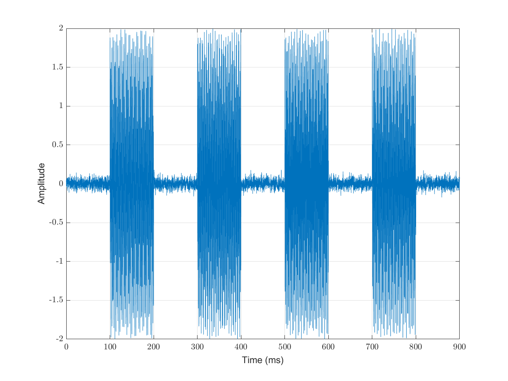
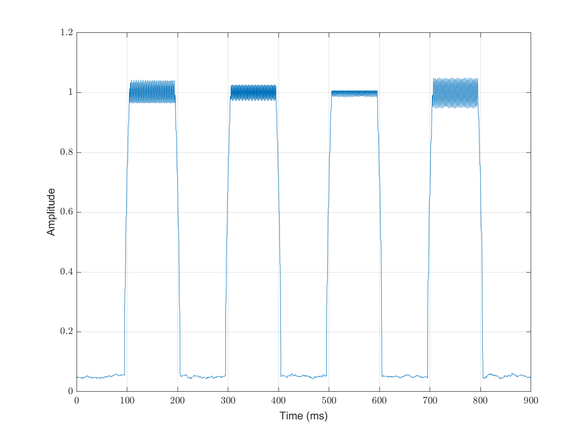
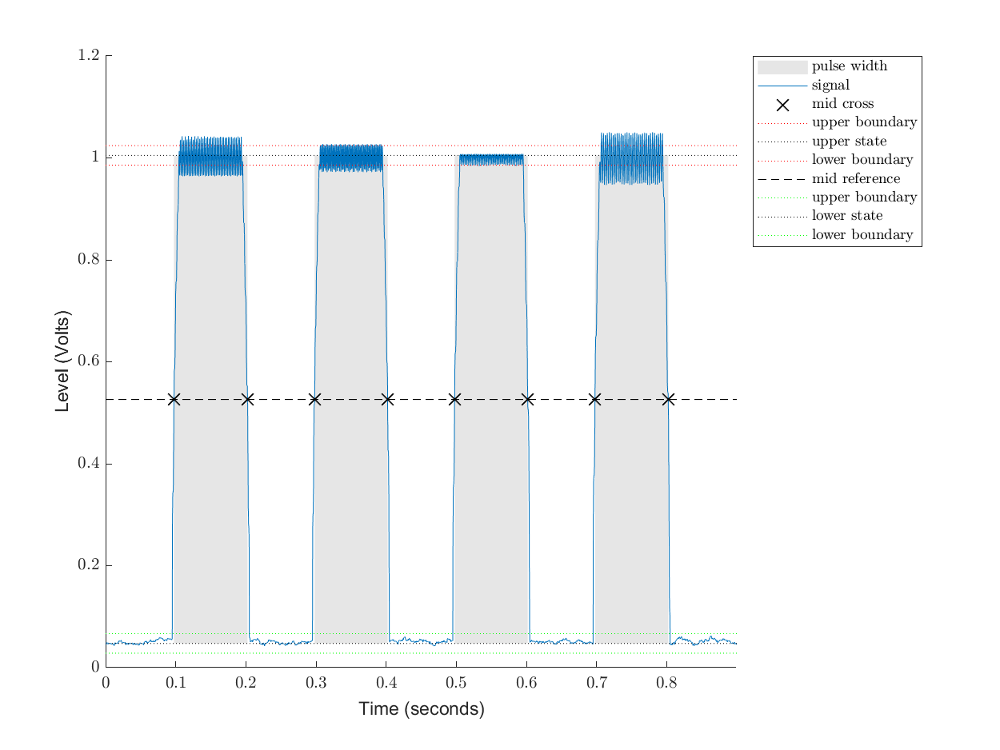
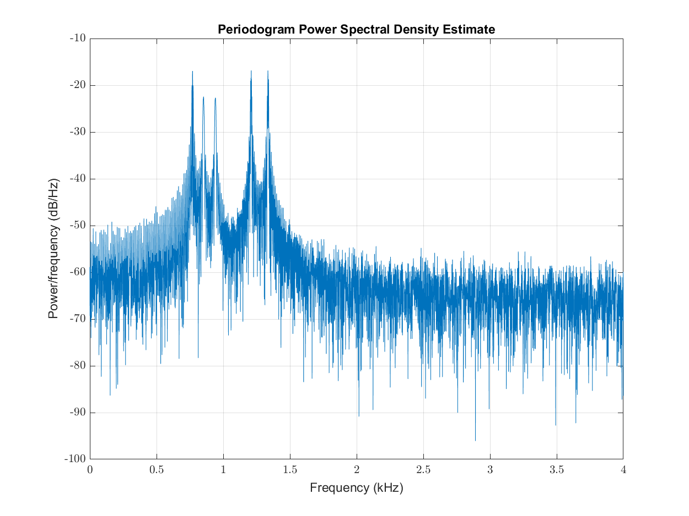
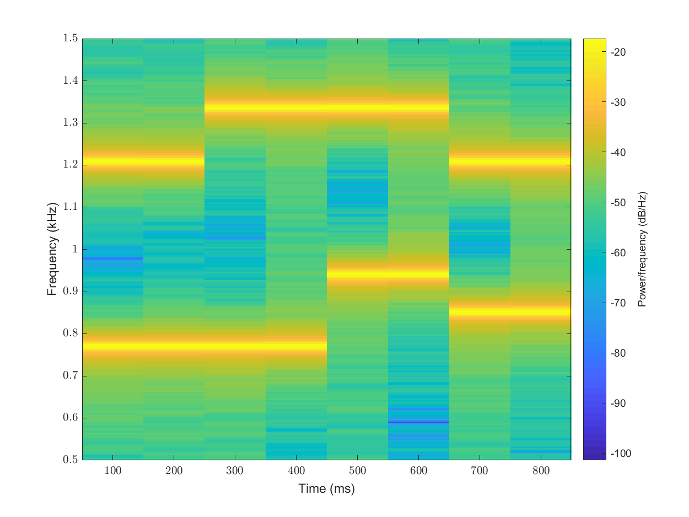
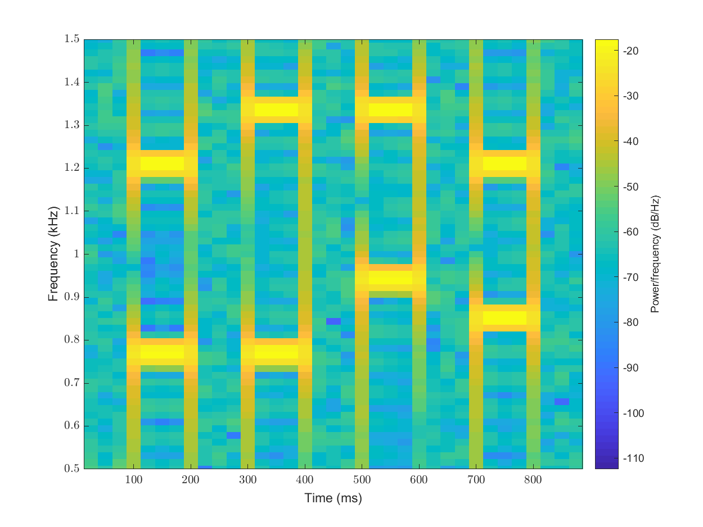
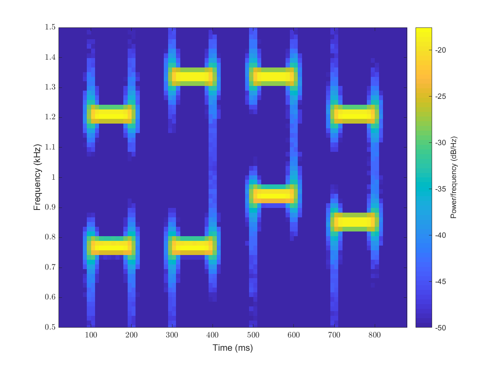
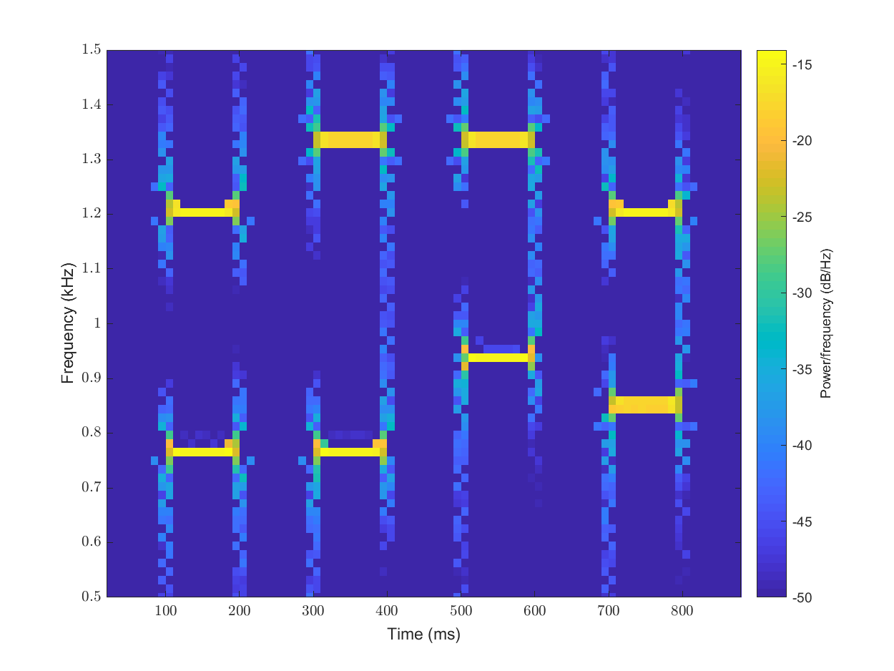

Detecting Dual Tone Multi Frequency Signals
===================================================

.. highlight:: matlab

.. highlights::

    Following Matlab functions are demonstrated
    in this article: 
    ``envelope``, ``pulsewidth``,
    ``periodogram``, ``findpeaks``,
    ``meanfreq``, 

A Dual Tone Multi Frequency (DTMF) signal is the 
signal generated from the punch keys of an ordinary 
telephone.

Each signal consists of a low frequency and a high frequency.

The table below lists the frequencies used for 
various keys.

.. list-table::
    :header-rows: 1

    * - Key
      - Low frequency
      - High frequency
    * - 1
      - 697
      - 1209 Hz
    * - 2
      - 697
      - 1336
    * - 3
      - 697
      - 1477
    * - 4
      - 770
      - 1209
    * - 5
      - 770
      - 1336
    * - 6
      - 770
      - 1477
    * - 7
      - 852
      - 1209
    * - 8
      - 852
      - 1336
    * - 9
      - 852
      - 1477
    * - 0
      - 941
      - 1336
    * - *
      - 941
      - 1209
    * - #
      - 941
      - 1477

Let's create a DTMM signal for the sequence
of symbols 4, 5, 0, 7::

    [signal, fs] = spx.dsp.dtmf({'4', '5', '0', '7'});

The corresponding time stamps::

    time = (0:(numel(signal) - 1)) / fs;

Let's plot it::

    plot(1e3*time, signal);
    xlabel('Time (ms)');
    ylabel('Amplitude');
    grid on;
    

The pulses are 100 ms wide. The gap between pulses 
is also 100 ms wide and consists of Gaussian noise.

Our challenge would be to isolate
the frequencies and identify the symbols
transmitted.

Envelope
---------------

We can look at the shape of the pulses 
where the symbols were punched by looking
at the RMS envelope of the signal::

    envelope_signal = envelope(signal, 80,'rms');
    plot(1e3*time, envelope_signal);

We are computing the RMS envelopes for
window size of 80 samples.

It is now easy to identify the pulses::

    pulsewidth(envelope_signal,fs)
    ans =

        0.1050
        0.1041
        0.1042
        0.1045

The recognized pulses are pretty close in size
to the actual pulse size of 100 ms each.

Periodogram
--------------

A periodogram can help us identify the dominant
frequencies present in the signal.

The frequencies involved in the sequence 4507 are
4 (770, 1209), 5(770, 1336), 0 (941, 1336),
7 (852, 1209).

We note that 770 Hz, 1209 Hz and 1336 Hz repeat twice, hence
we expect them to have more contribution in the
power spectrum. Other frequencies are 
941 and 852 Hz.

Computing the periodogram is straight-forward::

    [pxx,f]=periodogram(signal,[],[],fs);

Here is the display of power spectrum in deciBels.

We wish to isolate the peak frequencies from this plot::

    [peak_values, peak_freqs] = findpeaks(pxx, f, 'SortStr','descend', 'MinPeakHeight', max(pxx) / 10);
    peak_freqs = round(peak_freqs');

>> sort(peak_freqs)

ans =

  Columns 1 through 9

         766         771         774         853         941        1203        1205        1208        1210

  Columns 10 through 14

        1212        1215        1331        1335        1340

a. The frequencies 766, 771 and 774 are near 770 Hz.
#. 853 is near 852 Hz.
#. 941 matches 941 Hz.
#. 1203, 1205, 1208, 1210, 1212 and 1215 are near 1209 Hz.
#. 1331, 1335 and 1340 are near 1336 Hz.

Thus, the periodogram has been able to identify all the
relevant frequencies in the signal and their power 
contribution appears to match well in their contribution
in the constitution of the sequence 4502.

However, the periodogram is unable to localize the
frequencies in time and hence is unable to tell us
exactly which symbols were transmitted.

It is instructive to compute the mean frequencies
in different bands::

    >> round(meanfreq(pxx, f, 700 + [0, 100]))

    ans =

       769

    >> round(meanfreq(pxx, f, 800 + [0, 100]))

    ans =

       851

    >> round(meanfreq(pxx, f, 900 + [0, 100]))

    ans =

       941

    >> round(meanfreq(pxx, f, 1200 + [0, 100]))

    ans =

            1211

    >> round(meanfreq(pxx, f, 1300 + [0, 100]))

    ans =

            1336

The mean frequencies in these bands are mostly spot-on
or very close to actual frequencies sent in the DTMF signal.

Spectrogram
----------------------

While, we have been able to identify the
frequencies present in the signal, we haven't 
been able to localize them in time. Thus,
we are unable to identify exactly which symbols
were sent.

The spectrogram provides us the time-frequency 
representation of the signal::

    spectrogram(signal, [], [], [], fs, 'yaxis');
    % restrict the y-axis between 500Hz to 1500 Hz.
    ylim([0.5 1.5]);

In this plot, it is clearly visible that at any
point of time, two frequencies are active.
There are four different symbols which seem to have
been sent.

#. In the first symbol, the frequencies active seem
   to be around 770Hz and 1200 Hz which maps to the symbol 4.
#. In the second symbol, the frequencies active seem
   to be around 770Hz and 1330 Hz which maps to the symbol 5.
#. Similarly, we can see that the symbols 0 and 7 are
   easily visible in the spectrogram.

This spectrogram is not able to localize the 
symbols accurately. We are unable to see the
portions where no symbols are being sent and
only noise is present.

By default the ``spectrogram`` has following parameters:

* Signal is divided into segments which are 
  around 22% of the length of the signal.
* The segments overlap each other by 50%.
* No windowing is done for computing the
  FFT of each segment.

We should increase the time resolution of
the spectrogram.

Let's have a window length of 50 ms::

    window_length = floor(fs * 50 / 1000);

Let's continue to have overlap of 50%::

    overlap_length = floor(window_length / 2);

The FFT length depends on the window length::

    n_fft = 2^nextpow2(window_length);

We will compute the spectrogram with Hamming window::

    spectrogram(signal,hamming(window_length),overlap_length,n_fft, fs, 'yaxis');
    ylim([0.5 1.5]);

Let's visualize the results:

In this spectrogram, it is easy to 
see how the pulses in the signal are
clearly visible and their frequencies
can be easily read off the diagram.

While, we have improved time localization of pulses,
the frequency localization has suffered a bit.
Since, our interest is only in knowing the
mean frequencies, this loss of frequency
localization is not that important in this case.

We can remove the frequencies which are contributing
very small values to the spectrogram and enhance 
the prominent frequencies in the output.
Also, we can increase the overlap between
subsequent windows to introduce more spectrum lines
and make the spectrogram look smoother::

    overlap_length = floor(0.8 * window_length );
    spectrogram(signal,hamming(window_length),overlap_length,n_fft, fs, 'yaxis', 'MinThreshold', -50);
    ylim([0.5 1.5]);

By computing the center of energy for each spectral
estimate  in both time and frequency, we can
do spectral reassignment. This gives us a much
cleaner and crisper spectrogram.

Decoding the symbols
---------------------------

The complete process for decoding the DTMF sequence 
using the spectrogram has been implemented in 
the function ``spx.dsp.dtmf_decoder``.

The function does the following:

* Compute the spectrogram
* Identify the times where spectral content has high energy
* Identify peak frequencies at these times
* Match these frequencies to the nearest low and high
  frequencies of DTMF sequences.
* Map the identified frequencies to actual symbols.
* Identify the start and duration of each symbol in terms of time.

You are welcome to look at the implementation.

We show the example use::

    >> [symbols, starts, durations] = spx.dsp.dtmf_detector(signal, fs)

    symbols =

      1×4 cell array

        {'4'}    {'5'}    {'0'}    {'7'}

    starts =

        0.1000    0.3000    0.5000    0.7000

    durations =

        0.1000    0.1000    0.1000    0.1000

Another example::

    >> [signal, fs] = spx.dsp.dtmf({'2', '3', '4', '6', '*'});
    >> [symbols, starts, durations] = spx.dsp.dtmf_detector(signal, fs)

    symbols =

      1×5 cell array

        {'2'}    {'3'}    {'4'}    {'6'}    {'*'}

    starts =

        0.1000    0.3000    0.5000    0.7000    0.9000

    durations =

        0.1000    0.1000    0.1000    0.1000    0.1000

