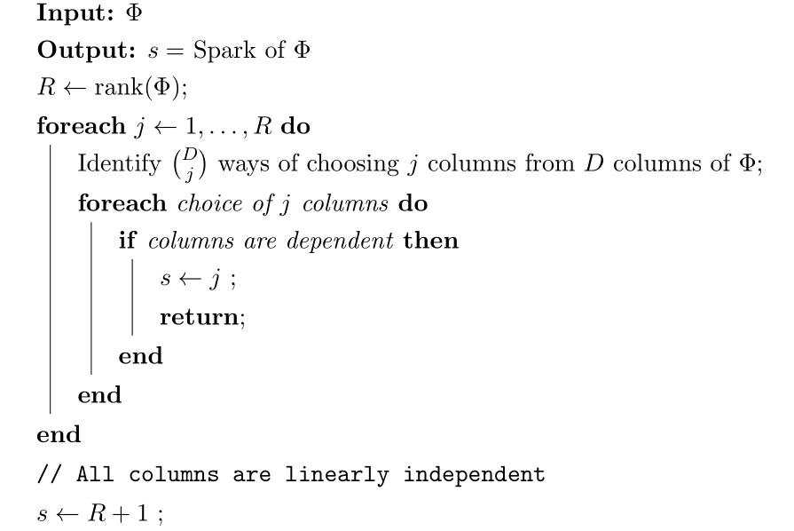

Spark
----------------------------------------------------

.. _def:spark:

.. definition:: 

    
    The  **spark**  of a given matrix  :math:`\Phi` 
    is the smallest number of columns of  :math:`\Phi` that
    are linearly dependent. If all columns are linearly independent, then
    the spark is defined to be number of columns plus one.
     
    .. index:: Spark
    

Note that the definition of spark applies to all matrices (wide, tall or square). It is not
restricted to the synthesis matrices for a dictionary.

Correspondingly, the spark of a dictionary is defined as the minimum number of atoms
which are linearly dependent.

We recall that  *rank*  of a matrix is defined as the maximum number of columns which
are linearly independent. Definition of spark bears remarkable resemblance yet its very hard 
to obtain as it requires a combinatorial search over all possible subsets of columns of  :math:`\Phi`.

.. example:: Spark

    * Spark of the  :math:`3 \times 3` identity matrix    

      .. math:: 
    
                \begin{pmatrix}
                    1 & 0 & 0\\
                    0 & 1 & 0 \\
                    0 & 0 & 1
                \end{pmatrix}
    
      is 4 since all columns are linearly independent.
        
    
    * Spark of the  :math:`2 \times 4` matrix 

      .. math:: 
    
        \begin{pmatrix}
            1 & 0 & -1 & 0\\
            0 & 1 & 0 & -1
        \end{pmatrix}
    
      is 2 since column 1 and 3 are linearly dependent.
    
    * If a matrix has a column with all zero entries, then the spark of such 
      a matrix is 1.  This is a trivial case
      and we will not consider such matrices in the sequel.
    
    * In general for an  :math:`N \times D` synthesis matrix,  
      :math:`\spark(\DDD) \in [2, N+1]`.
    
A naive combinatorial algorithm to calculate the spark of a matrix is given below.

.. _alg:ssm:spark_combinatorial_search:

    A naive algorithm to compute the spark of a matrix

Spark is useful in characterizing the uniqueness of the solution
of a  :math:`(\DDD, K)`- :textsc:`exact-sparse`  problem.

.. remark:: 

    The  :math:`l_0`-"norm" of vectors belonging to null space of a 
    matrix  :math:`\Phi` is greater than or equal to  :math:`\spark(\Phi)`:
        
    .. math::
        \| x \|_0 \geq \spark(\Phi) \Forall x\in \NullSpace(\Phi).
    
.. proof:: 

    If  :math:`x \in \NullSpace(\Phi)` then  :math:`\Phi x = 0`. Thus non-zero entries in  :math:`x` pick a set of columns in  :math:`\Phi` 
    which are linearly dependent. Clearly  :math:`\| x \|_0` indicates the number of columns in the set which are
    linearly dependent. By definition spark of  :math:`\Phi` indicates the minimum number of columns which are linearly
    dependent hence the result.
    
    
    .. math:: 
    
        \| x \|_0 \geq \spark(\Phi) \Forall x\in \NullSpace(\Phi).
    

We now present a criteria based on spark which characterizes the uniqueness of a sparse solution 
to the problem  :math:`y = \Phi x`.

.. _thm:ssm:uniqueness_spark:

.. theorem:: 

     
    .. index:: Uniqueness Spark
    

    
    Consider a solution  :math:`x^*` to the under-determined system  :math:`y = \Phi x`. If  :math:`x^*` obeys
    
    
    .. math::
        \| x^* \|_0 < \frac{\spark(\Phi)}{2}
    
    then it is necessarily the sparsest solution.

.. proof:: 

    Let  :math:`x'` be some other solution to the problem. Then 
    
    
    .. math:: 
    
        \Phi x' = \Phi x^* \implies \Phi (x' - x^*)  = 0 \implies (x' - x^*) \in \NullSpace(\Phi).
    
    Now based on previous remark we have
    
    
    .. math:: 
    
        \| x' - x^* \|_0 \geq \spark(\Phi).
    
    Now 
    
    
    .. math:: 
    
        \| x' \|_0 + \| x^* \|_0 \geq \| x' - x^* \|_0 \geq \spark(\Phi).
    
    Hence, if  :math:`\| x^* \|_0 < \frac{\spark(\Phi)}{2}`, then we have
    
    
    .. math:: 
    
        \| x' \|_0  > \frac{\spark(\Phi)}{2}
    
    for all other solutions  :math:`x'` to the equation  :math:`y = \Phi x`. 
    
    Thus  :math:`x^*` is necessarily the sparsest possible solution.

This result is quite useful as it establishes a global optimality criterion 
for the :math:`(\DDD, K)`- :textsc:`exact-sparse`  problem.

As long as  :math:`K < \frac{1}{2}\spark(\Phi)` this theorem guarantees that
the solution to   :math:`(\DDD, K)`- :textsc:`exact-sparse`  problem
is unique. This is quite surprising result for a non-convex combinatorial optimization
problem. We are able to guarantee a global uniqueness for the solution based
on a simple check on the sparsity of the solution.

Note that we are only saying that if a sufficiently sparse solution is found
then it is unique. We are not claiming that it is possible to find such a solution.

Obviously, the larger the spark, we can guarantee uniqueness for signals
with higher sparsity levels. So a natural question is: 
*How large can spark of a dictionary be*? 
We consider few examples.

.. example:: Spark of Gaussian dictionaries

    Consider a dictionary  :math:`\DDD` whose atoms  :math:`d_{i}` are random vectors 
    independently drawn from normal distribution.
    Since a dictionary requires all its atoms to be unit-norms, hence we divide the each of 
    the random vectors with their norms.
    
    We know that with probability  :math:`1`, any set of  :math:`N` independent Gaussian random vectors is linearly independent. 
    Also since  :math:`d_i \in \CC^N` hence a set of  :math:`N+1` atoms is always linearly dependent. 
    
    Thus  :math:`\spark(\DDD) = N +1`.
    
    Thus, if a solution to  :textsc:`exact-sparse`  problem contains  :math:`\frac{N}{2}` or fewer non-zero
    entries then it is necessarily unique with probability 1. 

.. example:: Spark of Dirac Fourier basis

    For 
    
    
    .. math:: 
    
        \DDD = \begin{bmatrix} I  & F \end{bmatrix} \in \CC^{N \times 2N} 
     
    it can be shown that
    
    
    .. math:: 
    
        \spark(\DDD) = 2 \sqrt{N}.
    
    In this case, the sparsity level of a unique solution must be less than  :math:`\sqrt{N}`.

.. _ex:ssm:spark:partial-hadamard:

.. example:: Spark of a Partial Hadamard matrix

    Let's construct a Hadamard matrix of size :math:`20 \times 20`::

        PhiA = hadamard(20);

    Let's print it::

        >> PhiA

        PhiA =

             1  1  1  1  1  1  1  1  1  1  1  1  1  1  1  1  1  1  1  1
             1 -1 -1  1  1 -1 -1 -1 -1  1 -1  1 -1  1  1  1  1 -1 -1  1
             1 -1  1  1 -1 -1 -1 -1  1 -1  1 -1  1  1  1  1 -1 -1  1 -1
             1  1  1 -1 -1 -1 -1  1 -1  1 -1  1  1  1  1 -1 -1  1 -1 -1
             1  1 -1 -1 -1 -1  1 -1  1 -1  1  1  1  1 -1 -1  1 -1 -1  1
             1 -1 -1 -1 -1  1 -1  1 -1  1  1  1  1 -1 -1  1 -1 -1  1  1
             1 -1 -1 -1  1 -1  1 -1  1  1  1  1 -1 -1  1 -1 -1  1  1 -1
             1 -1 -1  1 -1  1 -1  1  1  1  1 -1 -1  1 -1 -1  1  1 -1 -1
             1 -1  1 -1  1 -1  1  1  1  1 -1 -1  1 -1 -1  1  1 -1 -1 -1
             1  1 -1  1 -1  1  1  1  1 -1 -1  1 -1 -1  1  1 -1 -1 -1 -1
             1 -1  1 -1  1  1  1  1 -1 -1  1 -1 -1  1  1 -1 -1 -1 -1  1
             1  1 -1  1  1  1  1 -1 -1  1 -1 -1  1  1 -1 -1 -1 -1  1 -1
             1 -1  1  1  1  1 -1 -1  1 -1 -1  1  1 -1 -1 -1 -1  1 -1  1
             1  1  1  1  1 -1 -1  1 -1 -1  1  1 -1 -1 -1 -1  1 -1  1 -1
             1  1  1  1 -1 -1  1 -1 -1  1  1 -1 -1 -1 -1  1 -1  1 -1  1
             1  1  1 -1 -1  1 -1 -1  1  1 -1 -1 -1 -1  1 -1  1 -1  1  1
             1  1 -1 -1  1 -1 -1  1  1 -1 -1 -1 -1  1 -1  1 -1  1  1  1
             1 -1 -1  1 -1 -1  1  1 -1 -1 -1 -1  1 -1  1 -1  1  1  1  1
             1 -1  1 -1 -1  1  1 -1 -1 -1 -1  1 -1  1 -1  1  1  1  1 -1
             1  1 -1 -1  1  1 -1 -1 -1 -1  1 -1  1 -1  1  1  1  1 -1 -1

    We will now select 10 rows randomly from it::

        >> rng default;
        >> rows = randperm(20, 10)

        rows =

             6    18     7    16    12    13     3     4    19    20

        >> Phi = PhiA(rows, :)

        Phi =

             1 -1 -1 -1 -1  1 -1  1 -1  1  1  1  1 -1 -1  1 -1 -1  1  1
             1 -1 -1  1 -1 -1  1  1 -1 -1 -1 -1  1 -1  1 -1  1  1  1  1
             1 -1 -1 -1  1 -1  1 -1  1  1  1  1 -1 -1  1 -1 -1  1  1 -1
             1  1  1 -1 -1  1 -1 -1  1  1 -1 -1 -1 -1  1 -1  1 -1  1  1
             1  1 -1  1  1  1  1 -1 -1  1 -1 -1  1  1 -1 -1 -1 -1  1 -1
             1 -1  1  1  1  1 -1 -1  1 -1 -1  1  1 -1 -1 -1 -1  1 -1  1
             1 -1  1  1 -1 -1 -1 -1  1 -1  1 -1  1  1  1  1 -1 -1  1 -1
             1  1  1 -1 -1 -1 -1  1 -1  1 -1  1  1  1  1 -1 -1  1 -1 -1
             1 -1  1 -1 -1  1  1 -1 -1 -1 -1  1 -1  1 -1  1  1  1  1 -1
             1  1 -1 -1  1  1 -1 -1 -1 -1  1 -1  1 -1  1  1  1  1 -1 -1

    Let's measure its spark::

        >> spx.dict.spark(Phi)

        ans =

             8

    We can also find out the set of 8 columns which are linearly dependent::

        >> [spark, columns] = spx.dict.spark(Phi)

        spark =

             8

        columns =

             1     2     3     7    11    14    19    20

    Let's find out this sub-matrix ::

        >> PhiD = Phi(:, columns)

        PhiD =

             1 -1 -1 -1  1 -1  1  1
             1 -1 -1  1 -1 -1  1  1
             1 -1 -1  1  1 -1  1 -1
             1  1  1 -1 -1 -1  1  1
             1  1 -1  1 -1  1  1 -1
             1 -1  1 -1 -1 -1 -1  1
             1 -1  1 -1  1  1  1 -1
             1  1  1 -1 -1  1 -1 -1
             1 -1  1  1 -1  1  1 -1
             1  1 -1 -1  1 -1 -1 -1

    Let's verify that this matrix is indeed singular::

        >> rank(PhiD)

        ans =

             7

    We can find out a vector in its null space::

        >> z = null(PhiD)'

        z =

            0.4472    0.2236    0.2236    0.4472    0.4472    0.2236   -0.2236    0.4472

    Verify that it is indeed a null space vector::

        >> norm (PhiD * z')

        ans =

           1.1776e-15

    The rank of this matrix is 10. If every set of 10 columns was 
    independent, then the spark would have been 11 and the
    matrix would be a full spark matrix. Unfortunately, it is not so.
    However the spark is still quite large.

    We can normalize the columns of this matrix to make it 
    a proper dictionary::

        >> Phi = spx.norm.normalize_l2(Phi);

    Let's verify the column-wise norms::

        >> spx.norm.norms_l2_cw(Phi)

        ans =

          Columns 1 through 12

            1.0000    1.0000    1.0000    1.0000    1.0000    1.0000    1.0000    1.0000    1.0000    1.0000    1.0000    1.0000

          Columns 13 through 20

            1.0000    1.0000    1.0000    1.0000    1.0000    1.0000    1.0000    1.0000

    The coherence of this dictionary [to be discussed in next section]
    is 0.6 which is moderate (but not low).

