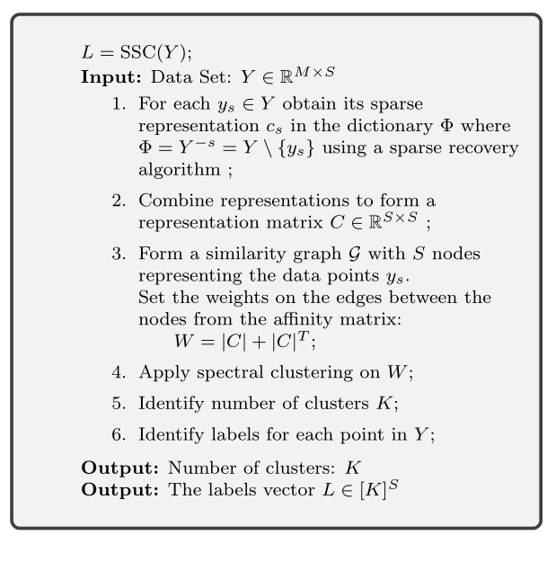

 
Sparse Subspace Clustering (SSC)
----------------------------------------------------

Sparse representations using overcomplete dictionaries 
have become a popular approach to solve a number of
signal and image processing problems in last couple of decades 
:cite:`elad2010sparse`. 
The dictionary :cite:`tropp2004greed,rubinstein2010dictionaries` consists
of a set of prototype signals called atoms which 
are representative of the particular class of signals
of interest. Signals are then approximated by a sparse
linear combination of these atoms (i.e. linear
combinations of as few atoms as possible). 
A wide range of
sparse recovery algorithms have been developed to 
decompose a given signal in terms of the atoms from
the dictionary in order to obtain the sparsest
possible representation :cite:`tropp2010computational`. 
Essentially, it is
expected that the signals reside in low dimensional subspaces
of the ambient signal space and a good dictionary
contains well chosen elementary signals called atoms such that a small set of those
atoms can span (or approximate) any of the low dimensional subspaces 
in the class of signals under consideration.  
Two typical approaches for computing the sparse
representation (a.k.a. sparse coding or recovery)
of a given signal in a given dictionary are
convex relaxation (:math:`\ell_1`-minimization) 
:cite:`chen1998atomic,tropp2004just,candes2005decoding,donoho2006stable,donoho2006most` 
and greedy pursuits :cite:`mallat1993matching,pati1993orthogonal,tropp2007signal,needell2009cosamp`. 

*Sparse Subspace Clustering* (SSC), introduced in 
:cite:`elhamifar2009sparse,elhamifar2013sparse`
is a method which utilizes the idea of sparse representations 
for solving the subspace clustering problem. It treats the 
dataset :math:`Y` itself as an (unstructured) dictionary and suggests
that a sparse representation of each point in a union of 
subspaces may be constructed from other data points in the dataset.

A dataset where each point can be expressed as a linear combination
of other points in the dataset is said to satisfy 
*self-expressiveness property*. The self-expressive 
representation of a point :math:`y_s` in :math:`Y` is given by 

.. math::
    y_s = Y c_s, \; c_{ss} = 0, \text{ or } Y = Y C, \quad \text{diag}(C) = 0

where :math:`C = \begin{bmatrix}c_1, \dots, c_S \end{bmatrix} \in \RR^{S \times S}` 
is the matrix of representation coefficients. 

In general, the representation :math:`c_s` for vector :math:`y_s` need not be unique. Now,
let :math:`y_s` belong to :math:`k`-th subspace :math:`\UUU_k`. 
Let :math:`Y^{-s}` denote the dataset :math:`Y` excluding the point :math:`y_s` 
and  :math:`Y_k^{-s}` denote the
set of points in :math:`Y_k` excluding :math:`y_s`. If :math:`Y_k^{-s}` spans the subspace
:math:`\UUU_k`, then a representation of :math:`y_s` can be constructed entirely
from the points in :math:`Y_k^{-s}`. A representation is called 
*subspace preserving* if it consists of points within the same subspace.
Now if :math:`c_i` is a subspace preserving representation of :math:`y_i` and :math:`y_j`
belongs to a different subspace, then :math:`c_{ij} = 0`. Thus, if :math:`C` consists
entirely of subspace preserving representations, then :math:`C_{ij} = 0` whenever
:math:`y_i` and :math:`y_j` belong to different subspaces. 

Note that, :math:`C` may not be symmetric. i.e. even if :math:`y_j` participates in the
representation of :math:`y_i`, :math:`y_i` may not participate in the representation 
of :math:`y_j` or the representation coefficients :math:`C_{ij}` and :math:`C_{ji}` may be
different. But we can construct a symmetric matrix :math:`W = | C | + |C|^T`,
where :math:`|C|` denotes taking absolute value of each entry in :math:`C`. The matrix
:math:`W` can be used as an affinity matrix for the points from the union of
subspaces such that the affinity of points from different subspaces is 0.
:math:`W` can be used to partition :math:`Y` into :math:`Y_k` via spectral clustering
\footnote{See :ref:`here <sec:spectral_clustering>` for 
a review of spectral clustering.}
:cite:`von2007tutorial`.

The remaining issue is constructing a *subspace preserving* 
representation :math:`C` of :math:`Y`. This is where the sparse recovery
methods developed in sparse representations literature come to our 
rescue. :cite:`elhamifar2009sparse,elhamifar2013sparse` initially proposed
the use of using :math:`\ell_1`-minimization by solving 

.. math::
    c_s^* = \underset{c}{\text{arg min}} \| c \|_1 \text{ s.t. }  y_s = Y c, \; c_{s} = 0. 

They proved theoretically that, if the subspaces :math:`\{\UUU_k\}` are independent, then :math:`\ell_1`
minimization can recover subspace preserving representations.  They also 
showed that if the subspaces are disjoint, then under certain conditions, 
subspace preserving representations can be obtained.

Subsequently, :cite:`dyer2013greedy,you2015sparse` showed that 
Orthogonal Matching Pursuit (OMP) :cite:`pati1993orthogonal,tropp2007signal` 
can also be used for obtaining
subspace preserving representations under appropriate conditions.
We will call these two variants of SSC as SSC-:math:`\ell_1` and SSC-OMP 
respectively. The essential SSC method is described below.

.. _alg:ssc:

.. disqus::

