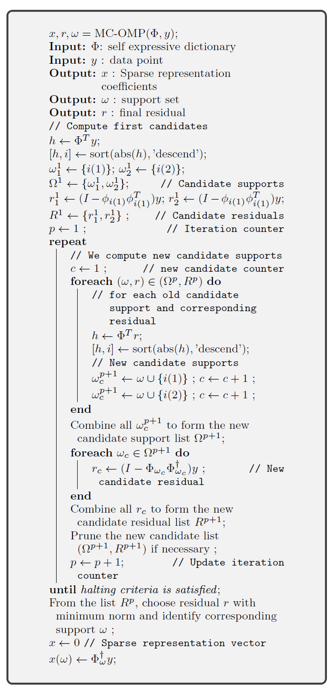

.. _sec:sc:ssc:mc-omp:

Sparse Subspace Clustering by Multiple Candidates OMP
===========================================================

.. highlight:: matlab

.. contents::
    :local:

Algorithm
-----------------------------

The overall SSC algorithm is reproduced in the figure below.

.. figure:: images/alg_ssc.png

The sparse representations are computed using the multiple
candidates version of OMP. This algorithm is
presented below.

This section discusses a new algorithm SSC-MC-OMP.

Benchmarks
-----------------------

.. rubric:: MNIST dataset

For  more information about sparse subspace clustering
on MNIST dataset, see :ref:`sec:sc:ssc:mnist`.

Here we report the benchmarks using the SSC-MC-OMP 
algorithm.

.. rubric:: Clustering Accuracy a%

.. list-table::
    :header-rows: 1

    * - Images per Digit
      - 1-4
      - 2.1-4
      - 42.1-4
      - 2-4
    * - 50
      - 82.18
      - 82.87
      - 82.68
      - 83.81
    * - 80
      - 87.39
      - 87.14
      - 85.34
      - 86.82
    * - 100
      - 87.20
      - 87.47
      - 86.75
      - 89.17
    * - 150
      - 89.16
      - 89.15
      - 88.06
      - 89.09
    * - 200
      - 89.68
      - 90.23
      - 88.17
      - 88.31
    * - 300
      - 92.19
      - 91.18
      - 87.80
      - 91.89
    * - 400
      - 91.13
      - 91.52
      - 90.16
      - 91.50

.. rubric:: Subspace Preserving Representation Error e%

.. list-table::
    :header-rows: 1

    * - Images per Digit
      - 1-4
      - 2.1-4
      - 42.1-4
      - 2-4
    * - 50
      - 42.11
      - 41.63
      - 41.46
      - 41.00
    * - 80
      - 39.79
      - 39.10
      - 38.85
      - 38.19
    * - 100
      - 38.86
      - 38.12
      - 37.80
      - 37.06
    * - 150
      - 37.33
      - 36.56
      - 36.11
      - 35.19
    * - 200
      - 36.39
      - 35.50
      - 34.99
      - 34.00
    * - 300
      - 35.18
      - 34.15
      - 33.59
      - 32.60
    * - 400
      - 34.26
      - 33.26
      - 32.70
      - 31.57

.. rubric:: Time t

.. list-table::
    :header-rows: 1

    * - Images per Digit
      - 1-4
      - 2.1-4
      - 42.1-4
      - 2-4
    * - 50
      - 2.07
      - 3.26
      - 5.95
      - 9.22
    * - 80
      - 3.57
      - 6.22
      - 11.67
      - 15.77
    * - 100
      - 4.71
      - 8.39
      - 15.88
      - 20.61
    * - 150
      - 8.97
      - 15.98
      - 30.88
      - 37.71
    * - 200
      - 13.50
      - 24.94
      - 48.13
      - 57.25
    * - 300
      - 30.50
      - 56.81
      - 120.77
      - 121.76
    * - 400
      - 50.38
      - 95.76
      - 177.78
      - 192.57

Observations

* Second column represents the performance of SSC-OMP algorithm.
* Other columns represent the performance of SSC-MC-OMP algorithm
  for various branching strategies. 

.. disqus::

