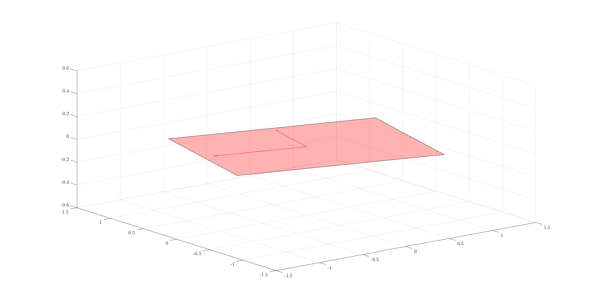
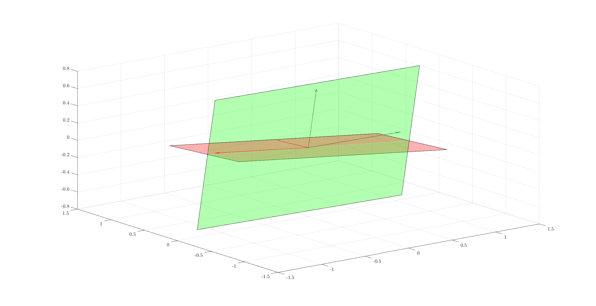

Synthetic Data Generation
================================

.. highlight:: matlab

Random Subspaces
-----------------------

Subspace clustering is focused on segmenting
data which fall in different subspaces 
where subspaces are either independent
or disjoint with each other and they are
sufficiently oriented away from each other.

For testing algorithms, it is useful to 
pick random subspaces of an ambient signal
space and then draw data points within 
these subspaces.

A way to pick a random subspace is to pick
a basis for the subspace. Then, all the 
linear combinations of the basis elements
fall in the subspace and the basis elements
span every vector in the said random subspace.

Let's pick a random plane in the 3-Dimensional
space::

    >> basis = orth(randn(3, 2))
    basis =

       -0.2634    0.6981
       -0.5459   -0.6769
        0.7954   -0.2334

What we are doing is we are constructing
a 3x2 Gaussian random matrix and orthogonalizing
its columns. With probability 1, the Gaussian
random matrix is full rank. Hence, this is
a safe way of choosing a basis for a random plane.

We can verify that the basis is indeed orthogonal::

    >> basis'*basis
    ans =

        1.0000         0
             0    1.0000

Visualizing Subspaces
'''''''''''''''''''''''''''''

It is possible to visualize 2D subspaces
in 3D space.

Let's pick one subspace::

  rng(10);
  A = orth(randn(3, 2))

Identify its basis vectors::

  e1 = A(:, 1);
  e2 = A(:, 2);

Identify the corner points of a square
around its basis vectors::

  corners = [e1+e2, e2-e1, -e1-e2, -e2+e1];

Visualize it::

  fill3(corners(1,:),corners(2,:),corners(3,:),'r');
  grid on;
  hold on;
  alpha(0.3);

Add the arrows of basis vectors from origin::

  quiver3(0, 0, 0, e1(1), e1(2), e1(3), 'color', 'r');
  quiver3(0, 0, 0, e2(1), e2(2), e2(3), 'color', 'r');

Let's add one more basis::

  B = orth(randn(3, 2));
  e1 = B(:, 1);
  e2 = B(:, 2);
  corners = [e1+e2, e2-e1, -e1-e2, -e2+e1];
  fill3(corners(1,:),corners(2,:),corners(3,:),'g');
  alpha(0.3);
  quiver3(0, 0, 0, e1(1), e1(2), e1(3), 'color', spx.graphics.rgb('DarkGreen'));
  quiver3(0, 0, 0, e2(1), e2(2), e2(3), 'color', spx.graphics.rgb('DarkGreen'));

Multiple Subspaces
''''''''''''''''''''''''''

``sparse-plex`` provides a way to draw
multiple random subspaces of a given dimension
from an ambient space.

Let's pick the dimension of the ambient space::

    M = 10;

Let's pick the dimension of subspaces::

    D = 4;

Let's pick the number of subspaces to be drawn::

    K = 2;

Let's draw the bases for each random subspace::

    import spx.data.synthetic.subspaces.random_subspaces;
    bases = random_subspaces(M, K, D);

The result ``bases`` is a cell array 
containing the orthogonal basis for each subspace::

    >> bases{1}

    ans =

       -0.1178   -0.1432    0.0438   -0.0100
        0.1311   -0.0110   -0.4409    0.1758
        0.5198   -0.6404    0.0422   -0.3980
        0.5211   -0.0172   -0.2929    0.6334
       -0.2253   -0.1194   -0.2797    0.0920
        0.4695    0.1059    0.5408    0.1396
        0.1919    0.0765   -0.1441   -0.3519
        0.0940    0.0145   -0.4542   -0.4078
        0.3209    0.6274   -0.2325   -0.2118
       -0.0855   -0.3791   -0.2537    0.2153

    >> bases{2}

    ans =

        0.4784   -0.0579   -0.4213   -0.0206
        0.1213   -0.0591    0.3498    0.2351
        0.3077   -0.2110    0.2573    0.0042
       -0.5581   -0.5284    0.0988   -0.1403
        0.1128    0.5914    0.2518   -0.1872
       -0.1804   -0.0095    0.0707   -0.1351
       -0.0728    0.2774   -0.2063    0.3801
       -0.4417    0.3878    0.2071    0.4004
        0.0695   -0.2496   -0.1836    0.7344
        0.3158   -0.1732    0.6608    0.1647

Verify orthogonality::

    >> bases{1}' * bases{1}

    ans =

        1.0000   -0.0000   -0.0000   -0.0000
       -0.0000    1.0000    0.0000    0.0000
       -0.0000    0.0000    1.0000   -0.0000
       -0.0000    0.0000   -0.0000    1.0000

Principal Angles
------------------------

If :math:`\UUU` and :math:`\VVV` are two linear subspaces of :math:`\RR^M`, then 
the *smallest principal angle* between them 
denoted by :math:`\theta` is defined as :cite:`bjorck1973numerical`

.. math::
    \cos \theta = \underset{u \in \UUU, v \in \VVV}{\max} \frac{u^T v}{\| u \|_2 \| v \|_2}.

For the functions provided in ``sparse-plex``
for measuring principal angles, see
:ref:`sec:la:principal_angles:hands-on`.

Uniformly Distributed Points in Subspaces
--------------------------------------------

For subspace clustering purposes, 
individual vectors are usually normalized.
They then fall onto the surface of 
the unit sphere of the
subspace to which they belong.

For experimentation, it is useful to 
generate uniformly distributed points
on the unit sphere of a random subspace.

It is actually very easy to do.
Let's start with a simple example
of a random 2D plane inside 3D space.

Let's choose a random plane::

  basis = orth(randn(3, 2));

Let's choose coordinates of some
points in this basis where the
coordinates are Gaussian distributed::

  num_points = 100;
  coefficients = randn(2, num_points);

Let's normalize the coefficients::

  coefficients = spx.norm.normalize_l2(coefficients);

The coordinates of these points in the 3D 
space can be easily calculated now::

  uniform_points = basis * coefficients;

Verify that these points are indeed on
unit sphere::

  >> max(abs(spx.norm.norms_l2_cw(uniform_points) - 1))

  ans =

     4.4409e-16

Time to visualize everything. First the
plane::

    e1 = basis(:, 1);
    e2 = basis(:, 2);
    corners = [e1+e2, e2-e1, -e1-e2, -e2+e1];
    spx.graphics.figure.full_screen;
    fill3(corners(1,:),corners(2,:),corners(3,:),'r');
    grid on;
    hold on;
    alpha(0.3);

Then the unit vectors::

  quiver3(0, 0, 0, e1(1), e1(2), e1(3), 'color', 'blue');
  quiver3(0, 0, 0, e2(1), e2(2), e2(3), 'color', 'blue');

Finally the points::

  x = uniform_points(1, :);
  y = uniform_points(2, :);
  z = uniform_points(3, :);
  plot3(x, y, z, '.', 'color', spx.graphics.rgb('Brown') );

We might as well draw the origin too::

  plot3(0, 0, 0, '+k', 'MarkerSize', 10, 'color', spx.graphics.rgb('DarkRed'));

.. figure:: images/uniform_points_2d_subspace.png

