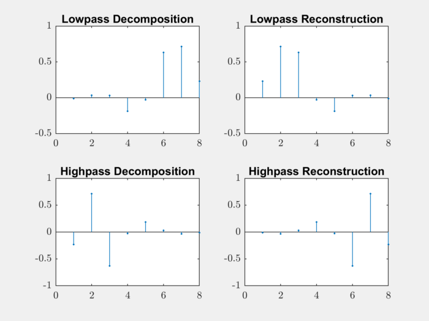
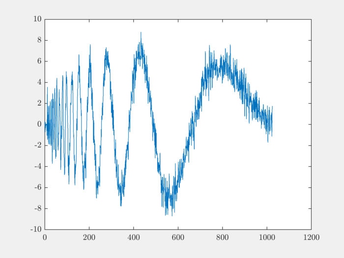
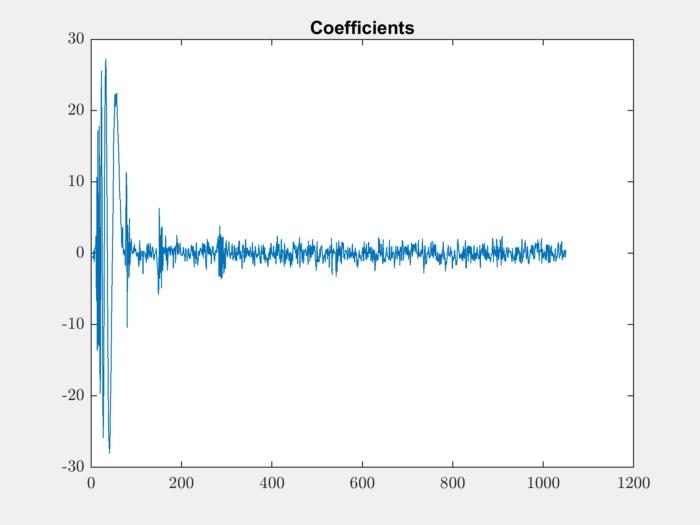
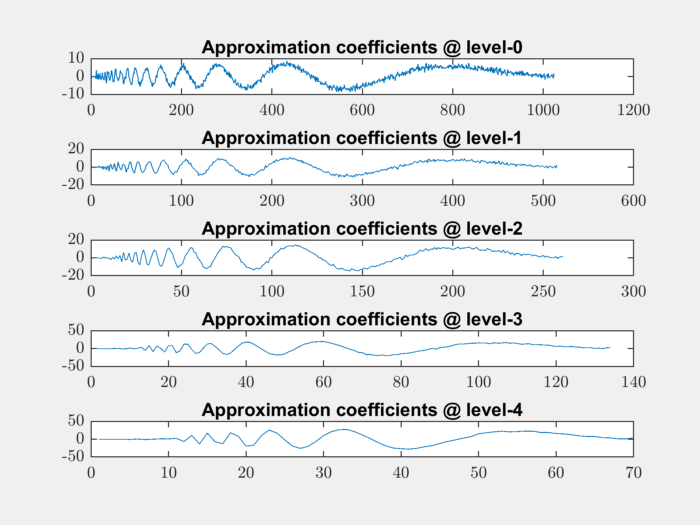
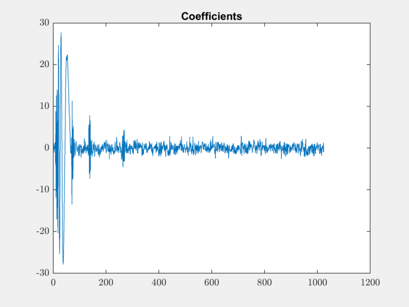
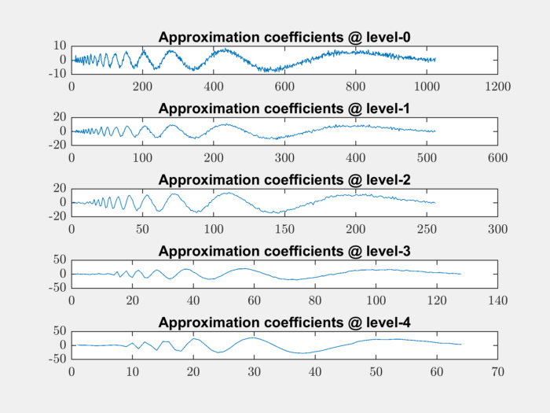
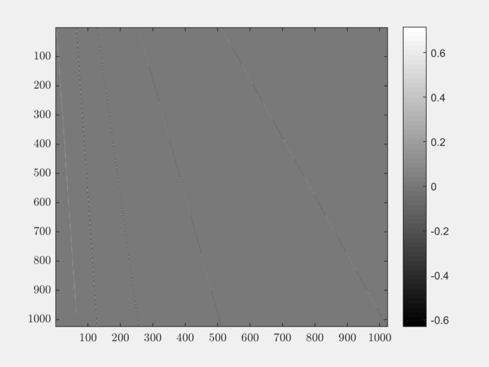
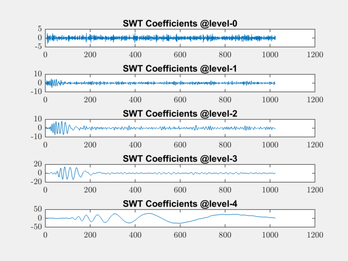

Working with Daubechies Wavelets
========================================

The short name for this family of wavelets is `db`.

Information about the wavelet family::

    >> waveinfo('db')
     Information on Daubechies wavelets.
     
        Daubechies Wavelets
     
        General characteristics: Compactly supported 
        wavelets with extremal phase and highest 
        number of vanishing moments for a given 
        support width. Associated scaling filters are
        minimum-phase filters.
     
        Family                  Daubechies
        Short name              db
        Order N                 N a positive integer from 1 to 45.
        Examples                db1 or haar, db4, db15
     
        Orthogonal              yes
        Biorthogonal            yes
        Compact support         yes
        DWT                     possible
        CWT                     possible
     
        Support width           2N-1
        Filters length          2N
        Regularity              about 0.2 N for large N
        Symmetry                far from
        Number of vanishing 
        moments for psi         N
     
        Reference: I. Daubechies, 
        Ten lectures on wavelets, 
        CBMS, SIAM, 61, 1994, 194-202.

Decomposition and Reconstruction filters
-------------------------------------------------

Let's construct the filters for 'db4' wavelet::

    >> [LoD,HiD,LoR,HiR] = wfilters('db4');

Let's plot the filters::

    subplot(221);
    stem(LoD, '.'); title('Lowpass Decomposition');
    subplot(222);
    stem(LoR,'.'); title('Lowpass Reconstruction');
    subplot(223);
    stem(HiD,'.'); title('Highpass Decomposition');
    subplot(224);
    stem(HiR,'.'); title('Highpass Reconstruction');

Single Level Decomposition and Reconstruction
------------------------------------------------

The ``dwt`` and ``idwt`` functions can be used
for single level decomposition and reconstruction.

Let's load a signal on which we will perform the
decomposition::

    load noisdopp;
    plot(noisdopp);

Let's perform 1-level decomposition::

    [approximation, detail] = dwt(noisdopp,LoD,HiD);

Let's plot the decomposed approximation and
detail components::

    subplot(211);
    plot(approximation); title('Approximation');
    subplot(212);
    plot(detail); title('Detail');

.. figure:: images/noisdopp_db4_decomposition.png

Reconstruct the original signal using ``idwt``::

    reconstructed = idwt(approximation, detail,LoR,HiR);

Let's measure the reconstruction error::

    >> max_abs_diff = max(abs(noisdopp-reconstructed))

    max_abs_diff =

       6.3300e-12

Multi-level Wavelet Decomposition
----------------------------------------

We can use the ``wavedec`` function for
multi-level wavelet decomposition::

    [coefficients, levels] = wavedec(s,3,'db1');

Let's plot the decomposition coefficients::

    plot(coefficients); title('Coefficients');

Reconstruction from multi-level decomposition::

    reconstructed = waverec(coefficients, levels, LoR, HiR);

Let's verify the reconstruction error::

    max_abs_diff = max(abs(noisdopp-reconstructed))
    max_abs_diff =

       2.0627e-11

It is possible to look at the approximation coefficients
at all levels::

    for level=0:4
        level_app_coeffs = appcoef(coefficients, levels, LoR, HiR, level);
        subplot(511+level);
        plot(level_app_coeffs);
        title(sprintf('Approximation coefficients @ level-%d', level));
    end

The level-0 coefficients are nothing but the original signal.
The higher level approximation coefficients are 
increasingly smoother.

It is important to know how many levels of decomposition 
are possible. ``wmaxlev`` can be used for finding it out::

    >> wmaxlev(numel(noisdopp),'db4')

    ans =

         7

The normal wavelet decomposition creates 
more coefficients than there are in the original signal.

Let's see how the number of coefficients increase 
with the level of decomposition::

    >> for i=1:7
        [coefficients, levels] = wavedec(noisdopp,i, LoD,HiD);
        fprintf('%d ', numel(coefficients));
    end

    1030 1037 1044 1050 1056 1062 1068

For every level 6 or 7 extra coefficients are being introduced.
This is because a normal convolution of length M signal with
length N filter produces a signal of length M + N -1.

The behavior is controlled by the DWT MODE. It defines
how the signals are extended to complete the convolution. 

The default mode is::

    >> dwtmode
                                                           
    *******************************************************
    **  DWT Extension Mode: Symmetrization (half-point)  **
    *******************************************************

Decomposition with Periodic Extension
----------------------------------------------

If we want to have a non-redundant wavelet decomposition,
we can use the periodic extension DWT mode.

Changing the mode::

    old_dwt_mode = dwtmode('status','nodisp');
    dwtmode('per');

    *****************************************
    **  DWT Extension Mode: Periodization  **
    *****************************************

Performing level 4 decomposition::

    [coefficients, levels] = wavedec(noisdopp,4, LoD,HiD);

Verify that the coefficients array is of same length as signal::

    >> numel(coefficients)

    ans =

            1024

Verify that number of elements at different levels is 
changing by a factor of 2 always::

    >> levels

    levels =

              64 64 128 256 512 1024

Plot the coefficients::

    plot(coefficients); title('Coefficients');

Reconstruct the signal::

    reconstructed = waverec(coefficients, levels, LoR, HiR);

Verify that the reconstruction is fine::

    max_abs_diff = max(abs(noisdopp-reconstructed))

    max_abs_diff =

       2.0357e-11

Plot the approximation coefficients at all levels::

    for level=0:4
        level_app_coeffs = appcoef(coefficients, levels, LoR, HiR, level);
        subplot(511+level);
        plot(level_app_coeffs);
        fprintf('%d ', numel(level_app_coeffs));
        title(sprintf('Approximation coefficients @ level-%d', level));
    end

    1024 512 256 128 64

The number of approximation coefficients is decreasing exactly
by a factor of 2 in each level.

Restoring the old DWT mode::

    % restore the old DWT mode
    dwtmode(old_dwt_mode);

Synthesis and Analysis Orthonormal Bases
-------------------------------------------

Daubechies wavelets are orthogonal. 
For the specific case where the 
DWT is decomposing a signal 
:math:`x \in \RR^N` to a representation
:math:`\alpha \in \RR^N`
(in the periodic extension case),
the transformation can be represented by
an equation

.. math::

    x = \Psi \alpha

where :math:`\Psi` is an 
Orthonormal basis (ONB) for :math:`\RR^N` 
synthesizing
the signal :math:`x` from the
representation :math:`\alpha`.

The decomposition process is represented
by 

.. math::

    \alpha = \Psi^T x.

We can easily construct the matrix
:math:`\Psi^T`. Each column
of :math:`\Psi^T` can be obtained by
computing :math:`\Psi^T e_i` where
:math:`e_i` is the standard unit vector
in i-th direction for :math:`\RR^N`.

We will construct the decomposition
matrix for the 'db4' wavelet and
level 4 decomposition. The
size of the signal would be :math:`N=1024`::

    [LoD,HiD,LoR,HiR] = wfilters('db4');

    N = 1024;
    L = 4;

Let's make sure that we are using ``per``
mode::

    old_dwt_mode = dwtmode('status','nodisp');
    dwtmode('per');

Let's construct :math:`\Psi^T`::

    PsiT = zeros(N, N);
    for i=1:N
        unit_vec = zeros(N, 1);
        unit_vec(i) = 1;
        [coefficients, levels] = wavedec(unit_vec, L, LoD,HiD);
        PsiT(:, i) = coefficients;
    end

Let's verify that the rows of :math:`\Psi^T`
are unit norm::

    >> norms = spx.norm.norms_l2_rw(PsiT);
    fprintf('norms: min: %.4f, max: %.4f\n', min(norms), max(norms));

    norms: min: 1.0000, max: 1.0000

Let's get the corresponding synthesis
matrix :math:`\Psi` ::

    Psi = PsiT';

Let's verify that it is indeed an orthonormal basis::

    >> max(max(abs(Psi * Psi' - eye(N))))

    ans =

       1.8573e-12

We should also verify that the matrix
:math:`\Psi` behaves same as the
application of ``wavedec`` and ``waverec``
functions.

Let's load our sample signal::

    load noisdopp;
    %  make it a column vector
    noisdopp = noisdopp';

Let's construct its representation by ``wavedec``::

    [a1, levels] = wavedec(noisdopp, L, LoD, HiD);

Let's construct its representation by :math:`\Psi^T`::

    a2 = PsiT * noisdopp;

Let's compare if they match::

    >> fprintf('Decomposition diff: %e\n', max(a1 - a2));
    Decomposition diff: 2.486900e-14

They indeed match. Now, let's reconstruct
the signal through both ways. 
First using ``waverec``::

    x1  = waverec(a1, levels, LoR, HiR);

Now using :math:`\Psi` ::

    x2 = Psi * a2;

Compare them:: 

    fprintf('Synthesis diff: %e\n', max(x1 - x2));
    Synthesis diff: 1.065814e-14

It's working great.

Finally, don't forget to restore the older DWT mode::

    dwtmode(old_dwt_mode);

It is instructive to visualize the basis 
:math:`\Psi`:: 

    colormap('gray');
    imagesc(Psi);
    colorbar;

The matrix is sparse. In fact only 3% of its
entries are non-zero::

    >> nnz(Psi) / (N*N)

    ans =

        0.0283

This is expected since wavelets have 
a very small support.

Stationary Wavelet Transform
------------------------------------------

DWT is not translation invariant. In some
applications, translation invariance is
important. Stationary Wavelet Transform (SWT)
overcomes this limitation. 
It removes all the upsamplers and downsamplers
in DWT. It is a highly redundant transform.

In MATLAB, it is implemented using `swt` function.

``swt`` doesn't involve any downsampling. All details
and approximations are of same length as the original signal. 

``swt`` is defined using periodic extension. 
The length of the approximation and detail coefficients 
computed at each level equals the length of the signal.

Let us construct a level 4 decomposition::

    coefficients = swt(noisdopp, 4, LoD,HiD);

Let's plot the approximation and detail coefficients::

    for level=0:4
        subplot(511+level);
        plot(coefficients(level+1, :)); 
        title(sprintf('SWT Coefficients @level-%d', level));
    end

