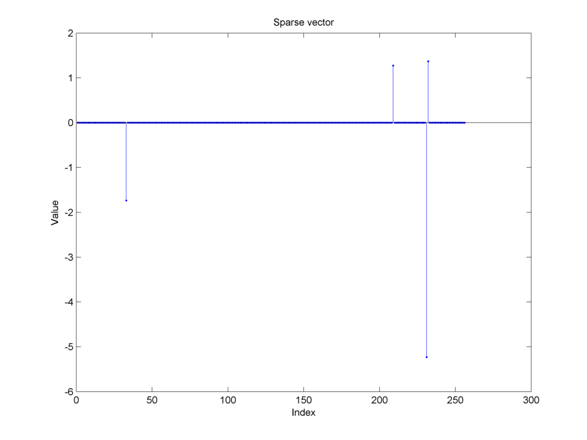
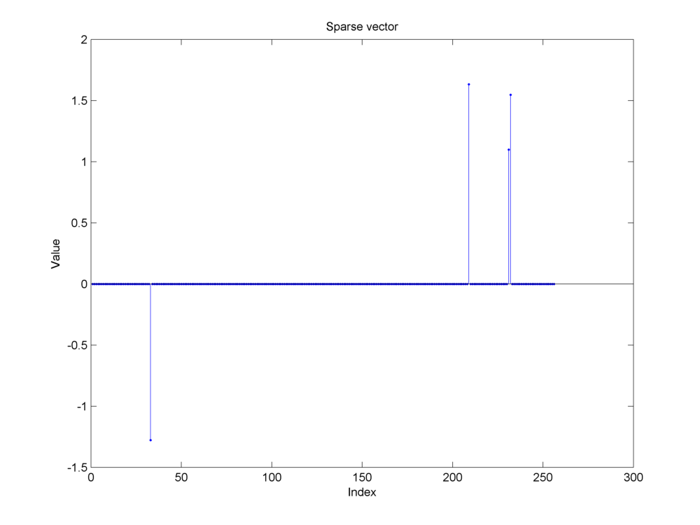
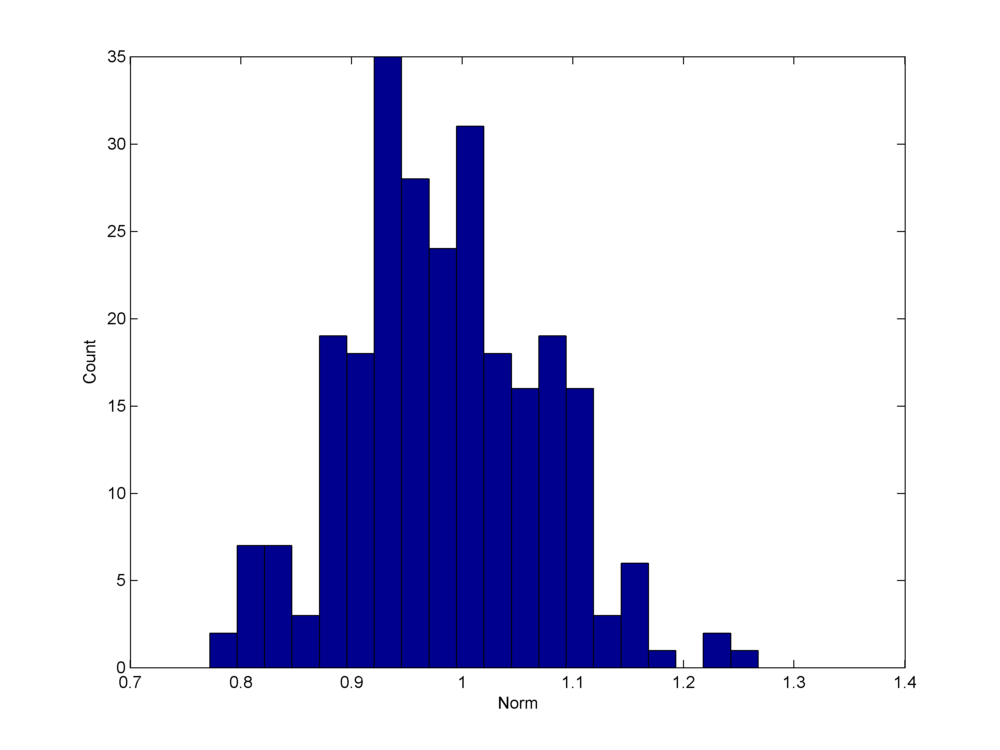
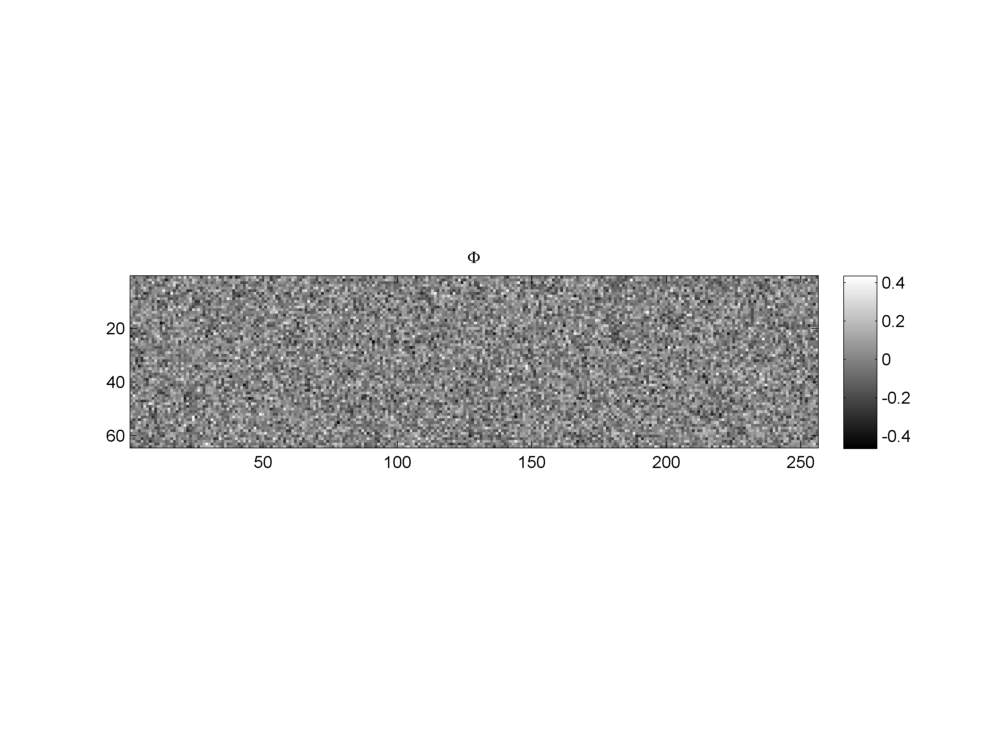
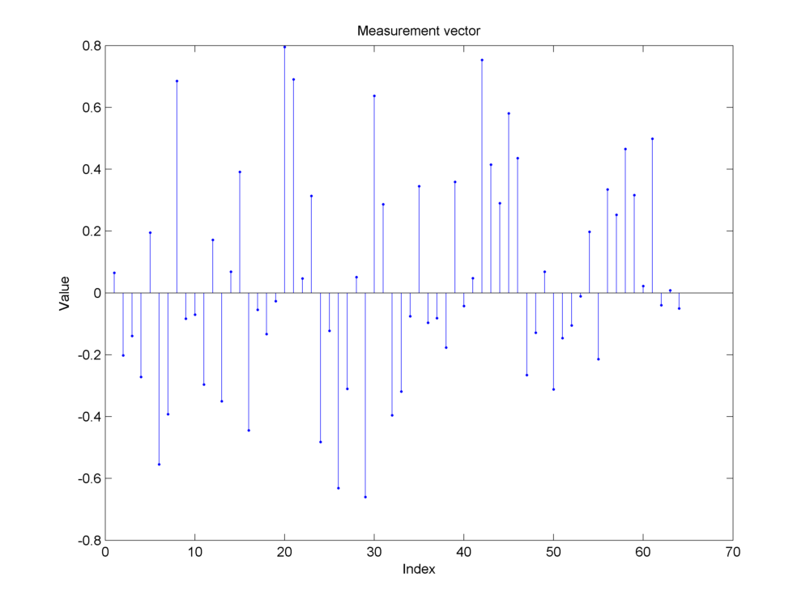
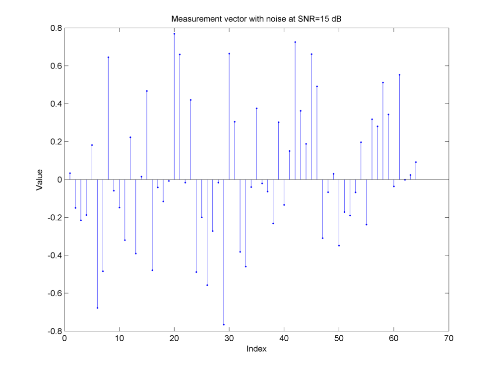
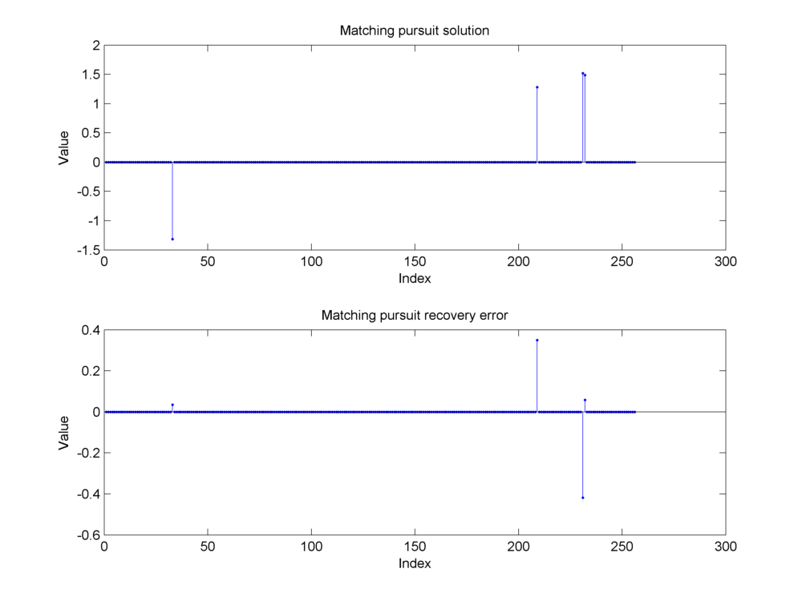
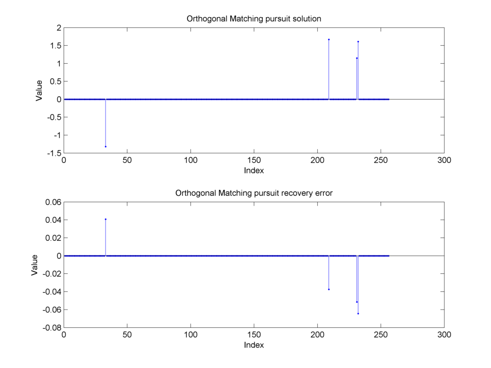
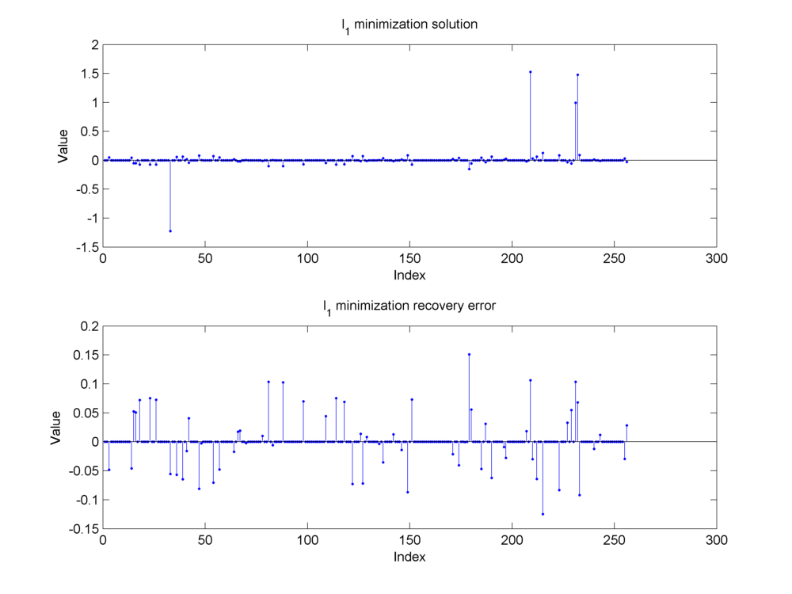

Basic  CS Tutorial
========================

.. highlight:: matlab

Basic setup::

    % Signal space 
    N = 1000;
    % Number of measurements
    M = 200;
    % Sparsity level
    K = 8;

Choosing the support randomly::

    Omega = randperm(N, K);

Constructing a sparse vector with Gaussian entries::

    % Initializing a zero vector
    x = zeros(N, 1);
    % Filling it with non-zero Gaussian entries at specified support
    x(Omega) = 4 * randn(K, 1);

Constructing a bi-uniform sparse vector::

    a = 1;
    b = 2; 
    % unsigned magnitudes of non-zero entries
    xm = a + (b-a).*rand(K, 1);
    % Generate sign for non-zero entries randomly
    sgn = sign(randn(K, 1));
    % Combine sign and magnitude
    x(Omega) = sgn .* xm;

Identifying support::

    find(x ~= 0)'
    % 98   127   277   544   630   815   905   911

Constructing a Gaussian sensing matrix::

    Phi = randn(M, N);
    % Make sure that variance is 1/sqrt(M)
    Phi = Phi ./ sqrt(M);

Computing norm of each column::

    column_norms = sqrt(sum(Phi .* conj(Phi)));

Norm histogram

Constructing a Gaussian dictionary with normalized columns::

    for i=1:N
        v = column_norms(i);
        % Scale it down
        Phi(:, i) = Phi(:, i) / v;
    end

Visualizing the sensing matrix::

    imagesc(Phi) ;
    colormap(gray);
    colorbar;
    axis image;

Making random measurements from sparse high dimensional vector::

    y0 = Phi * x;

Adding some measurement noise::

    SNR = 15;
    snr = db2pow(SNR);
    noise = randn(M, 1);
    % we treat each column as a separate data vector
    signalNorm = norm(y0);
    noiseNorm = norm(noise);
    actualNormRatio = signalNorm / noiseNorm;
    requiredNormRatio = sqrt(snr);
    gain_factor = actualNormRatio  / requiredNormRatio;
    noise = gain_factor .* noise;

Measurement vector with noise::

    y = y0 + noise;

Sparse recovery using matching pursuit::

    solver = SPX_MatchingPursuit(Phi, K);
    result = solver.solve(y);
    mp_solution = result.z;

Recovery error::

    mp_diff = x - mp_solution;
    mp_recovery_error = norm(mp_diff) / norm(x);

Matching pursuit recovery error: 0.1612.

Sparse recovery using orthogonal matching pursuit::

    solver = SPX_OrthogonalMatchingPursuit(Phi, K);
    result = solver.solve(y);
    omp_solution = result.z;
    omp_diff = x - omp_solution;
    omp_recovery_error = norm(omp_diff) / norm(x);

Orthogonal Matching pursuit recovery error: 0.0301.

Sparse recovery using l_1 minimization::

    solver = SPX_L1SparseRecovery(Phi, y);
    result = solver.solve_l1_noise();
    l1_solution = result;
    l1_diff = x - l1_solution;
    l1_recovery_error = norm(l1_diff) / norm(x);

l_1 recovery error: 0.1764.
