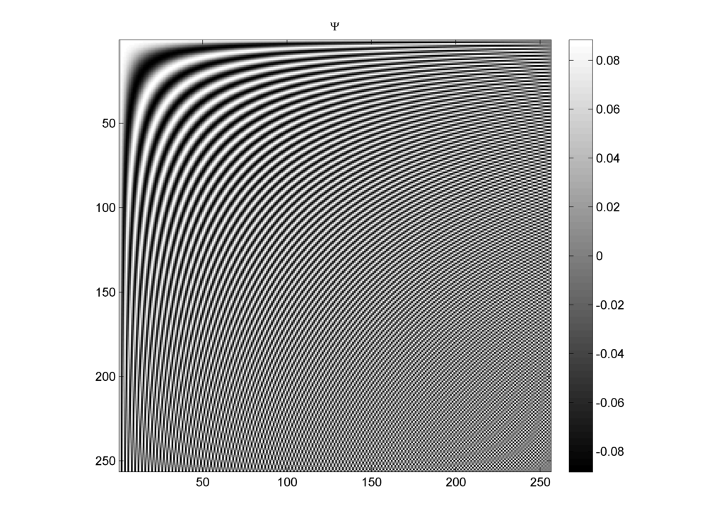
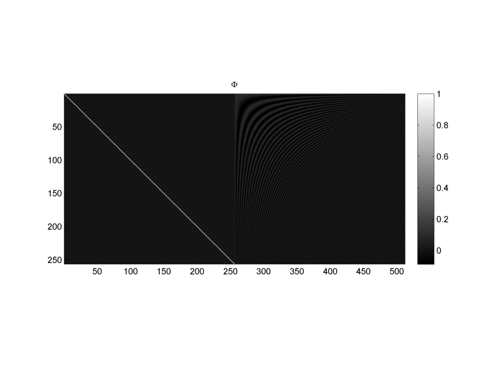
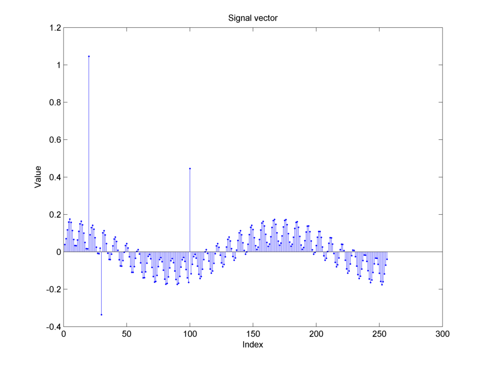
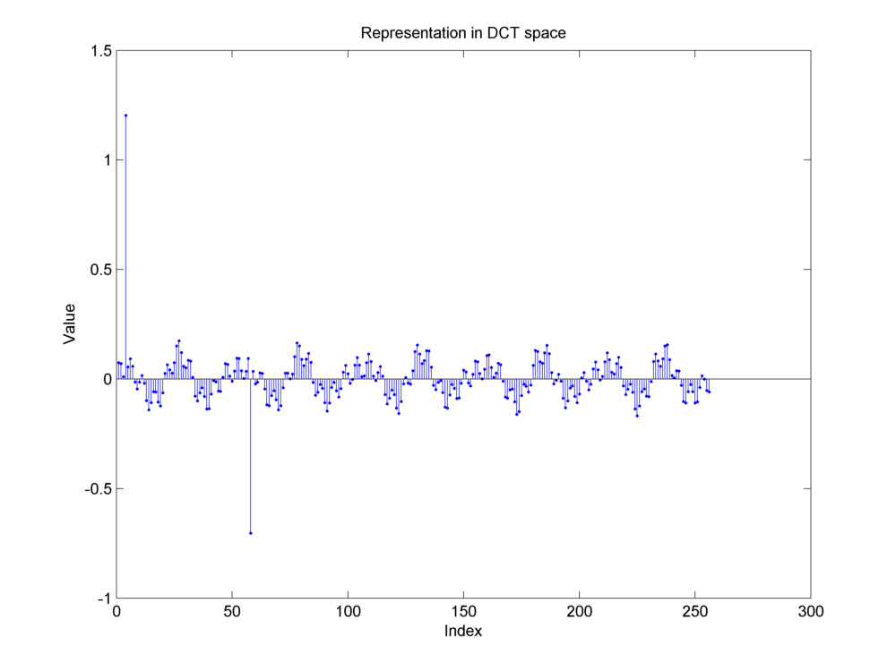
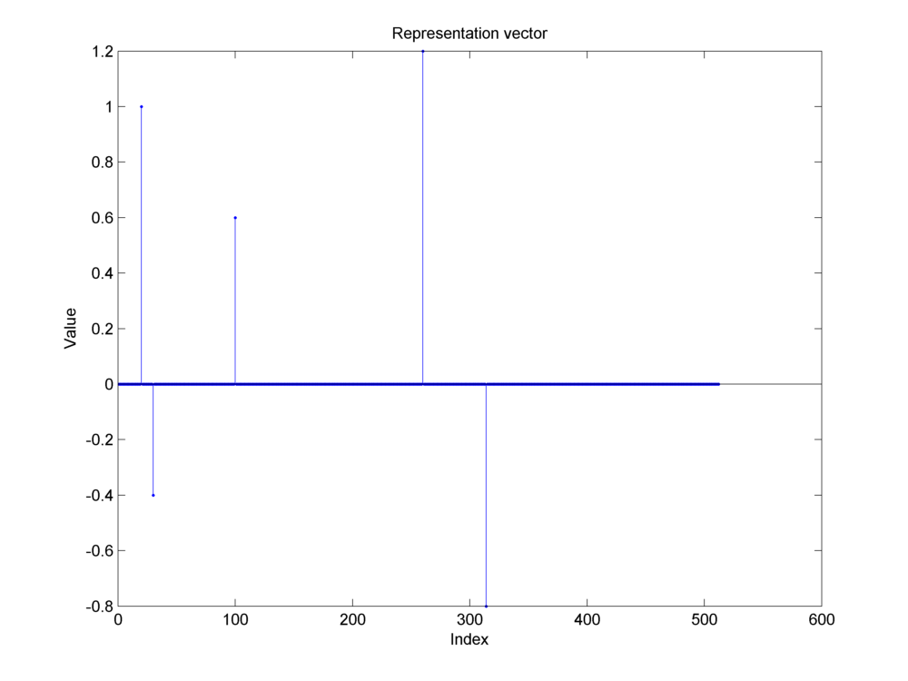
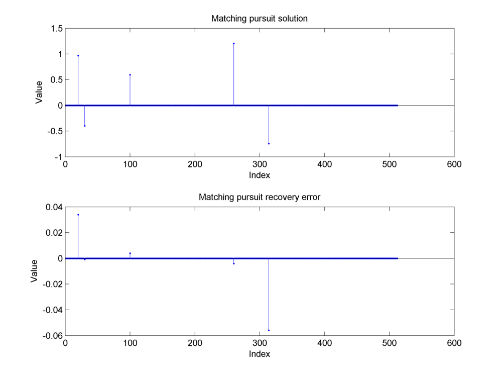
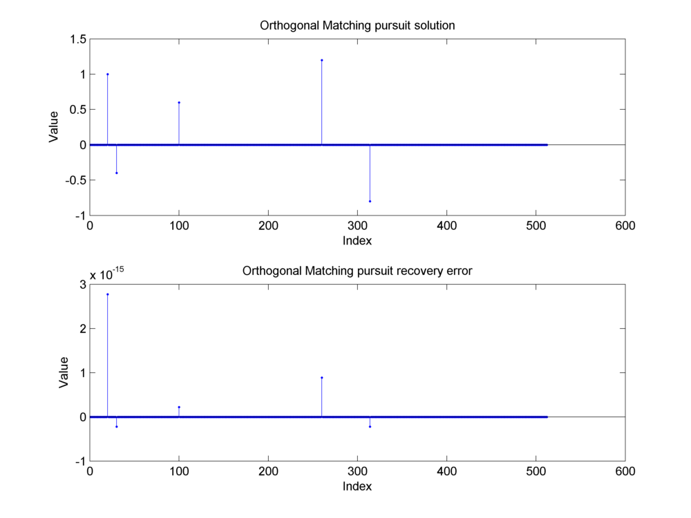
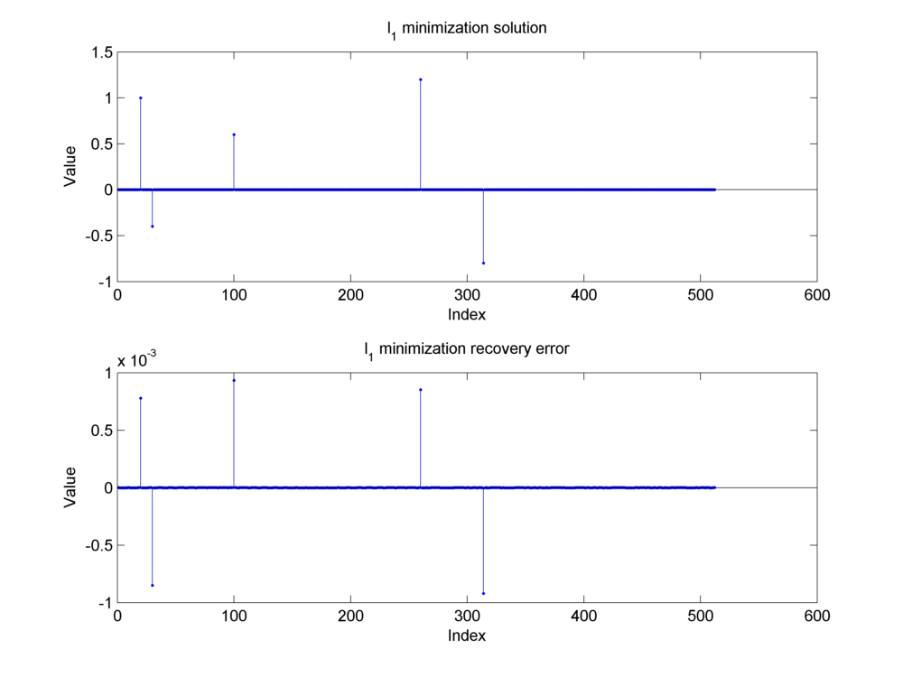

Dirac DCT Tutorial
==========================

.. highlight:: matlab

Signal space dimension::

    N = 256;

Dirac basis::

    I = eye(N);

DCT basis::

    Psi = dctmtx(N)';

Visualizing the DCT basis::

    imagesc(Psi) ;
    colormap(gray);
    colorbar;
    axis image;
    title('\Psi');

Combining the Dirac and  DCT orthonormal bases to form a two-ortho dictionary::

    Phi = [I  Psi];

Visualizing the dictionary::

    imagesc(Phi) ;
    colormap(gray);
    colorbar;
    axis image;
    title('\Phi');

Constructing a signal which is a combination of impulses and cosines::

    alpha = zeros(2*N, 1);
    alpha(20) = 1;
    alpha(30) = -.4;
    alpha(100) = .6;
    alpha(N + 4) = 1.2;
    alpha(N + 58) = -.8;
    x = Phi * alpha;
    K  = 5;

Finding the representation in DCT basis::

    x_dct = Psi' * x;

Sparse representation in the Dirac DCT dictionary

Obtaining the sparse representation using matching pursuit algorithm::

    solver = SPX_MatchingPursuit(Phi, K);
    result = solver.solve(x);
    mp_solution = result.z;
    mp_diff = alpha - mp_solution;
    % Recovery error
    mp_recovery_error = norm(mp_diff) / norm(x);

Matching pursuit recovery error: 0.0353.

Obtaining the sparse representation using orthogonal matching pursuit algorithm::

    solver = spx.pursuit.single.OrthogonalMatchingPursuit(Phi, K);
    result = solver.solve(x);
    omp_solution = result.z;
    omp_diff = alpha - omp_solution;
    % Recovery error
    omp_recovery_error = norm(omp_diff) / norm(x);

Orthogonal Matching pursuit recovery error: 0.0000.

Obtaining a sparse approximation via basis pursuit::

    solver = SPX_L1SparseRecovery(Phi, x);
    result = solver.solve_l1_noise();
    l1_solution = result;
    l1_diff = alpha - l1_solution;
    % Recovery error
    l1_recovery_error = norm(l1_diff) / norm(x);

l_1 recovery error: 0.0010.
