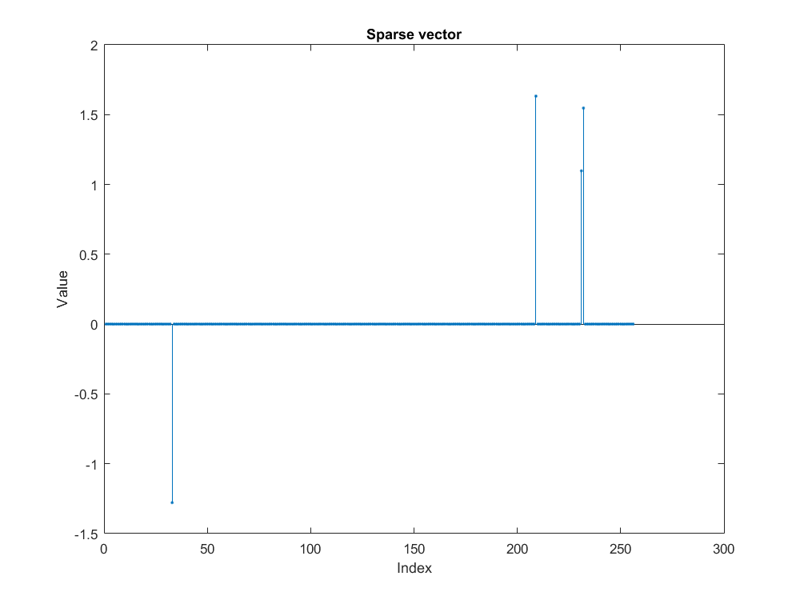
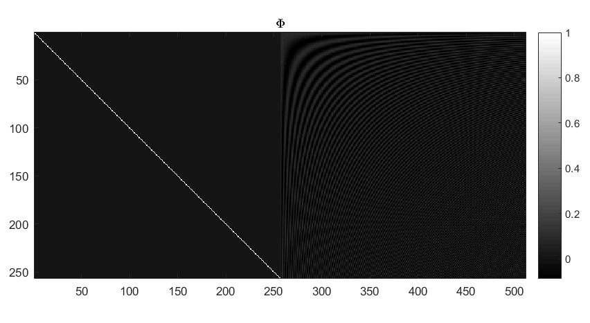
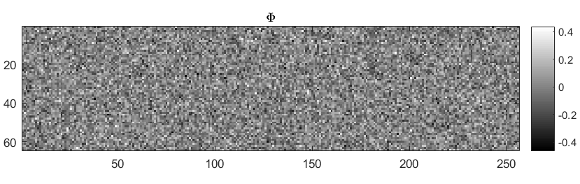
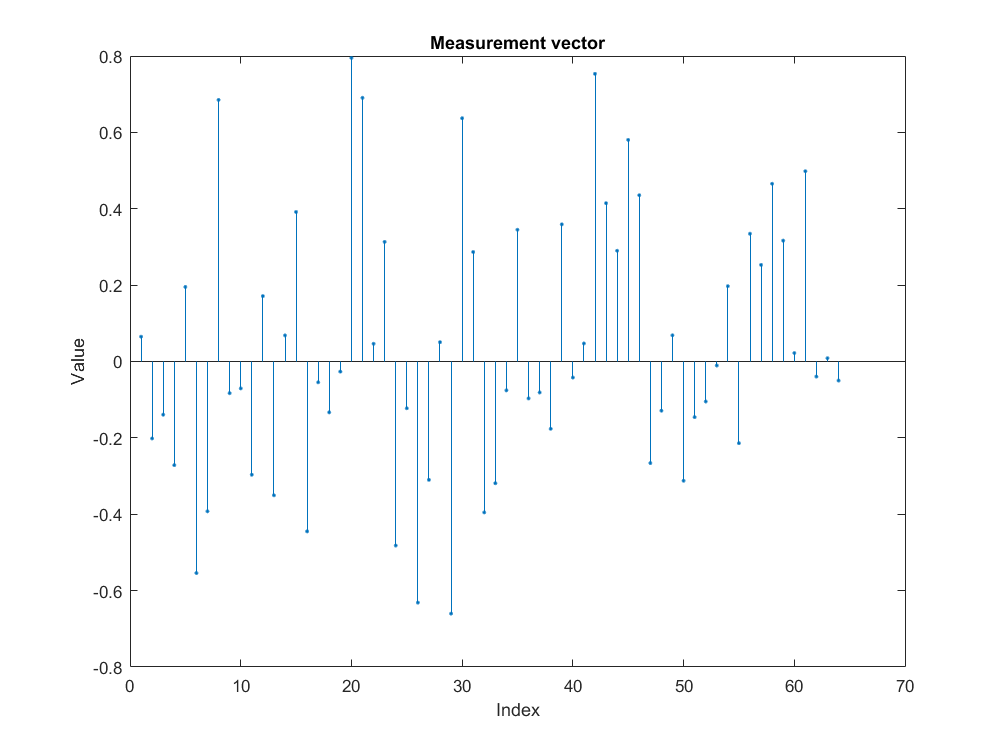
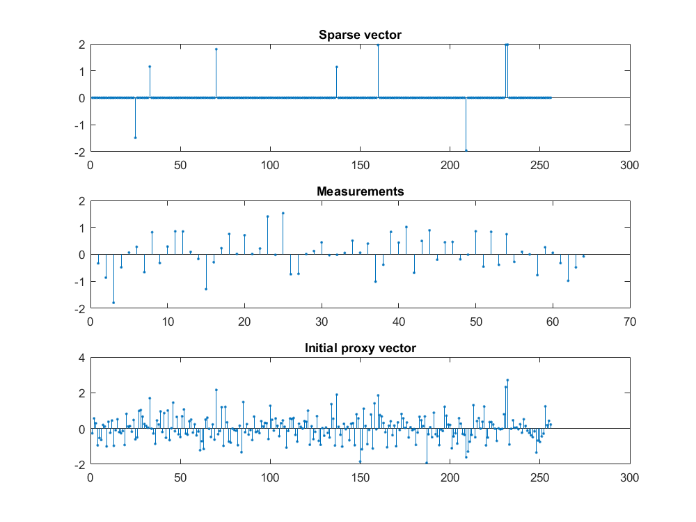
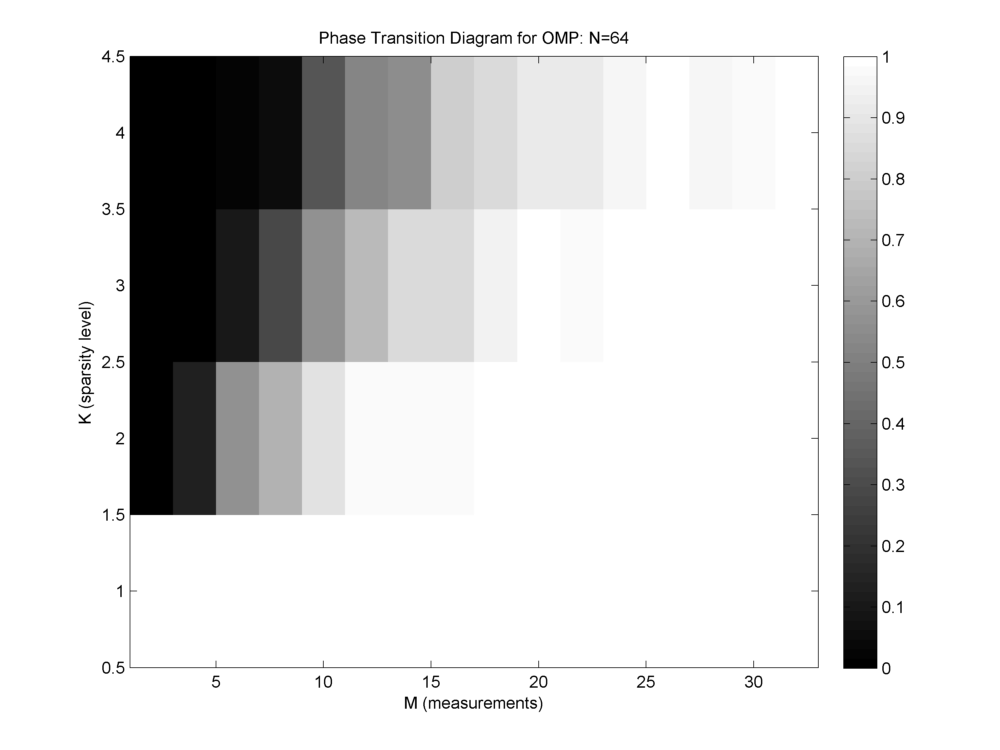
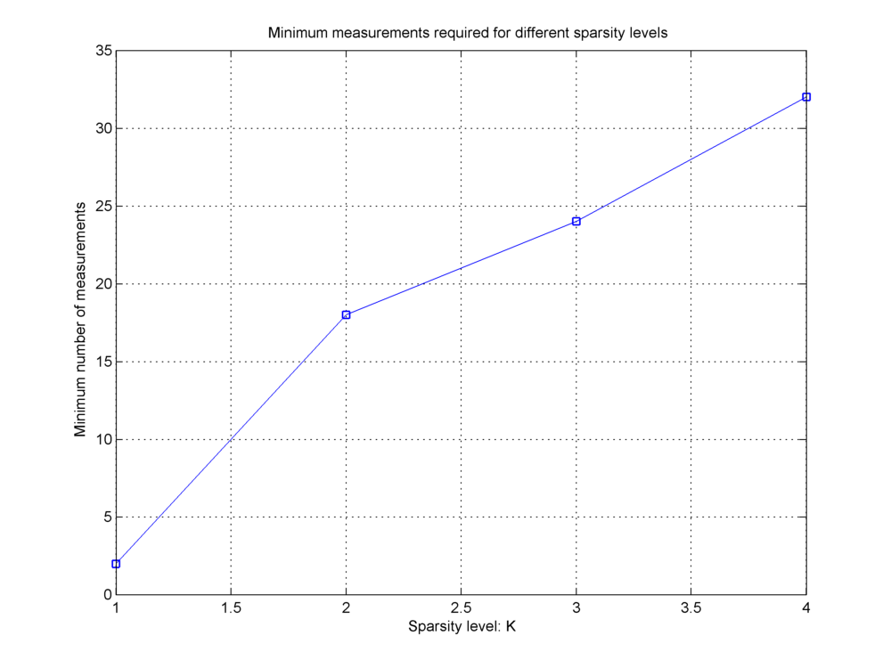
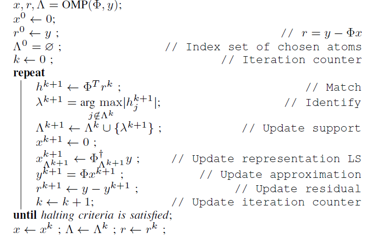

Exercises
======================

.. highlight:: matlab

The best way to learn is by doing exercises yourself. 
In this section,
we present a set of computer exercises which help you learn
the fundamentals of sparse representations: algorithms and applications. 

Most of these exercises are implemented in some form or
other as part of the ``sparse-plex`` library. 
Once you have written your own implementations, you may 
hunt the code in library and compare your implementation
with the reference implementation.

The exercises are described in terms of MATLAB 
programming environment. But they can be easily
developed in other programming environments too.

Throughout these exercises, we will develop a set of functions
which are reusable for performing various tasks related to 
sparse representation problems. We suggest you to collect
such functions developed by you in one place together so that
you can implement the more sophisticated exercises easily later.

Creating a sparse signal
-----------------------------

The first aspect is deciding the support for the
sparse signal.

#. Decide on the length of signal N=1024.
#. Decide on the sparsity level K=10.
#. Choose K entries from 1..N randomly as your choice of sparse support. You can use ``randperm`` function.

Now, we need to consider the values of non-zero entries
in the sparse vector. Typically, they
are chosen from a random distribution. 
Few of the common choices are:

* Gaussian
* Uniform 
* Bi-uniform

.. rubric:: Gaussian 

#. Generate K Gaussian random numbers with zero 
   mean and unit standard deviation. You can 
   use ``randn`` function. You may choose to
   change the standard deviation, but mean should
   usually be zero.
#. Create a column vector with N zeros.
#. On the entries indexed by the sparse support set,
   place the K numbers generated above. 

.. rubric:: Plotting

#. Use ``stem`` command to visualize the sparse signal.

.. rubric::  Uniform

* Most of the steps are similar to creating a 
  Gaussian sparse vector.
* The ``rand`` function generates a number uniformly between 
  0 and 1.
* In order to generate a number uniformly between a and b,
  we can use the simple trick of ``a + (b -a) * rand``

#. Choose a and b (say -4 and 4).
#. Generate K uniformly distributed numbers between a and b.
#. Place them in the N length vector as described above.
#. Plot them.

.. rubric:: Bi-uniform

A problem with Gaussian and uniform distributions 
as described above is that they are prone to 
generate some non-zero entries which are much
smaller compared to others. 

Bi-uniform approach attempts to avoid this situation.
It generates numbers uniformly between [-b, -a] 
and [a, b] where a and b are both positive numbers
with a < b.

#. Choose a and by [say 1 and 2].
#. Generate K uniformly distributed random numbers
   between a and b (as discussed above). These
   are the magnitudes of the sparse non-zero entries.
#. Generate K Gaussian numbers and apply ``sign`` 
   function to them to map them to 1 and -1.
   Note that with equal probability, the signs would 
   be 1 or -1.
#. Multiply the signs and magnitudes to generate your
   sparse non-zero entries.
#. Place them in the N length vector as described above.
#. Plot them.

Following image is an example of how a sparse vector looks.

Creating a two ortho basis
--------------------------------------

Simplest example of an overcomplete dictionary
is  Dirac Fourier dictionary.

* You can use ``eye(N)`` to generate the standard
  basis of :math:`\mathbb{C}^N` which is 
  also known as Dirac basis.
* ``dftmtx(N)`` gives the matrix for forward
  Fourier transform. Corresponding Fourier basis 
  can be constructed by taking its transpose.
* The columns / rows of ``dftmtx(N)`` are not 
  normalized. Hence, in order to construct an
  orthonormal basis, we need to normalize the
  columns too. This can be easily done by multiplying
  with :math:`\frac{1}{\sqrt{N}}`. 

#. Choose the dimension of the ambient signal space
   (say N=1024).
#. Construct the Dirac basis for :math:`\mathbb{C}^N`.
#. Construct the orthonormal Fourier basis for :math:`\mathbb{C}^N`.
#. Combine the two to form the two ortho basis 
   (Dirac in left, Fourier in right).

.. rubric:: Verification

We assume that the dictionary has been stored
in a variable named ``Phi``. We will use the
mathematical symbol :math:`\Phi` for the same.

* Verify that each column has unit norm.
* Verify that each row has a norm of :math:`\sqrt{2}`.
* Compute the Gram matrix :math:`\Phi' * \Phi`. 
* Verify that the diagonal elements are all one.
* Divide the Gram matrix into four quadrants.
* Verify that the first and fourth quadrants are identity
  matrices.
* Verify that the Gram matrix is symmetric.
* What can you say about the values in 2nd and 3rd quadrant?

Creating a Dirac-DCT two-ortho basis
------------------------------------------
While Dirac-DFT two ortho basis has the lowest possible 
coherence amongst all pairs of orthogonal bases, it is 
not restricted to :math:`\mathbb{R}^N`.  A good starting
point is to consider constructing a Dirac-DCT two ortho
basis.

#. Construct the Dirac-DCT two-ortho basis dictionary.

* Replace ``dftmtx(N)`` by ``dctmtx(N)``. 
* Follow steps similar to previous exercise to construct a
  Dirac-DCT dictionary.
* Notice the differences in the Gram matrix of Dirac-DFT dictionary
  with Dirac-DCT dictionary.  
* Construct the Dirac-DCT dictionary for different values of N=(8, 16, 32, 64, 128, 256).
* Look at the changes in the Gram matrix as you vary N for constructing Dirac-DCT dictionary.

An example Dirac-DCT dictionary has been illustrated in the figure below.

.. note::
 
  While constructing the two-ortho bases is nice for illustration, it
  should be noted that using them directly for computing :math:`\Phi x` 
  is not efficient. This entails full cost of a matrix vector multiplication.
  An efficient implementation would consider following ideas:

  * :math:`\Phi x = [I \Psi] x = I x_1  + \Psi x_2` where :math:`x_1`
    and :math:`x_2` are upper and lower halves of the vector :math:`x`.
  * :math:`I x_1` is nothing but `x_1`.
  * :math:`\Psi x_2` can be computed by using the efficient implementations
    of (Inverse) DFT or DCT transforms with appropriate scaling. 
  * Such implementations would perform the multiplication with dictionary in 
    :math:`O(N \log N)` time.
  * In fact, if the second basis is a wavelet basis, then the multiplication can
    be carried out in linear time too.
  * You are suggested to take advantage of these ideas in following exercises.

.. rubric:: Creating a signal which is a mixture of sinusoids and impulses

If we split the sparse vector :math:`x` into two halves :math:`x_1` and :math:`x_2`
then:
* The first half corresponds to impulses from the Dirac basis.
* The second half corresponds to sinusoids from DCT or DFT basis.

It is straightforward to construct a signal which is a mixture of impulses and
sinusoids and has a sparse representation in Dirac-DFT or Dirac-DCT representation.

#. Pick a suitable value of N (say 64).
#. Construct the corresponding two ortho basis.
#. Choose a sparsity pattern for the vector x (of size 2N) such that some
   of the non-zero entries fall in first half while some in second half.
#. Choose appropriate non-zero coefficients for x.
#. Compute :math:`y = \Phi x` to obtain a signal which is a mixture of impulses
   and sinusoids.

Verification

* It is obvious that the signal is non-sparse in time domain.
* Plot the signal using ``stem`` function.
* Compute the DCT or DFT representation of the signal (by taking inverse transform).
* Plot the transform basis representation of the signal.
* Verify that the transform basis representation does indeed have some large spikes
  (corresponding to the non-zero entries in second half of :math:`x`) but the rest
  of the representation is also full with (small) non-zero terms (corresponding to
  the transform representation of impulses).

Creating a random dictionary
---------------------------------------------

We consider constructing a Gaussian random matrix.

#. Choose the number of measurements :math:`M` say 128.
#. Choose the signal space dimension :math:`N` say 1024.
#. Generate a Gaussian random matrix as :math:`\Phi = \text{randn(M, N)}`.

.. rubric:: Normalization

There are two ways of normalizing the random matrix to a dictionary.

One view considers that all columns or atoms of a dictionary should be 
of unit norm.

#. Measure the norm of each column. You may be tempted to write a for loop
   to do the same. While this is alright, but MATLAB is known for its 
   vectorization capabilities. Consider using a combination of ``sum``
   ``conj`` element wise multiplication and ``sqrt`` to come up with 
   a function which can measure the column wise norms of a matrix.
   You may also explore ``bsxfun``.
#. Divide  each column by its norm to construct a normalized dictionary.
#. Verify that the columns of this dictionary are indeed unit norm.

An alternative way considers a probabilistic view. 

* We say that each entry in the Gaussian random matrix should be zero mean
  and variance :math:`\frac{1}{M}`.
* This ensures that on an average the mean of each column is indeed 1 though
  actual norms of each column may differ.
* As the number of measurements increases, the likelihood of norm being close
  to one increases further.

We can apply these ideas as follows.
Recall that ``randn`` generates Gaussian random variables with zero mean
and unit variance.

 
#. Divide the whole random matrix by :math:`\frac{1}{\sqrt{M}}` to achieve
   the desired sensing matrix.
#. Measure the norm of each column.
#. Verify that the norms are indeed close to 1 (though not exactly).
#. Vary M and N to see how norms vary.
#. Use ``imagesc`` or ``imshow`` function to visualize the sensing matrix.

An example Gaussian sensing matrix is illustrated in figure below.

Taking compressive measurements
------------------------------------

#. Choose a sparsity level (say K=10)
#. Choose a sparse support over :math:`1 \dots N` of size K randomly using
   ``randperm`` function.
#. Construct a sparse vector with bi uniform non-zero entries.
#. Apply the Gaussian sensing matrix on to the sparse signal to compute 
   compressive measurement vector :math:`y = \Phi x \in \mathbb{R}^M`.

An example of compressive measurement vector is shown in figure below.

In the sequel we will refer to the computation of noiseless measurement vector
by the equation :math:`y = \Phi x`.

When we make measurement noisy, the equation would be :math:`y = \Phi x + e`.

Before we jump into sparse recovery, let us spend some time
studying some simple properties of dictionaries.

Measuring dictionary properties
-------------------------------------

Gram matrix
'''''''''''''''''''

You have already done this before. The straight forward 
calculation is :math:`G = \Phi' * \Phi` where we are
considering the conjugate transpose of the dictionary :math:`\Phi`.

#. Write a function to measure the Gram matrix of any dictionary.
#. Compute the Gram matrix for all the dictionaries discussed above.
#. Verify that Gram matrix is symmetric.

For most of our purposes, the sign or phase of entries in the Gram
matrix is not important.  We may use the symbol ``G`` to refer to
the Gram matrix in the sequel.

#. Compute absolute value Gram matrix ``abs(G)``.

Coherence
'''''''''''''''''
Recall that the coherence of a dictionary is largest (absolute value)
inner product between any pair of atoms. 
Actually it's quite easy to read the coherence from the absolute 
value Gram matrix.

* We reject the diagonal elements since they correspond to the inner product
  of an atom with itself. For a properly normalized dictionary, they should
  be 1 anyway.
* Since the matrix is symmetric we need to look at only the upper triangular half
  or the lower triangular half (excluding the diagonal) to read off the
  coherence.
* Pick the largest value in the upper triangular half.

#. Write a MATLAB function to compute the coherence.
#. Compute coherence of a Dirac-DFT dictionary for different values of N.
   Plot the same to see how coherence decreases with N.
#. Do the same for Dirac-DCT.
#. Compute the coherence of Gaussian dictionary (with say N=1024) for 
   different values of M and plot it.
#. In the case of Gaussian dictionary, it is better to take average coherence
   for same M and N over different instances of Gaussian dictionary of the
   specified size.

Babel function
''''''''''''''''''''''''''

Babel function is quite interesting. While the definition looks pretty
scary, it turns out that it can be computed very easily from the Gram matrix.

#. Compute the (absolute value) Gram matrix for a dictionary.
#. Sort the rows of the Gram matrix (each row separately) in descending order.
#. Remove the first column (consists of all ones in for a normalized dictionary).
#. Construct a new matrix by accumulating over the columns of the 
   sorted Gram matrix above. In other words, in the new matrix 
  
   * First column is as it is.
   * Second column consists of sum of first and second column of sorted matrix.
   * Third column consists of sum of first to third column of sorted matrix .
   * Continue accumulating like this.

#. Compute the maximum for each column.
#. Your Babel function is in front of you.
#. Write a MATLAB function to carry out the same for any dictionary.
#. Compute the Babel function for Dirac-DFT and Dirac-DCT dictionary 
   with (N=256).
#. Compute the Babel function for Gaussian dictionary with N=256. Actually
   compute Babel functions for many instances of Gaussian dictionary and
   then compute the average Babel function.

Getting started with sparse recovery
-----------------------------------------------

Our first objective will be to develop algorithms for sparse recovery in noiseless case.

The defining equation is :math:`y = \Phi x` where :math:`x` is the sparse representation vector, 
:math:`\Phi` is the dictionary or sensing matrix 
and :math:`y` is the signal or measurement vector.
In any sparse recovery algorithm, following quantities are of core interest:

* :math:`x` which is unknown to us.
* :math:`\Phi` which is known to us. Sometimes we may know :math:`\Phi` only approximately.
* :math:`y` which is known to us.
* Given :math:`\Phi` and :math:`y`, we estimate an approximation of :math:`x` which we will
  represent as :math:`\widehat{x}`.
* :math:`\widehat{x}` is (typically) sparse even if :math:`x` may be only approximately sparse or compressible.
* Given an estimate :math:`\widehat{x}`, we compute the residual :math:`r = y - \Phi \widehat{x}`. This 
  quantity is computed during the sparse recovery process.
* Measurement or signal error norm :math:`\| r \|_2`. We strive to reduce this as much as possible.
* Sparsity level :math:`K`. We try to come up with an :math:`\widehat{x}` which is K-sparse. 
* Representation error or recovery error :math:`f = x - \widehat{x}`.  This is unknown to us. The recovery process
  tends to minimize its norm :math:`\| f \|_2` (if it is working correctly !).

Some notes are in order

* K may or may not be given to us. If K is given to us, we should use it in our recovery process. 
  If it is not given, then we should work with :math:`\| r \|_2`.
* While the recovery algorithm itself doesn't know about :math:`x` and hence cannot calculate :math:`f`,
  a controlled testing environment can carefully choose and :math:`x`, compute :math:`y` and pass
  :math:`\Phi` and :math:`y` to the recovery algorithm. Thus, the testing environment can easily 
  compute :math:`f` by using the :math:`x` known to it and :math:`\widehat{x}` given by the 
  recovery algorithm.

Usually the sparse recovery algorithms are iterative. In each iteration, we improve our
approximation :math:`\widehat{x}` and reduce :math:`\| r \|_2`.

* We can denote the iteration counter by :math:`k` starting from 0 onwards.
* We denote k-th approximation by :math:`\widehat{x}^k` and k-th residual by :math:`r^k`.
* A typical initial estimate is given by :math:`\widehat{x}^0 = 0` and thus, :math:`r^0 = y`.

.. rubric:: Objectives of recovery algorithm

There are fundamentally two objectives of a sparse recovery algorithm

* Identification of locations at which :math:`\widehat{x}` has
  non-zero entries. This corresponds to the sparse support of :math:`x`.
* Estimation of the values of non-zero entries in :math:`\widehat{x}`.

We will use following notation.

* The identified support will be denoted as :math:`\Lambda`. It is
  the responsibility of the sparse recovery algorithm to guess it.
* If the support is identified gradually in each iteration, we can
  use the notation :math:`\Lambda^k`.
* The actual support of :math:`x` will be denoted by :math:`\Omega`.
  Since :math:`x` is unknown to us hence :math:`\Omega` is also 
  unknown to us within the sparse recovery algorithm. However,
  the controlled testing environment would know about :math:`\Omega`.

If the support has been identified correctly, then estimation part
is quite easy. It's nothing but the application of least squares
over the columns of :math:`\Phi` selected by the support set.

Different recovery algorithms vary in how they approach 
the support identification and coefficient estimations.

* Some algorithms try to identify whole support at once and then
  estimate the values of non-zero entries.
* Some algorithms identify atoms in the support one at a time 
  and iteratively estimate the non-zero values for the current
  support.

**Simple support identification**

* Write a function which sorts a given vector by the
  decreasing order of magnitudes of its entries.
* Identify the K largest (magnitude) entries in the sorted vector
  and their locations in the original vector.
* Collect the locations of K largest entries into a set

.. note::

  ``[sorted_x, index_vector] = sort(x)`` in MATLAB returns
  both the sorted entries and the index vector 
  such that ``sorted_x = x[index_vector]``. Our interest
  is usually in the ``index_vector`` as we don't want 
  to really change the order of entries in ``x`` while 
  identifying the largest K entries.

  In MATLAB a set can be represented using an array. You
  have to be careful to ensure that such a set never have
  any duplicate elements.

**Sparse approximation of a given vector**

Given a vector :math:`x` which may not be sparse, its 
K sparse approximation which is the best approximation 
in :math:`l_p` norm sense can be obtained by choosing
the K largest (in magnitude) entries.

#. Write a MATLAB function to compute the K sparse representation of
  any vector.

  * Identify the K largest entries and put their locations 
    in the support set :math:`\Lambda`.
  * Compute :math:`\Lambda^c = \{1 \dots N \} \setminus \Lambda`.
  * Set the entries corresponding to :math:`\Lambda^c` in :math:`x` to zero.

  

.. rubric:: The proxy vector

A very interesting quantity which appears in many sparse
recovery algorithms is the proxy vector  :math:`p = \Phi' r`.

The figure below shows a sparse vector, its measurements and
corresponding proxy vector :math:`p^0 = \Phi r^0 =\Phi y`.

While the proxy vector may look quite chaotic on first look,
it is very interesting to note that it tends to have large
entries at exactly the same location as the sparse vector :math:`x`
itself. 

if we think about the proxy vector closely, we can notice that
each entry in the proxy is the inner product of an atom in :math:`\Phi`
with the residual :math:`r`. Thus, each entry in proxy vector
indicates how similar an atom in the dictionary is with the residual.

#. Choose M, N and K and construct a sparse vector :math:`x` 
   with support :math:`\Omega`
   and Gaussian dictionary :math:`\Phi`.
#. For the measurement vector :math:`y = \Phi x`, compute :math:`p = \Phi' y`.
#. Identify the K largest entries in :math:`p` and use their locations to 
   make a guess of support as :math:`\Lambda`. 
#. Compare the sets :math:`\Omega` and :math:`\Lambda`. Measure the 
   support identification ratio as :math:`\frac{|\Lambda \cap \Omega|}{|\Omega|}`
   i.e. the ratio of the number of indices common in :math:`\Lambda` and
   :math:`\Omega` with the number of indices in :math:`\Omega` (which is K). 
#. Keep M and N fixed and vary K to see how support identification ratio changes.
   For this, measure average support identification ratio for say 100 trials.
   You may increase the number of trials if you want.
#. Keep K=4, N=1024 and vary M from 10 to 500 to see how support identification
   ratio changes. Again use the average value.

.. note:: 

  The support identification ratio is a critical tool for evaluating the
  quality of a sparse recovery algorithm. Recall that if the support has
  been identified correctly, then reconstructing a sparse vector is a simple
  least squares problem. If the support is identified partially, or some
  of the indices are incorrect, then it can lead to large recovery errors.

  If the support identification ratio is 1, then we have correctly identified 
  the support. Otherwise, we haven't.

  For noiseless recovery, if support is identified correctly, then representation
  will be recovered correctly (unless :math:`\Phi` is ill conditioned). 
  Thus, support identification ratio is a good measure of success or failure of
  recovery. We don't need to worry about SNR or norm of recovery error. 

  In the sequel, for noiseless recovery, we will say that recovery succeeds
  if support identification ratio is 1.

  If we run multiple trials of a recovery algorithm (for a specific configuration
  of K, M, N etc.) with different data, then the **recovery rate** would be
  the number of trials in which successful recovery happened divided by
  the total number of trials. 

  The recovery rate (on reasonably high number of trials) would be our main
  tool for measuring the quality of a recovery algorithm. Note that the 
  recovery rate depends on

  * The representation space dimension :math:`N`.
  * The number of measurements :math:`M`.
  * The sparsity level :math:`K`.
  * The choice of dictionary :math:`\Phi`.

  It doesn't really depend much on the choice of distribution for
  the non-zero entries in :math:`x` if the entries are i.i.d. Or 
  the dependence as such is not very significant. 

Developing the hard thresholding algorithm
----------------------------------------------------

Based on the idea of the proxy vector, we can easily compute
a sparse approximation as follows.

#. Identify the K largest entries in the proxy and their locations.
#. Put the locations together in your guess for the support :math:`\Lambda`.
#. Identify the columns of :math:`\Phi` corresponding to :math:`\Lambda`
   and construct a submatrix :math:`\Phi_{\Lambda}`. 
#. Compute :math:`x_{\Lambda} = \Phi_{\Lambda}^{\dagger} y` as the least squares solution
   of the problem :math:`y = \Phi_{\Lambda} x_{\Lambda}`.
#. Set the remaining entries in :math:`x` corresponding to :math:`\Lambda^c` as zeros.

Put together the algorithm described above in a MATLAB function 
like ``x_hat = hard_thresholding(Phi, y, K)``.

#. Think and explain why hard thresholding will always succeed if :math:`K=1`.
#. Say :math:`N=256` and :math:`K=2`. What is the required number of measurements
   at which the recovery rate will be equal to 1.

.. rubric:: Phase transition diagram

A nice visualization of the performance of a recovery algorithm
is via its phase transition diagram. The figure below shows the
phase transition diagram for orthogonal matching pursuit algorithm
with a Gaussian dictionary and Gaussian sparse vectors. 

* N is fixed at 64. 
* K is varied from 1 to 4. 
* M is varied from 1 and 2 to 32 (N/2) with steps of 2.
* For each configuration of K and M, 1000 trials are conducted 
  and recovery rate is measured. 
* In the phase transition diagram, 
  a white cell indicates that for the corresponding K and M, the algorithm
  is able to recover successfully always.
* A black cell indicates that the algorithm never successfully recovers any
  signal for the corresponding K and M.
* A gray cell indicates that the algorithm sometimes recovers successfully
  while sometimes it may fail.
* Safe zone of operation is the white area in the diagram.

In the figure below, we capture the minimum required number of measurements
for different values of K for OMP algorithm running on Gaussian sensing matrix.

It is evident that as K increases, the minimum M required for successful 
recovery also increases. 

#. Generate the phase transition diagram for thresholding algorithm 
   with N = 256, K varying from 1 to 16 and M varying from 2 to 128
   and a minimum of 100 trials for each configuration.
#. Use the phase transition diagram data for estimating the minimum M
   for different values of K and plot it.

Developing the matching pursuit algorithm
----------------------------------------------------

You can read the description of matching pursuit algorithms
on `Wikipedia <https://en.wikipedia.org/wiki/Matching_pursuit>`_.
This is a simpler algorithm than orthogonal matching pursuit. 
It doesn't involve any least squares step.

#. Implement the matching pursuit (MP) algorithm in MATLAB.
#. Generate the phase transition diagram for MP algorithm 
   with N = 256, K varying from 1 to 16 and M varying from 2 to 128
   and a minimum of 100 trials for each configuration.
#. Use the phase transition diagram data for estimating the minimum M
   for different values of K and plot it.

Developing the orthogonal matching pursuit algorithm
----------------------------------------------------- 

The orthogonal matching pursuit algorithm is described in the
figure below.

#. Implement the orthogonal matching pursuit (OMP) algorithm in MATLAB.
#. Generate the phase transition diagram for OMP algorithm 
   with N = 256, K varying from 1 to 16 and M varying from 2 to 128
   and a minimum of 100 trials for each configuration.
#. Use the phase transition diagram data for estimating the minimum M
   for different values of K and plot it.

Sparsifying an image
----------------------------------------------------

