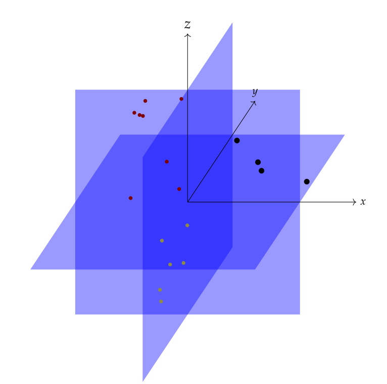

.. Sparse-plex documentation master file, created by
   sphinx-quickstart on Mon Feb 16 22:34:29 2015.

Sparse-Plex
===================================

A journey into sparse and redundant representations.

.. toctree::
   :maxdepth: 1

   intro
   start
   demos/index
   book/sparse_signal_models
   book/compressive_sensing
   book/data_analysis
   book/clustering
   book/pursuit
   book/subspace_clustering
   book/set_theory
   book/linear_algebra
   book/matrices
   book/real_analysis
   book/convex_analysis
   book/probability
   book/geometry
   book/signal_processing
   book/wavelets
   book/ecg
   library/index
   exercises/index
   scripts
   zzzreferences

..
   datasets

Indices and tables
==================

* :ref:`genindex`
* :ref:`search`

